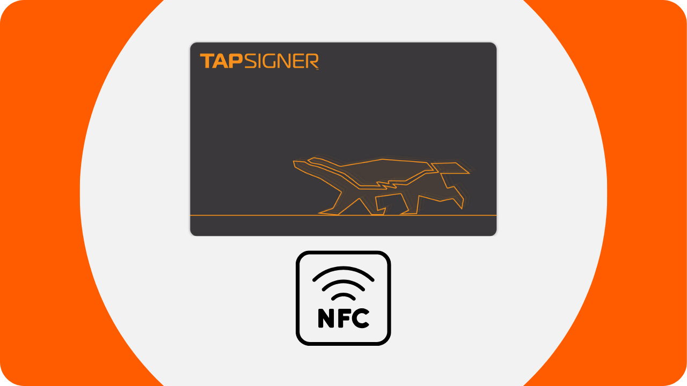
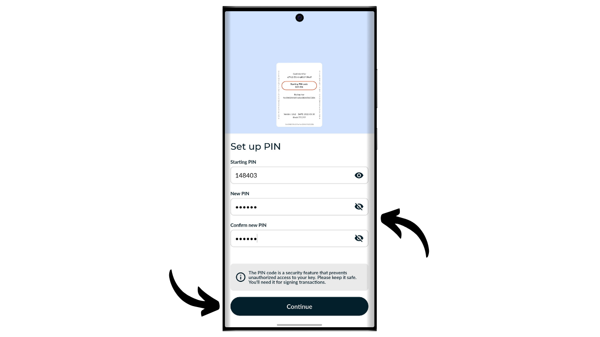
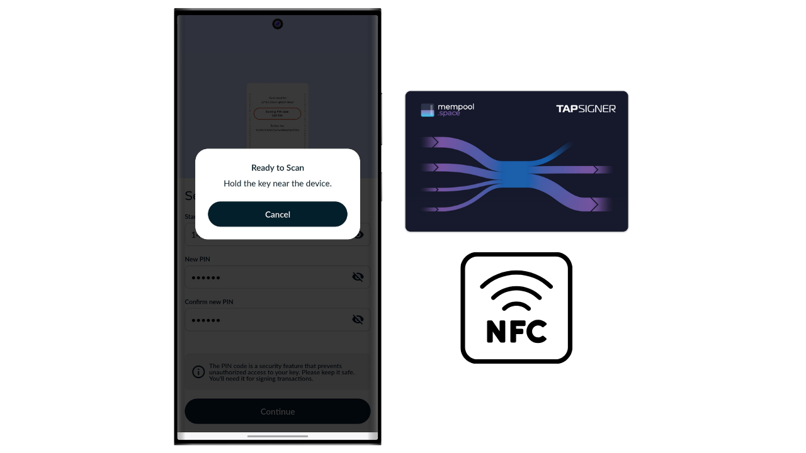
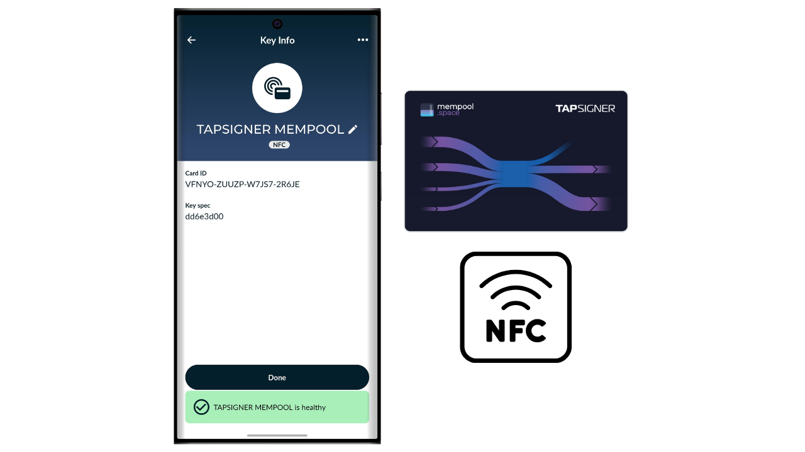

ハードウェアウォレットは、ビットコインウォレットの秘密鍵の管理とセキュリティを専門とする電子デバイスです。インターネットに接続されることが多い汎用機器にインストールされたソフトウェアウォレット（またはホットウォレット）とは異なり、ハードウェアウォレットは秘密鍵の物理的な隔離を可能にし、ハッキングや盗難のリスクを軽減します。

ハードウェアウォレットの主な目的は、デバイスの機能を最小限に抑えることで攻撃対象面を減らすことです。攻撃対象面が小さいということは、攻撃者がビットコインにアクセスするために悪用できる潜在的な攻撃ベクトル、つまりシステムの弱点が少ないことを意味します。

特に大量のビットコインを保有している場合、絶対値であれ資産全体の割合であれ、ビットコインを保護するためにハードウェアウォレットの使用が推奨されます。

ハードウェアウォレットは、コンピューターやスマートフォン上のウォレット管理ソフトウェアと組み合わせて使用されます。このソフトウェアはトランザクションの作成を管理しますが、これらのトランザクションを検証するために必要な暗号署名は、ハードウェアウォレット内だけで完結します。つまり、秘密鍵は潜在的に脆弱な環境にさらされることがありません。

ハードウェアウォレットはユーザーに二重の保護を提供します：一方で、秘密鍵をオフラインに保つことでリモート攻撃からビットコインを保護し、他方で、鍵を抽出しようとする試みに対して物理的により優れた耐性を一般的に提供します。そして、これら2つのセキュリティ基準に基づいて市場に出回っている異なるモデルを評価し、ランク付けすることができます。

このチュートリアルでは、これらのソリューションの1つ、Coinkite社が製造したTapsignerを紹介します。

## Tapsignerの紹介

Tapsignerは、Coldcardsを製造していることでも知られる会社CoinkiteによってNFCカードの形で設計されたハードウェアウォレットです。

Tapsignerは、BIP32に準拠したマスター秘密鍵とチェーンコードのペアを保存し、暗号鍵のツリーを派生させることができます。これらの鍵は、Tapsignerを電話やNFCカードリーダーに対して配置することでトランザクションに署名するために使用できます。
このNFCカードは$19.99で販売されており、市場に出回っている他のハードウェアウォレットと比較して非常に手頃な価格です。しかし、その形式のため、Tapsignerは他のデバイスほど多くのオプションを提供しません。明らかに、バッテリー、カメラ、またはマイクロSDカードリーダーはありません。私の意見では、最大の欠点はハードウェアウォレットに画面がないことで、これにより特定のタイプのリモート攻撃に対してより脆弱になります。実際、これによりユーザーは盲目的に署名を行い、コンピューター画面に表示される内容を信頼する必要があります。

その制限にもかかわらず、Tapsignerはその低価格のために興味深いものになる可能性があります。このウォレットは、画面付きのハードウェアウォレットで保護された貯蓄ウォレットに加えて、支出ウォレットのセキュリティを強化するために特に使用できます。また、少額のビットコインを保有しており、より洗練されたデバイスに数百ユーロを投資したくない人にとっても良い解決策を提供します。さらに、マルチシグ構成でのTapsignerの使用、または将来的にはタイムロックを持つウォレットシステムでの使用は、興味深い利点を提供する可能性があります。

## Tapsignerの購入方法

Tapsignerは、[公式のCoinkiteウェブサイト](https://store.coinkite.com/store/category/tapsigner)で購入できます。実店舗で購入する場合は、[認定販売店のリスト](https://coinkite.com/resellers)もサイト上で見つけることができます。
NFC通信に対応した電話、または標準周波数13.56 MHzでNFCカードを読み取るUSBデバイスが必要になります。
## TapsignerをNunchukで初期化する方法は？

Tapsignerを受け取ったら、最初のステップはパッケージが開封されていないことを確認することです。パッケージが損傷している場合、カードが損なわれ、本物ではない可能性があります。CoinKiteは、電波を遮断するケースと共にTapsignerをお届けします。パッケージにそれが含まれていることを確認してください。

ウォレットを管理するために、**Nunchuk Wallet**モバイルアプリを使用します。スマートフォンがNFCに対応していることを確認し、[Google Play Store](https://play.google.com/store/apps/details?id=io.nunchuk.android)、[App Store](https://apps.apple.com/us/app/nunchuk-bitcoin-wallet/id1563190073)、または直接その[`.apk`ファイル](https://github.com/nunchuk-io/nunchuk-android/releases)からNunchukをダウンロードしてください。

Nunchukを初めて使用する場合、アプリはアカウントの作成を促します。このチュートリアルの目的では、アカウントを作成する必要はありません。したがって、「*ゲストとして続行*」を選択して、アカウントなしで進めてください。

次に、「*アシストなしのウォレット*」をクリックします。

次に、「*自分で探索する*」ボタンをクリックします。

Nunchukに入ったら、「*キー*」タブの隣にある「*+*」ボタンをクリックします。

「*NFCキーを追加*」を選択します。

次に、「*TAPSIGNERを追加*」をクリックします。

「*続行*」をクリックし、その後スマートフォンにTapsigner NFCカードをかざします。

Tapsignerが新しい場合、Nunchukはそれを初期化することを提案します。「*はい*」をクリックします。

これで、マスターチェーンコードの生成方法を選択する必要があります。

TapsignerはBIP32標準を使用します。これは、ビットコインを保護する暗号鍵の導出がBIP39ウォレットのようなニーモニックフレーズに依存せず、マスタープライベートキーとマスターチェーンコードに直接依存することを意味します。これら2つの要素は、ウォレットの残りの部分を決定論的かつ階層的に導出するためにHMAC関数を通じて渡されます。

マスタープライベートキーは、Tapsignerに統合されたTRNG（*True Random Number Generator*）によって直接生成されます。一方、マスターチェーンコードは外部から提供する必要があります。このステップでは、選択肢があります：「*自動*」をクリックしてNunchukに自動的に生成させるか、「*詳細*」を選択して提供されたフィールドに入力して自分で生成します。

次に、PINコードを選択する必要があります。「*Starting PIN*」エリアに、Tapsignerの裏面に書かれているPINコードを入力してください。

Tapsignerへの物理的なアクセスを保護するためのPINコードを選択してください。このPINコードはウォレットの復旧プロセスには関係ありません。その唯一の機能は、トランザクションを署名するためにTapsignerをアンロックすることです。このPINコードを忘れないように保存してください。「*Continue*」をクリックして進んでください。

今すぐTapsignerカードを携帯電話の裏に置いて、初期化してください。

Nunchukはその後、あなたがNFCカードを失った場合にビットコインへのアクセスを再取得することを可能にするウォレットの復旧ファイルを生成します。このファイルは、Tapsignerの裏面に書かれたバックアップコードで暗号化されています。ビットコインを回復するためには、このファイルとそれを解読するためのコードが絶対に必要です。したがって、NFCカードを失うとこのコードへのアクセスも失われるため、今のところカードにのみ書かれているこのコードの紙のコピーを作成することが重要です。暗号化された復旧ファイルの複数のバックアップも作成してください。

ウォレットの名前を選んでください。

これで、ウォレットの基盤が設定されました。Tapsignerの真正性をいつでも確認するために、「*Run health check*」ボタンをクリックできます。

PINを入力してください。

その後、カードを携帯電話の裏に置いてください。

## Tapsignerでウォレットを作成する方法は？

Nunchukのホームページに戻ると、Tapsignerが利用可能な署名デバイスに登録されていることがわかります。

これから、ビットコインウォレットのためのキーを生成する必要があります。これを行うには、「*Wallets*」タブの右にある「*+*」ボタンをクリックしてください。

「*Create new wallet*」をクリックしてください。

その後、「*Create a new wallet using existing keys*」オプションを選択してください。

ウォレットの名前を選んで、「*Continue*」をクリックしてください。

この新しいキーセットの署名デバイスとしてTapsignerを選択し、「*Continue*」をクリックしてください。

すべてがご満足いただける場合は、作成を確認してください。

次に、ウォレットの設定ファイルを保存できます。このファイルには公開鍵のみが含まれているため、誰かがアクセスしたとしてもビットコインを盗むことはできません。しかし、すべての取引を追跡することは可能です。したがって、このファイルはプライバシーに関してのみリスクを提示します。場合によっては、ウォレットの復旧に不可欠なこともあります。

そして、これでウォレットの作成が成功しました！

Tapsignerを使用していないときは、無許可の読み取りを防ぐためにラジオ波を遮断するCoinkite提供のケースに保管することを忘れないでください。

## Tapsignerでビットコインを受け取る方法は？

ビットコインを受け取るには、ウォレットをクリックします。

次に、生成されたアドレスを使用してビットコインを受け取ります。以前にこのウォレットでビットコインを受け取っている場合は、新しい空白の受信アドレスを生成するために「*Receive*」ボタンをクリックする必要があります。

送信者のトランザクションがブロードキャストされると、ウォレットに表示されます。

「*View coins*」をクリックします。

新しいUTXOを選択します。

「*Tags*」の隣にある「*+*」をクリックして、UTXOにラベルを追加します。これは良い習慣です。なぜなら、コインの起源を覚えておくのに役立ち、将来の支出のためにプライバシーを最適化するからです。

既存のタグを選択するか、新しいタグを作成してから「*Save*」をクリックします。また、「*collections*」を作成してコインをより構造化された方法で整理するオプションもあります。

## Tapsignerでビットコインを送る方法は？

ウォレットにビットコインがあるので、それを送ることもできます。これを行うには、選択したウォレットをクリックします。

「*Send*」ボタンをクリックします。

送信する金額を選択し、「*Continue*」をクリックします。

将来のトランザクションの目的を覚えておくために「*note*」を追加します。

次に、指定されたフィールドに受信者のアドレスを手動で入力します。

画面の右上にあるアイコンをクリックすることで、QRコードでエンコードされたアドレスをスキャンすることもできます。

「*Create Transaction*」ボタンをクリックします。

トランザクションの詳細を確認し、Tapsignerの隣にある「*Sign*」ボタンをクリックします。

PINを入力してそれを解除します。

その後、スマートフォンの背面にTapsignerを置きます。

あなたの取引は今、署名されました。全てが正しいことを最後にもう一度確認した後、「*Broadcast Transaction*」をクリックして、ビットコインネットワーク上でそれをブロードキャストしてください。

あなたの取引は現在、確認を待っています。

## Tapsignerを紛失した場合のウォレットの回復方法は？

Tapsignerを紛失した場合、カードの裏に記載されたコードを使用してウォレットを回復することができます。したがって、カードが失われた場合にはこのコードへのアクセスも失われるため、Tapsignerから別にこのコードを保存しておくことが重要です。また、ウォレットの暗号化されたバックアップも必要になります。

回復のために、Nunchukアプリを使用しますが、これは一時的に資金をホットウォレットで保護することを意味することを念頭に置いてください。Tapsignerが大量の資金を保護していた場合は、新しいColdcardで同じ回復プロセスを実行することを検討してください。

Nunchukアプリを開き、「*Keys*」タブの隣にある「*+*」ボタンをクリックします。

「*Add NFC key*」を選択します。

「*Recover TAPSIGNER key from backup*」オプションを選択します。

次に、デバイスのファイルエクスプローラーにリダイレクトされます。ウォレットの暗号化されたバックアップファイルを探して選択します。通常、このファイルの名前は`backup...`で始まります。

バックアップファイルを復号化するパスワードを入力します。このパスワードは、Tapsignerの裏に最初に記載されたものに対応しています。

次に、回復ウォレットの名前を選択します。

これで、あなたのビットコインへのアクセスを取り戻しました。あなたのウォレットは今、Nunchukアプリの「*Keys*」タブにホットウォレットとして表示されています。次に、「*Wallets*」セクションで新しい暗号鍵のセットを作成し、この鍵と関連付ける必要があります。これを行うには、「*How to create a wallet on a Tapsigner?*」のこのチュートリアルのステップを再度フォローできます。

Tapsignerを紛失した場合は、直ちにビットコインを自分が所有する別のウォレットに転送することを強くお勧めします。理想的には、ハードウェアウォレットによって保護されたウォレットです。実際、紛失したTapsignerは間違った手に渡っている可能性があります。したがって、回復したばかりのウォレットを空にして、それを使用するのをやめることが重要です。

おめでとうございます、これでTapsignerの使用方法をマスターしました！このチュートリアルが役に立ったと思われる場合、下にあるサムズアップを残していただけると嬉しいです。この記事をソーシャルネットワークで共有してください。どうもありがとうございました！