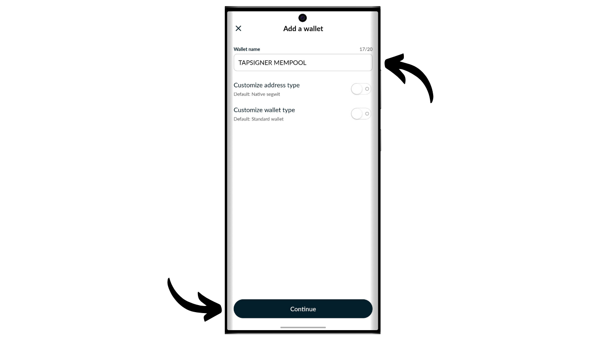
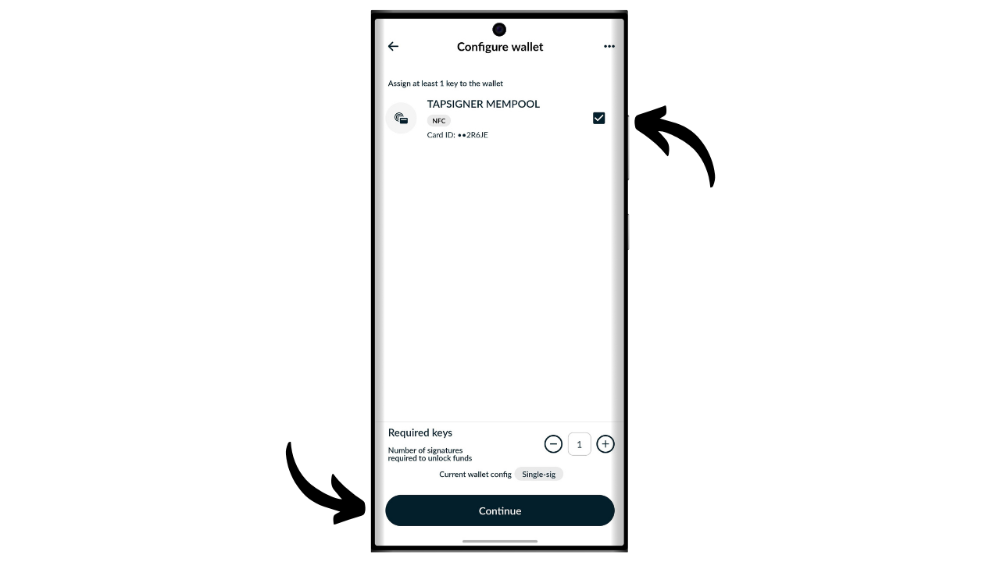
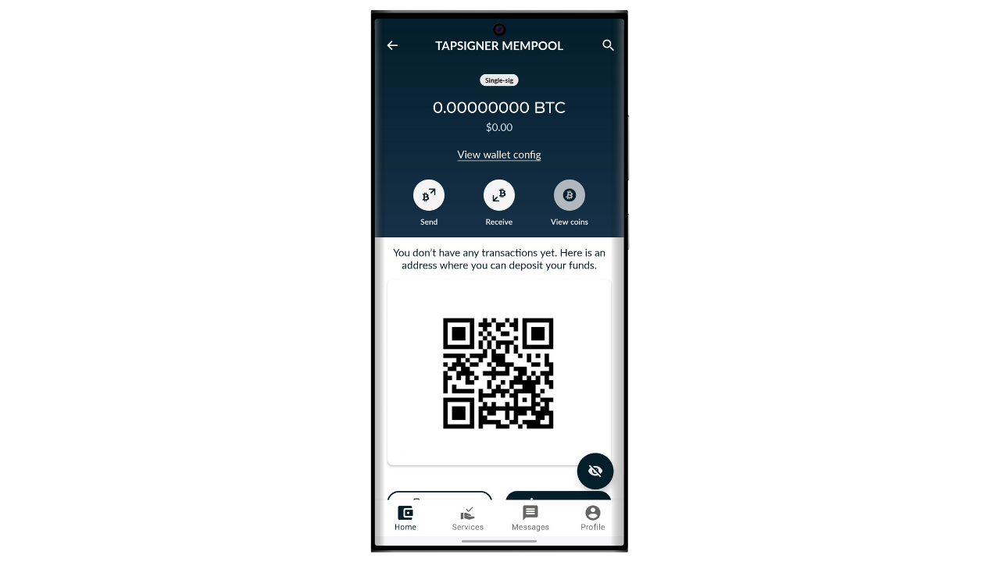
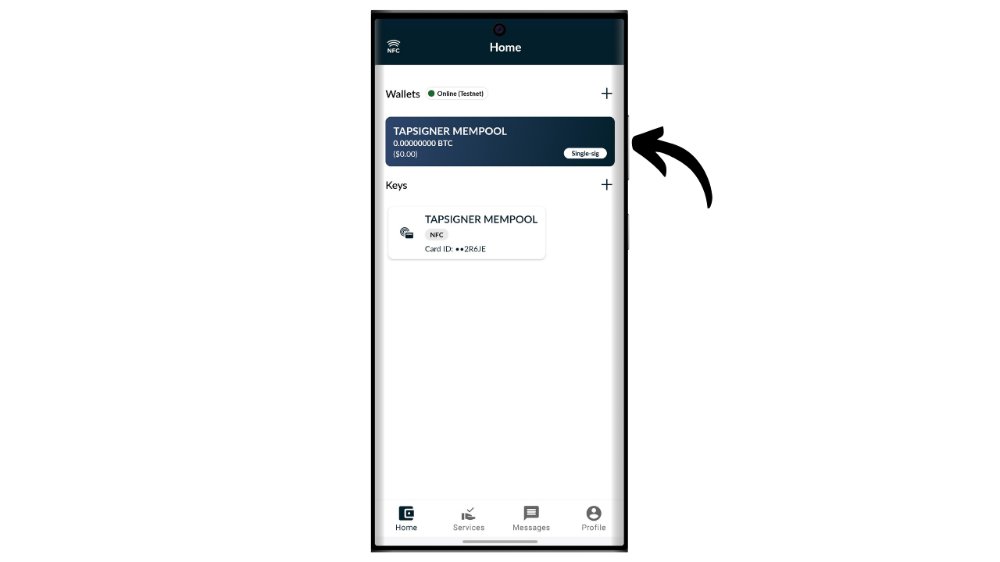
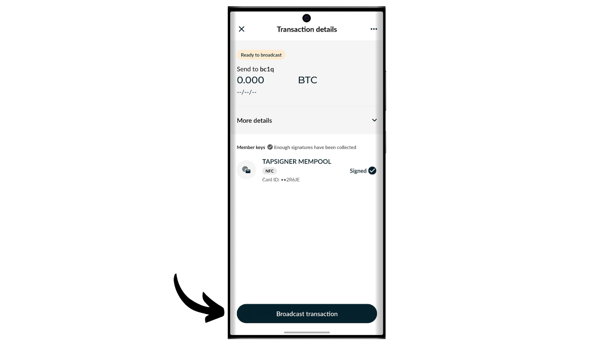

Uma carteira de hardware é um dispositivo eletrônico dedicado à gestão e segurança das chaves privadas de uma carteira Bitcoin. Diferentemente das carteiras de software (ou carteiras quentes) instaladas em máquinas de propósito geral frequentemente conectadas à Internet, as carteiras de hardware permitem o isolamento físico das chaves privadas, reduzindo os riscos de hacking e roubo.

O principal objetivo de uma carteira de hardware é minimizar as funcionalidades do dispositivo para reduzir sua superfície de ataque. Uma superfície de ataque menor também significa menos vetores de ataque potenciais, ou seja, menos pontos fracos no sistema que os atacantes poderiam explorar para acessar os bitcoins.

É recomendado usar uma carteira de hardware para proteger seus bitcoins, especialmente se você possui quantidades significativas, seja em valor absoluto ou como proporção de seus ativos totais.

As carteiras de hardware são usadas em combinação com um software de gestão de carteira em um computador ou smartphone. Este software gerencia a criação de transações, mas a assinatura criptográfica necessária para validar essas transações é feita exclusivamente dentro da carteira de hardware. Isso significa que as chaves privadas nunca são expostas a um ambiente potencialmente vulnerável.

As carteiras de hardware oferecem dupla proteção para o usuário: por um lado, elas protegem seus bitcoins contra ataques remotos mantendo as chaves privadas offline, e por outro lado, geralmente oferecem melhor resistência física contra tentativas de extrair as chaves. E é precisamente nesses 2 critérios de segurança que se pode julgar e classificar os diferentes modelos disponíveis no mercado.

Neste tutorial, proponho descobrir uma dessas soluções: o Tapsigner da Coinkite.

## Introdução ao Tapsigner

O Tapsigner é uma carteira de hardware projetada na forma de um cartão NFC pela empresa Coinkite, também conhecida por produzir Coldcards.

O Tapsigner permite o armazenamento de um par consistindo de uma chave privada mestre e um código de cadeia de acordo com o BIP32, para derivar uma árvore de chaves criptográficas. Essas chaves podem ser usadas para assinar transações posicionando o Tapsigner contra um telefone ou um leitor de cartão NFC.
Este cartão NFC é vendido por $19.99, o que é muito acessível comparado a outras carteiras de hardware disponíveis no mercado. No entanto, devido ao seu formato, o Tapsigner não oferece tantas opções quanto outros dispositivos. Obviamente, não há bateria, câmera, nem leitor de cartão micro SD, pois é um cartão. Na minha opinião, sua maior desvantagem é a falta de uma tela na carteira de hardware, o que a torna mais vulnerável a certos tipos de ataques remotos. De fato, isso força o usuário a assinar às cegas e a confiar no que vê na tela do computador.

Apesar de suas limitações, o Tapsigner pode ser interessante devido ao seu preço reduzido. Esta carteira pode notavelmente ser usada para aumentar a segurança de uma carteira de gastos além de uma carteira de poupança protegida por uma carteira de hardware equipada com tela. Também representa uma boa solução para aqueles que possuem pequenas quantidades de bitcoins e não desejam investir centenas de euros em um dispositivo mais sofisticado. Além disso, o uso do Tapsigner em configurações multisig, ou potencialmente em sistemas de carteira com timelock no futuro, pode oferecer benefícios interessantes.

## Como comprar um Tapsigner?

O Tapsigner está disponível para compra [no site oficial da Coinkite](https://store.coinkite.com/store/category/tapsigner). Para comprá-lo em uma loja física, você também pode encontrar [a lista de revendedores certificados](https://coinkite.com/resellers) no site.
Você também precisará de um telefone compatível com comunicações NFC ou de um dispositivo USB para ler cartões NFC na frequência padrão de 13,56 MHz.
## Como inicializar um Tapsigner com Nunchuk?

Uma vez que você tenha recebido seu Tapsigner, o primeiro passo é examinar a embalagem para garantir que ela não foi aberta. Se a embalagem estiver danificada, isso pode indicar que o cartão foi comprometido e pode não ser autêntico. A CoinKite entregará seu Tapsigner com uma capa que bloqueia ondas de rádio. Certifique-se de que ela esteja presente em sua embalagem.

Para gerenciar a carteira, usaremos o aplicativo móvel **Nunchuk Wallet**. Certifique-se de que seu smartphone seja compatível com NFC, depois baixe o Nunchuk da [Google Play Store](https://play.google.com/store/apps/details?id=io.nunchuk.android), da [App Store](https://apps.apple.com/us/app/nunchuk-bitcoin-wallet/id1563190073) ou diretamente através do seu arquivo [`.apk`](https://github.com/nunchuk-io/nunchuk-android/releases).

Se você estiver usando o Nunchuk pela primeira vez, o aplicativo solicitará que você crie uma conta. Para os propósitos deste tutorial, não é necessário criar uma. Então, selecione "*Continuar como convidado*" para prosseguir sem uma conta.

Em seguida, clique em "*Carteira não assistida*".

Depois, clique no botão "*Explorarei por conta própria*".

Uma vez no Nunchuk, clique no botão "*+*" ao lado da aba "*Chaves*".

Escolha "*Adicionar chave NFC*".

Então clique em "*Adicionar TAPSIGNER*".

Clique em "*Continuar*" e depois coloque seu cartão Tapsigner NFC contra o seu smartphone.

Se o seu Tapsigner for novo, o Nunchuk oferecerá para inicializá-lo. Clique em "*Sim*".

Agora você precisará escolher como gerar seu código de cadeia mestre.

O Tapsigner usa o padrão BIP32. Isso significa que a derivação de suas chaves criptográficas que protegem seus bitcoins não depende de uma frase mnemônica como as carteiras BIP39, mas diretamente da chave privada mestre e do código de cadeia mestre. Esses 2 elementos são passados pela função HMAC para derivar de forma determinística e hierárquica o restante de sua carteira.

A chave privada mestre é gerada diretamente pelo TRNG (*True Random Number Generator*) integrado ao seu Tapsigner. O código de cadeia mestre, por outro lado, deve ser fornecido de fora. Neste passo, você tem uma escolha: deixar o Nunchuk gerá-lo automaticamente clicando em "*Automático*", ou gerá-lo você mesmo selecionando "*Avançado*" e inserindo-o no campo fornecido.

Em seguida, você precisa escolher um código PIN. Na área "*Starting PIN*", insira o código PIN escrito no verso do seu Tapsigner.

Escolha um código PIN para garantir o acesso físico ao seu Tapsigner. Este código PIN não desempenha nenhum papel no processo de recuperação da carteira. Sua única função é desbloquear seu Tapsigner para assinar transações. Certifique-se de salvar este código PIN para evitar esquecê-lo. Clique em "*Continue*" para prosseguir.

Coloque seu cartão Tapsigner na parte de trás do seu telefone agora para inicializá-lo.

O Nunchuk então gerará o arquivo de recuperação para sua carteira, que permite que você recupere o acesso aos seus bitcoins caso perca seu cartão NFC. Este arquivo é criptografado com o código de backup escrito no verso do seu Tapsigner. Para recuperar seus bitcoins, você precisará absolutamente deste arquivo, bem como do código para descriptografá-lo. Portanto, é importante fazer uma cópia em papel deste código, porque se você perder seu cartão NFC, o acesso a este código também será perdido, já que por enquanto ele está apenas escrito no cartão. Certifique-se de também criar várias cópias de segurança do seu arquivo de recuperação criptografado.

Escolha um nome para sua carteira.

A base da sua carteira está agora configurada. Para verificar a autenticidade do seu Tapsigner, a qualquer momento, você pode clicar no botão "*Run health check*".

Digite seu PIN.

Em seguida, coloque seu cartão na parte de trás do seu telefone.

## Como criar uma carteira em um Tapsigner?

De volta à página inicial do Nunchuk, você pode ver que seu Tapsigner está registrado nos dispositivos de assinatura disponíveis.

Agora você precisará gerar as chaves para sua carteira Bitcoin. Para fazer isso, clique no botão "*+*" à direita da aba "*Wallets*".

Clique em "*Create new wallet*".

Em seguida, escolha a opção "*Create a new wallet using existing keys*".

Escolha um nome para sua carteira e depois clique em "*Continue*".

Selecione seu Tapsigner como o dispositivo de assinatura para este novo conjunto de chaves, e então clique em "*Continue*".

Se tudo estiver ao seu gosto, confirme a criação.

Você pode então salvar o arquivo de configuração da sua carteira. Este arquivo contém exclusivamente suas chaves públicas, o que significa que mesmo que alguém o acesse, não poderá roubar seus bitcoins. No entanto, essa pessoa pode acompanhar todas as suas transações. Portanto, este arquivo apresenta um risco apenas para a sua privacidade. Em alguns casos, pode ser essencial para recuperar sua carteira.

E pronto, sua carteira foi criada com sucesso!

Quando não estiver usando seu Tapsigner, lembre-se de guardá-lo no estojo fornecido pela Coinkite, que bloqueia ondas de rádio para proteger contra leituras não autorizadas.

## Como receber bitcoins no Tapsigner?

Para receber bitcoins, clique na sua carteira.

Em seguida, use o endereço gerado para receber bitcoins. Se você já recebeu bitcoins nesta carteira anteriormente, precisará clicar no botão "*Receber*" para gerar um novo endereço de recebimento em branco.

Uma vez que a transação do remetente seja transmitida, você a verá aparecer na sua carteira.

Clique em "*Ver moedas*".

Selecione seu novo UTXO.

Clique no "*+*" ao lado de "*Tags*" para adicionar um rótulo ao seu UTXO. Isso é uma boa prática, pois ajuda você a lembrar a origem de suas moedas e otimizar sua privacidade para gastos futuros.

Selecione uma tag existente ou crie uma nova, depois clique em "*Salvar*". Você também tem a opção de criar "*coleções*" para organizar suas moedas de maneira mais estruturada.

## Como enviar bitcoins com o Tapsigner?

Agora que você tem bitcoins na sua carteira, também pode enviá-los. Para fazer isso, clique na carteira de sua escolha.

Clique no botão "*Enviar*".

Selecione o valor a enviar, depois clique em "*Continuar*".

Adicione uma "*nota*" à sua futura transação para lembrar seu propósito.

Em seguida, insira manualmente o endereço do destinatário no campo designado.

Você também pode escanear um endereço codificado em QR code clicando no ícone localizado no canto superior direito da tela.

Clique no botão "*Criar Transação*".

Verifique os detalhes da sua transação, depois clique no botão "*Assinar*" ao lado do seu Tapsigner.

Digite seu PIN para desbloqueá-lo.

Então, posicione o Tapsigner na parte de trás do seu smartphone.

Sua transação agora está assinada. Verifique mais uma vez se tudo está correto, então clique em "*Broadcast Transaction*" para transmiti-la na rede Bitcoin.

Sua transação agora está aguardando confirmação.

## Como recuperar a carteira em caso de perda do Tapsigner?

Se você perdeu seu Tapsigner, pode recuperar sua carteira usando o código anotado no verso do cartão. Portanto, é importante salvar este código separadamente do Tapsigner, porque se o cartão for perdido, o acesso a este código também será perdido. Você também precisará do backup criptografado da carteira.

Para a recuperação, usaremos o aplicativo Nunchuk, mas tenha em mente que isso significa proteger temporariamente seus fundos em uma carteira quente (hot wallet). Se seu Tapsigner estava protegendo quantias significativas, considere seguir o mesmo processo de recuperação com um novo Coldcard.

Abra o aplicativo Nunchuk e clique no botão "*+*" ao lado da aba "*Keys*".

Escolha "*Add NFC key*".

Escolha a opção "*Recover TAPSIGNER key from backup*".

Você será então redirecionado para o explorador de arquivos do seu dispositivo. Localize e selecione o arquivo de backup criptografado da sua carteira. Normalmente, o nome deste arquivo começa com `backup...`.

Digite a senha que descriptografa o arquivo de backup. Esta senha corresponde àquela inicialmente anotada no verso do seu Tapsigner.

Em seguida, escolha um nome para sua carteira de recuperação.

Você agora recuperou o acesso aos seus bitcoins. Sua carteira agora é gerenciada como uma carteira quente visível na aba "*Keys*" do aplicativo Nunchuk. A seguir, você precisa criar um novo conjunto de chaves criptográficas na seção "*Wallets*" associando esta chave a ela. Para fazer isso, você pode seguir novamente os passos na parte "*How to create a wallet on a Tapsigner?*" deste tutorial.

Se você perdeu seu Tapsigner, aconselho fortemente que transfira imediatamente seus bitcoins para outra carteira de sua propriedade, idealmente protegida por uma carteira de hardware. De fato, o Tapsigner que você perdeu poderia potencialmente estar em mãos erradas. Portanto, é importante esvaziar a carteira que você acabou de recuperar e parar de usá-la.

Parabéns, você agora está atualizado sobre como usar o Tapsigner! Se você achou este tutorial útil, eu apreciaria se você pudesse deixar um joinha abaixo. Sinta-se livre para compartilhar este artigo em suas redes sociais. Muito obrigado!