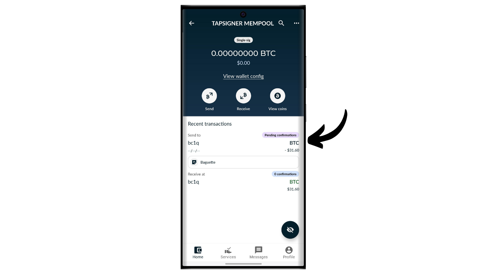

Аппаратный кошелек — это электронное устройство, предназначенное для управления и обеспечения безопасности приватных ключей биткойн-кошелька. В отличие от программных кошельков (или горячих кошельков), установленных на универсальных машинах, часто подключенных к Интернету, аппаратные кошельки позволяют физически изолировать приватные ключи, снижая риски взлома и кражи.

Основная цель аппаратного кошелька — минимизировать функциональность устройства для сокращения его уязвимости к атакам. Меньшая уязвимость также означает меньше потенциальных векторов атак, то есть меньше слабых мест в системе, которые злоумышленники могли бы использовать для доступа к биткойнам.

Рекомендуется использовать аппаратный кошелек для обеспечения безопасности ваших биткойнов, особенно если вы владеете значительными суммами, будь то в абсолютном значении или как доля от ваших общих активов.

Аппаратные кошельки используются в сочетании с программным обеспечением для управления кошельком на компьютере или смартфоне. Это программное обеспечение управляет созданием транзакций, но криптографическая подпись, необходимая для подтверждения этих транзакций, выполняется исключительно в аппаратном кошельке. Это означает, что приватные ключи никогда не подвергаются воздействию потенциально уязвимой среды.

Аппаратные кошельки обеспечивают двойную защиту для пользователя: с одной стороны, они защищают ваши биткойны от удаленных атак, сохраняя приватные ключи вне сети, а с другой стороны, они обычно предлагают лучшую физическую устойчивость против попыток извлечения ключей. И именно по этим 2 критериям безопасности можно судить и ранжировать различные доступные на рынке модели.

В этом руководстве я предлагаю ознакомиться с одним из таких решений: Tapsigner от Coinkite.

## Введение в Tapsigner

Tapsigner — это аппаратный кошелек, разработанный в форме NFC-карты компанией Coinkite, также известной производством Coldcards.

Tapsigner позволяет хранить пару, состоящую из мастер-приватного ключа и цепочечного кода в соответствии с BIP32, для вывода дерева криптографических ключей. Эти ключи могут использоваться для подписания транзакций путем размещения Tapsigner рядом с телефоном или считывателем NFC-карт.
Эта NFC-карта продается по цене $19.99, что очень доступно по сравнению с другими аппаратными кошельками, доступными на рынке. Однако из-за своего формата Tapsigner не предлагает столько же опций, сколько другие устройства. Очевидно, что нет батареи, камеры или считывателя карт micro SD, поскольку это карта. На мой взгляд, его главным недостатком является отсутствие экрана на аппаратном кошельке, что делает его более уязвимым к определенным типам удаленных атак. Действительно, это заставляет пользователя подписывать в слепую и доверять тому, что он видит на экране своего компьютера.

Несмотря на свои ограничения, Tapsigner может быть интересен из-за своей сниженной цены. Этот кошелек может быть использован в частности для повышения безопасности кошелька для расходов в дополнение к кошельку для сбережений, защищенному аппаратным кошельком с экраном. Он также представляет хорошее решение для тех, кто владеет небольшими суммами биткойнов и не желает инвестировать сотни евро в более сложное устройство. Более того, использование Tapsigner в конфигурациях multisig или потенциально в системах кошельков с временным замком в будущем может предложить интересные преимущества.

## Как купить Tapsigner?

Tapsigner доступен для покупки [на официальном сайте Coinkite](https://store.coinkite.com/store/category/tapsigner). Чтобы купить его в физическом магазине, вы также можете найти [список сертифицированных реселлеров](https://coinkite.com/resellers) на сайте.
Вам также потребуется телефон, совместимый с NFC-связью, или USB-устройство для чтения NFC-карт на стандартной частоте 13,56 МГц.
## Как инициализировать Tapsigner с помощью Nunchuk?

После получения вашего Tapsigner первым шагом будет проверка упаковки на предмет её вскрытия. Если упаковка повреждена, это может указывать на то, что карта была скомпрометирована и может быть не подлинной. CoinKite поставит ваш Tapsigner в чехле, блокирующем радиоволны. Убедитесь, что он присутствует в вашей упаковке.

Для управления кошельком мы будем использовать мобильное приложение **Nunchuk Wallet**. Убедитесь, что ваш смартфон совместим с NFC, затем загрузите Nunchuk из [Google Play Store](https://play.google.com/store/apps/details?id=io.nunchuk.android), [App Store](https://apps.apple.com/us/app/nunchuk-bitcoin-wallet/id1563190073) или напрямую через его [`.apk` файл](https://github.com/nunchuk-io/nunchuk-android/releases).

Если вы используете Nunchuk в первый раз, приложение предложит вам создать аккаунт. Для целей этого руководства создавать его не обязательно. Так что выберите "*Продолжить как гость*", чтобы продолжить без аккаунта.

Затем нажмите на "*Неподдерживаемый кошелек*".

Далее, нажмите на кнопку "*Я самостоятельно изучу приложение*".

Оказавшись в Nunchuk, нажмите на кнопку "*+*" рядом с вкладкой "*Ключи*".

Выберите "*Добавить NFC ключ*".

Затем нажмите на "*Добавить TAPSIGNER*".

Нажмите на "*Продолжить*", а затем приложите вашу карту Tapsigner NFC к вашему смартфону.

Если ваш Tapsigner новый, Nunchuk предложит его инициализировать. Нажмите на "*Да*".

Теперь вам нужно будет выбрать, как вы будете генерировать ваш мастер-код цепочки.

Tapsigner использует стандарт BIP32. Это означает, что производные ваши криптографические ключи, которые защищают ваши биткойны, не зависят от мнемонической фразы, как в кошельках BIP39, а напрямую от мастер-приватного ключа и мастер-кода цепочки. Эти 2 элемента передаются через функцию HMAC для детерминированного и иерархического вывода остальной части вашего кошелька.

Мастер-приватный ключ генерируется непосредственно TRNG (*True Random Number Generator*, Генератором Истинно Случайных Чисел), интегрированным в ваш Tapsigner. Мастер-код цепочки, с другой стороны, должен быть предоставлен извне. На этом этапе у вас есть выбор: позволить Nunchuk сгенерировать его автоматически, нажав на "*Автоматически*", или сгенерировать его самостоятельно, выбрав "*Расширенный*" и введя его в предоставленное поле.

Далее вам необходимо выбрать PIN-код. В области "*Начальный PIN*" введите PIN-код, указанный на обратной стороне вашего Tapsigner.

Выберите PIN-код для защиты физического доступа к вашему Tapsigner. Этот PIN-код не играет роли в процессе восстановления кошелька. Его единственная функция - разблокировать ваш Tapsigner для подписания транзакций. Убедитесь, что вы сохранили этот PIN-код, чтобы избежать его забывания. Нажмите на "*Продолжить*", чтобы перейти дальше.

Теперь поместите вашу карту Tapsigner на заднюю сторону вашего телефона, чтобы инициализировать её.

Затем Nunchuk сгенерирует файл восстановления для вашего кошелька, который позволит вам восстановить доступ к вашим биткойнам в случае потери вашей NFC-карты. Этот файл зашифрован с помощью резервного кода, написанного на обратной стороне вашего Tapsigner. Для восстановления ваших биткойнов вам абсолютно необходим этот файл, а также код для его расшифровки. Поэтому важно сделать бумажную копию этого кода, потому что если вы потеряете свою NFC-карту, доступ к этому коду также будет потерян, поскольку на данный момент он записан только на карте. Убедитесь, что вы также создали несколько резервных копий вашего зашифрованного файла восстановления.

Выберите имя для вашего кошелька.

Основа вашего кошелька теперь настроена. Чтобы проверить подлинность вашего Tapsigner, в любое время вы можете нажать на кнопку "*Проверить состояние*".

Введите ваш PIN-код.

Затем поместите вашу карту на заднюю сторону вашего телефона.

## Как создать кошелек на Tapsigner?

Вернувшись на главную страницу Nunchuk, вы можете видеть, что ваш Tapsigner зарегистрирован в доступных устройствах для подписи.

Теперь вам нужно будет сгенерировать ключи для вашего кошелька Bitcoin. Для этого нажмите на кнопку "*+*" справа от вкладки "*Кошельки*".

Нажмите на "*Создать новый кошелек*".

Затем выберите опцию "*Создать новый кошелек с использованием существующих ключей*".

Выберите имя для вашего кошелька, затем нажмите на "*Продолжить*".

Выберите ваш Tapsigner как устройство для подписи для этого нового набора ключей, затем нажмите на "*Продолжить*".

Если все устраивает, подтвердите создание.

Вы можете сохранить файл конфигурации вашего кошелька. Этот файл содержит исключительно ваши публичные ключи, что означает, что даже если кто-то получит к нему доступ, украсть ваши биткоины он не сможет. Однако, он сможет отслеживать все ваши транзакции. Поэтому, этот файл представляет риск только для вашей конфиденциальности. В некоторых случаях он может быть необходим для восстановления вашего кошелька. 

И вот, ваш кошелек успешно создан!

Когда вы не используете ваш Tapsigner, помните о том, чтобы хранить его в футляре, предоставленном Coinkite, который блокирует радиоволны для защиты от несанкционированного считывания.

## Как получать биткоины на Tapsigner?

Чтобы получить биткоины, нажмите на ваш кошелек.

Затем используйте сгенерированный адрес для получения биткоинов. Если вы ранее уже получали биткоины на этот кошелек, вам нужно будет нажать на кнопку "*Получить*", чтобы сгенерировать новый пустой адрес для получения.

Как только транзакция отправителя будет транслирована, вы увидите ее в вашем кошельке.

Нажмите на "*Просмотреть монеты*".

Выберите ваш новый UTXO.

Нажмите на "*+*" рядом с "*Тегами*", чтобы добавить метку к вашему UTXO. Это хорошая практика, так как это помогает вам помнить происхождение ваших монет и оптимизировать вашу конфиденциальность для будущих расходов.

Выберите существующий тег или создайте новый, затем нажмите на "*Сохранить*". У вас также есть возможность создать "*коллекции*", чтобы организовать ваши монеты более структурированно.

## Как отправить биткоины с Tapsigner?

Теперь, когда у вас есть биткоины в вашем кошельке, вы также можете их отправить. Для этого нажмите на кошелек вашего выбора.

Нажмите на кнопку "*Отправить*".

Выберите сумму для отправки, затем нажмите на "*Продолжить*".

Добавьте "*заметку*" к вашей будущей транзакции, чтобы помнить ее назначение.

Затем вручную введите адрес получателя в предназначенное поле.

Вы также можете сканировать адрес в виде QR-кода, нажав на иконку в верхнем правом углу экрана.

Нажмите на кнопку "*Создать транзакцию*".

Проверьте детали вашей транзакции, затем нажмите на кнопку "*Подписать*" рядом с вашим Tapsigner.

Введите ваш PIN-код, чтобы разблокировать его.

Затем поместите Tapsigner на заднюю часть вашего смартфона.

Ваша транзакция теперь подписана. Проверьте еще раз, что все верно, затем нажмите на "*Broadcast Transaction*", чтобы транслировать ее в сети Bitcoin.

Теперь ваша транзакция ожидает подтверждения.

## Как восстановить кошелек в случае потери Tapsigner?

Если вы потеряли свой Tapsigner, вы можете восстановить свой кошелек, используя код, записанный на обратной стороне карты. Поэтому важно сохранить этот код отдельно от Tapsigner, потому что в случае потери карты доступ к этому коду также будет потерян. Вам также понадобится зашифрованная резервная копия кошелька.

Для восстановления мы будем использовать приложение Nunchuk, но имейте в виду, что это означает временное хранение ваших средств в горячем кошельке. Если ваш Tapsigner защищал значительные суммы, рассмотрите возможность следования тому же процессу восстановления с новым Coldcard.

Откройте приложение Nunchuk и нажмите на кнопку "*+*" рядом с вкладкой "*Keys*".

Выберите "*Add NFC key*".

Выберите опцию "*Recover TAPSIGNER key from backup*".

Затем вы будете перенаправлены в файловый менеджер вашего устройства. Найдите и выберите зашифрованный файл резервной копии вашего кошелька. Обычно имя этого файла начинается с `backup...`.

Введите пароль, который расшифровывает файл резервной копии. Этот пароль соответствует тому, который изначально был записан на обратной стороне вашего Tapsigner.

Затем выберите имя для вашего восстановленного кошелька.

Теперь вы вновь получили доступ к своим биткоинам. Ваш кошелек теперь управляется как горячий кошелек и виден во вкладке "*Keys*" приложения Nunchuk. Далее вам нужно создать новый набор криптографических ключей в разделе "*Wallets*", ассоциировав этот ключ с ним. Для этого вы можете повторить шаги в разделе "*Как создать кошелек на Tapsigner?*" этого руководства.

Если вы потеряли свой Tapsigner, я настоятельно советую вам немедленно перевести ваши биткоины в другой кошелек, которым вы владеете, идеально защищенный аппаратным кошельком. Действительно, потерянный Tapsigner может оказаться в чужих руках. Поэтому важно опустошить только что восстановленный кошелек и прекратить его использование.

Поздравляем, теперь вы полностью осведомлены о использовании Tapsigner! Если вы нашли это руководство полезным, я был бы признателен, если бы вы могли оставить отзыв в виде лайка ниже. Не стесняйтесь делиться этой статьей в своих социальных сетях. Большое спасибо!