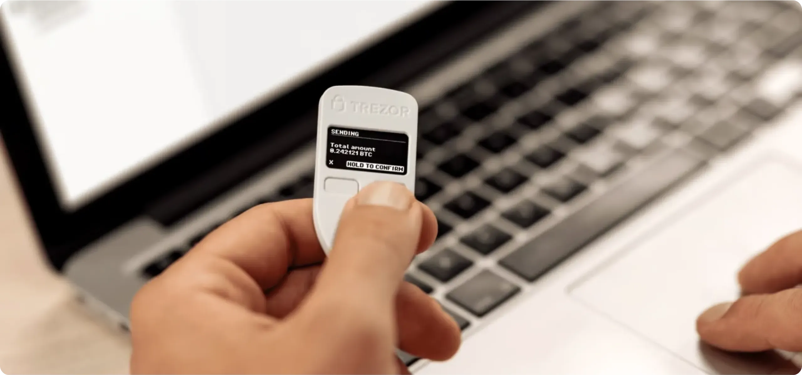

*Kredit gambar: [Trezor.io](https://trezor.io/)*

Trezor Model One adalah hardware wallet pertama yang pernah dirilis, diluncurkan pada tahun 2014 oleh SatoshiLabs. Setelah lebih dari sepuluh tahun berdiri, ini tetap jadi pilihan yang menarik, terutama buat kamu yang cari hardware wallet yang mudah diakses secara teknis maupun dari sisi anggaran. Bahkan, harganya cuma €49 di situs web resmi Trezor. Ini satu-satunya dompet perangkat keras di kisaran harga ini. Harga ini berada di tengah antara perangkat entry-level dengan harga sekitar €20 seperti Tapsigner yang sering kali tidak punya layar, dan perangkat kelas menengah dengan harga sekitar €80 seperti Ledger Nano S Plus atau Trezor Safe 3.

Model One punya layar OLED monokrom 0,96 inci dan dua tombol fisik. Perangkat ini beroperasi tanpa baterai, hanya menggunakan koneksi micro-USB untuk daya dan transfer data.

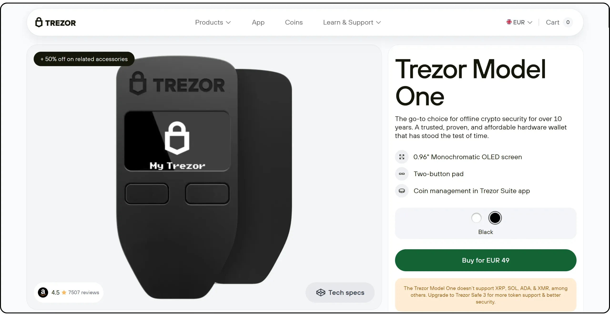

Kelemahan utama Model One adalah tidak adanya Secure Element, yang bikin perangkat ini lebih rentan terhadap berbagai serangan fisik, dan beberapa di antaranya relatif mudah dieksekusi. Serangan ini bisa mencakup analisis saluran samping untuk mengetahui PIN perangkat, atau teknik yang lebih canggih untuk mengekstrak seed yang terenkripsi lalu melakukan brute-force setelahnya. Perlu kamu ingat, serangan seperti ini butuh akses fisik ke perangkat. Tapi kerentanan ini bisa dikurangi secara signifikan dengan memakai passphrase BIP39 yang kuat. Kalau kamu pilih hardware wallet ini, aku sangat sarankan untuk mengonfigurasi passphrase.

Model One menawarkan dua keunggulan penting:

- Ini berbasis arsitektur yang sepenuhnya open source. Berbeda dengan model yang lebih baru yang memakai Secure Element, semua komponen perangkat keras dan perangkat lunak Model One bisa diaudit;
- Perangkat ini punya layar. Sepengetahuanku, ini satu-satunya hardware wallet di pasaran dalam kisaran harga ini yang dilengkapi layar. Fitur ini penting banget, karena memungkinkan kamu memverifikasi informasi yang ditandatangani dan alamat penerimaan, sehingga bisa mencegah banyak serangan digital.

Karena itu, Trezor Model One bisa jadi pilihan yang bijak buat pengguna pemula dan menengah dengan anggaran terbatas. Tapi tetap penting untuk sadar akan keterbatasannya dalam perlindungan fisik karena tidak adanya Secure Element. Kalau anggaran kamu terbatas, ini pilihan yang bagus. Kalau kamu bisa memilih model yang lebih unggul seperti Trezor Safe 3 dengan harga €79, itu lebih baik karena sudah dilengkapi Secure Element.

## Membuka Kotak Trezor Model One

Ketika kamu menerima Model One, pastikan kotak dan segelnya utuh untuk memastikan paket belum pernah dibuka. Verifikasi perangkat lunak untuk keaslian dan integritas perangkat juga akan dilakukan saat proses setup nanti.

Isi kotak termasuk:

- Trezor Model One;
- Kartu kosong untuk mencatat seedphrase, stiker, dan instruksi mnemonic;
- Kabel USB-A ke micro-USB.

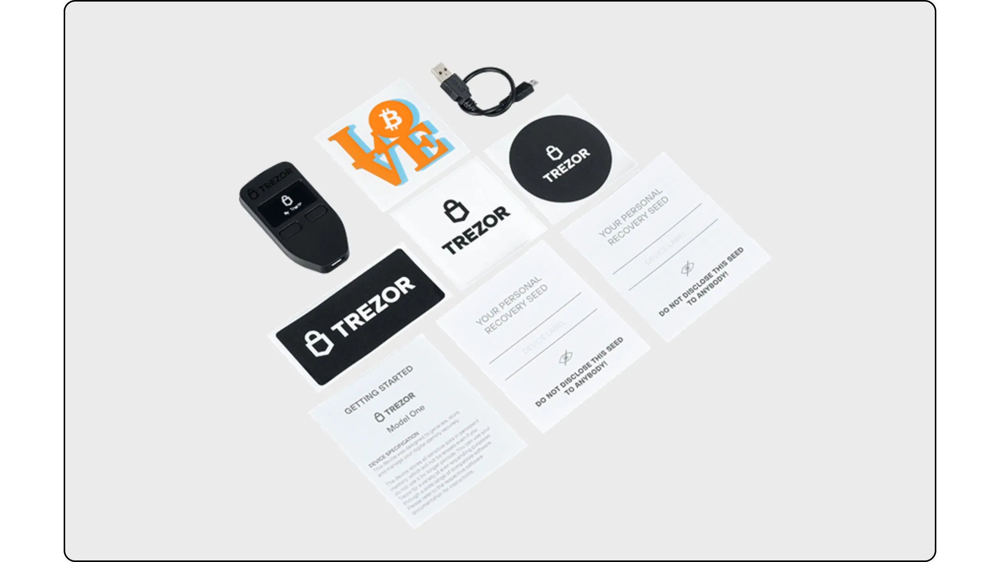

Menavigasi perangkat ini sangat sederhana:

- Klik kanan untuk mengonfirmasi dan melanjutkan ke langkah berikutnya;
- Gunakan tombol kiri untuk kembali.

## Prasyarat

Untuk tutorial ini, aku akan menunjukkan kepada kamu bagaimana cara menggunakan Trezor Model One dengan [perangkat lunak manajemen portofolio Sparrow Wallet](https://sparrowwallet.com/download/). Kalau kamu belum menginstal perangkat lunak ini, silakan lakukan sekarang. Kalau kamu butuh bantuan, kami juga punya tutorial lengkap tentang cara konfigurasi Sparrow Wallet:

https://planb.academy/tutorials/wallet/desktop/sparrow-c674e2ac-d46f-4c82-92a7-7d1b0e262f5d

Kamu juga butuh perangkat lunak Trezor Suite untuk mengonfigurasi Model One, memeriksa keasliannya, dan menginstal firmware. Kita cuma pakai software ini untuk proses tersebut, dan setelah itu hanya diperlukan lagi kalau ada pembaruan firmware. Untuk pengelolaan wallet sehari-hari, kita akan pakai Sparrow Wallet saja, karena lebih optimal untuk Bitcoin dan lebih mudah dipakai, bahkan buat pemula (Sparrow hanya mendukung Bitcoin, bukan altcoin).

[Unduh Trezor Suite dari situs web resmi](https://trezor.io/trezor-suite)

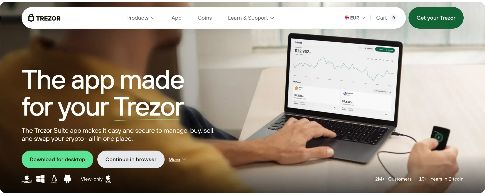

Untuk kedua program ini, aku sangat menyarankan kamu untuk memeriksa keasliannya (pakai GnuPG) dan integritasnya (lewat hash) sebelum menginstalnya di komputer. Kalau kamu belum tahu caranya, kamu bisa ikuti tutorial lain ini:

https://planb.academy/tutorials/computer-security/data/integrity-authenticity-21d0420a-be02-4663-94a3-8d487f23becc

## Memulai Trezor Model One

Hubungkan Model One kamu ke komputer yang sudah terinstal Trezor Suite dan Sparrow Wallet.

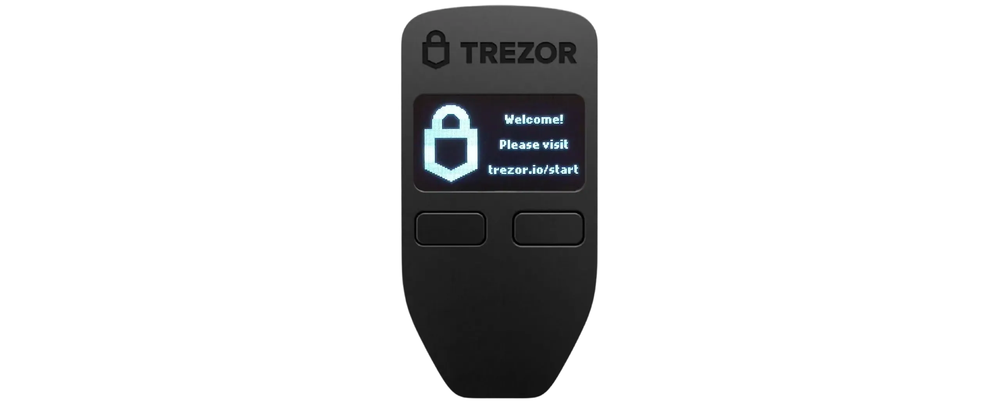

Buka Trezor Suite, lalu klik "*Setup my Trezor*".

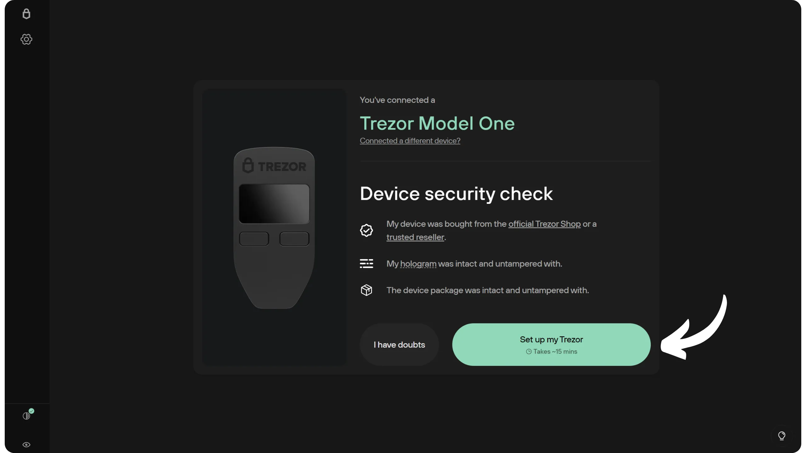

Pilih "*Firmware khusus Bitcoin*", lalu klik "*Instal Bitcoin saja*".

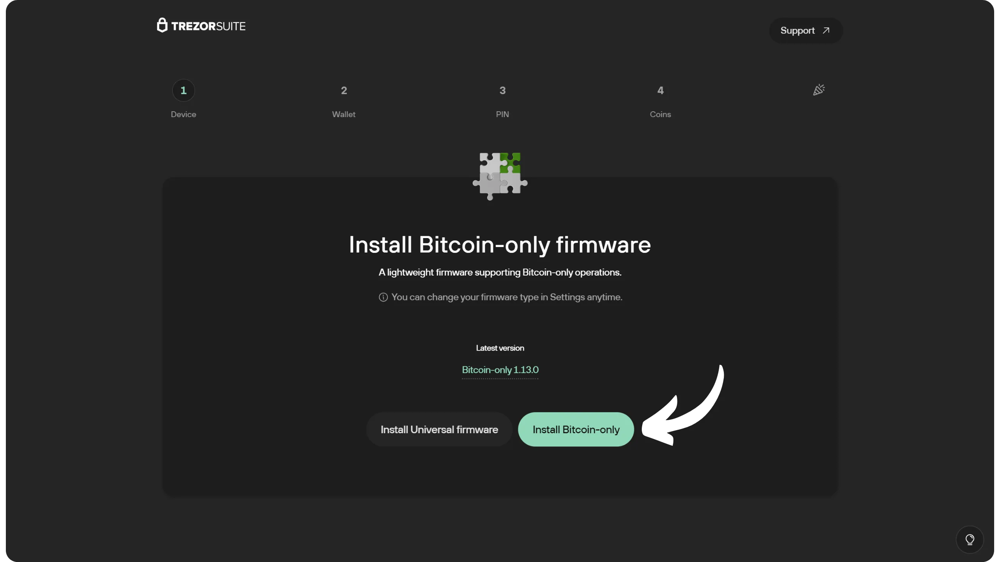

Trezor Suite kemudian akan menginstal firmware pada Model One kamu. Harap tunggu selama proses instalasi.

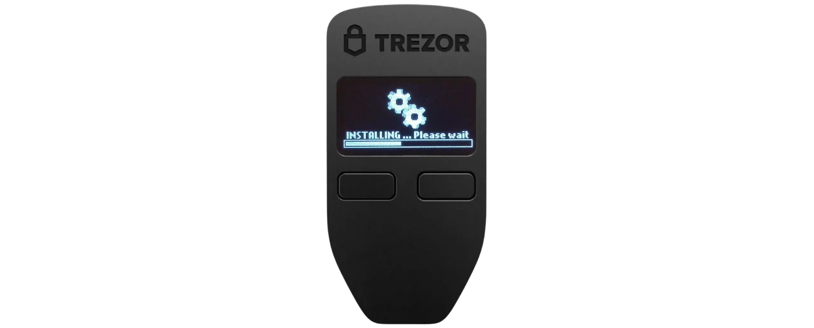

Klik "*Lanjutkan*".

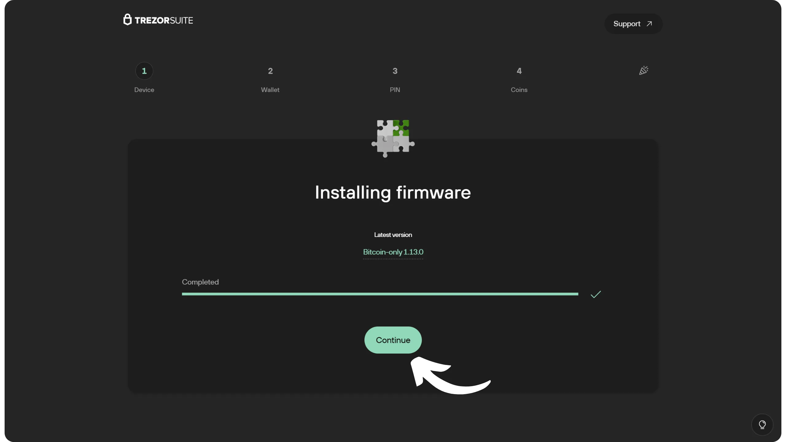

## Menciptakan portofolio Bitcoin

Pada Trezor Suite, klik tombol "*Buat Wallet baru*".

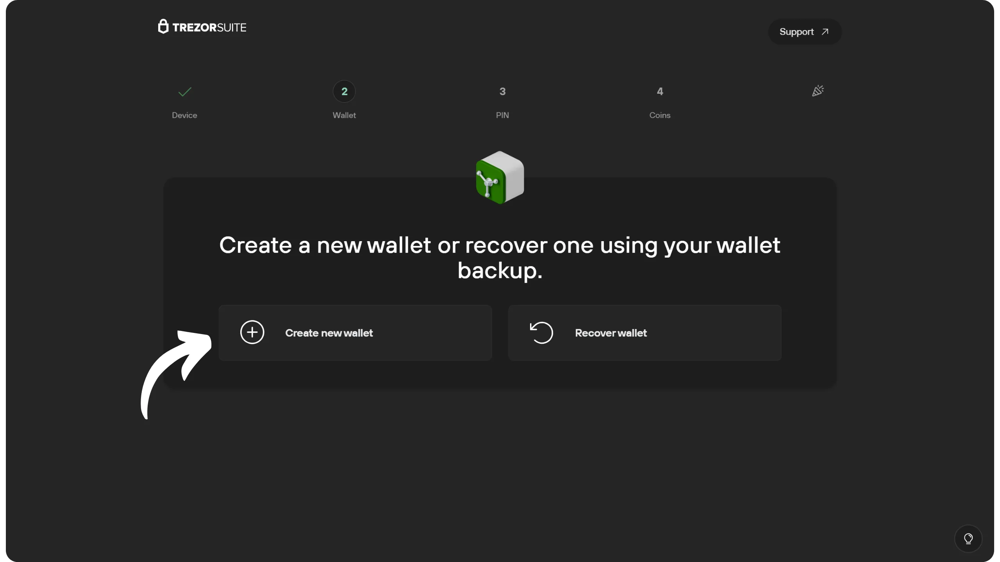

Menerima persyaratan penggunaan pada Hardware Wallet.

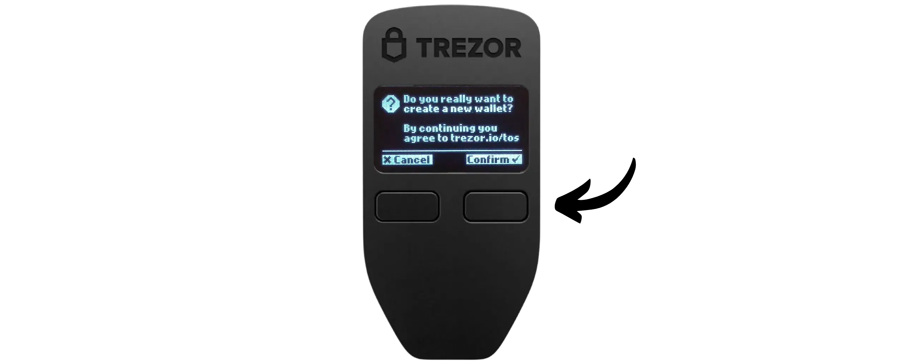

Di Trezor Suite, klik "*Lanjutkan pencadangan*".

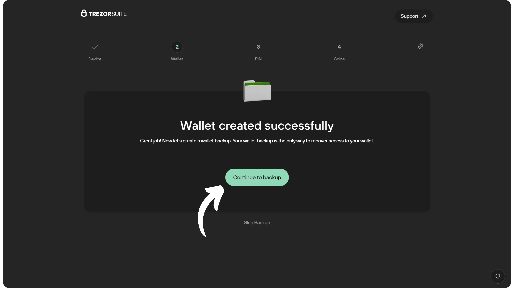

Perangkat lunak ini memberi kamu panduan tentang cara mengelola mnemonic.

Mnemonic ini memberi kamu akses penuh dan tidak terbatas ke semua bitcoin. Siapa pun yang punya frasa ini bisa mencuri dana kamu, bahkan tanpa akses fisik ke Trezor Model One.

Frasa 24 kata ini bisa mengembalikan akses ke bitcoin kamu kalau terjadi kehilangan, pencurian, atau kerusakan pada hardware wallet. Karena itu, sangat penting untuk menyimpannya dengan hati-hati dan menaruhnya di tempat yang aman.

Kamu bisa menuliskannya di kartu karton yang ada di dalam kotak, atau untuk keamanan tambahan, aku sarankan mengukirnya di plat baja tahan karat supaya terlindung dari kebakaran, banjir, atau kerusakan fisik lainnya.

Konfirmasi instruksi, lalu klik tombol "*Buat cadangan Wallet*".

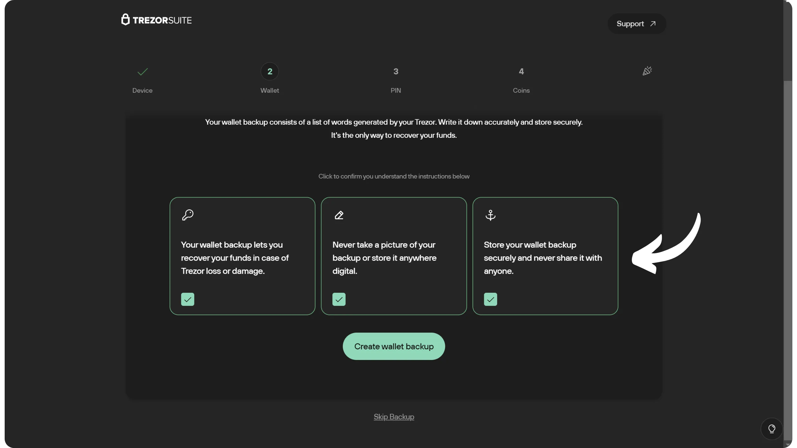

Model One akan membuat mnemonic pakai generator nomor acak. Pastikan kamu tidak diawasi selama proses ini. Tuliskan kata-kata yang muncul di layar ke media fisik pilihanmu. Tergantung strategi keamanan kamu, kamu bisa mempertimbangkan membuat beberapa salinan fisik lengkap dari frasa tersebut (tapi yang paling penting, jangan pernah membagikannya). Sangat penting untuk menuliskan kata-kata itu secara bernomor dan berurutan.

**Tentu saja, kamu tidak boleh membagikan kata-kata ini di internet, seperti yang aku lakukan dalam tutorial ini. Contoh wallet ini hanya dipakai di testnet dan akan dihapus di akhir tutorial.**

Untuk info lebih lanjut tentang cara menyimpan dan mengelola mnemonic dengan benar, aku sangat merekomendasikan tutorial lain ini, terutama kalau kamu masih pemula:

https://planb.academy/tutorials/wallet/backup/backup-mnemonic-22c0ddfa-fb9f-4e3a-96f9-46e2a7954270

Untuk pindah ke kata berikutnya, klik kanan. Setelah semua kata kamu tulis, klik tombol kanan lagi untuk lanjut ke langkah berikutnya.

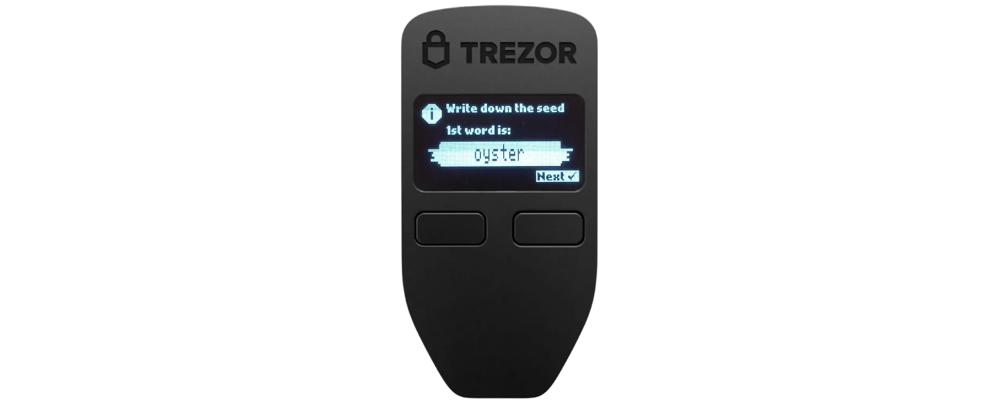

Hardware Wallet sekali lagi menunjukkan semua kata-kata kamu. Pastikan kamu telah menuliskan semuanya.

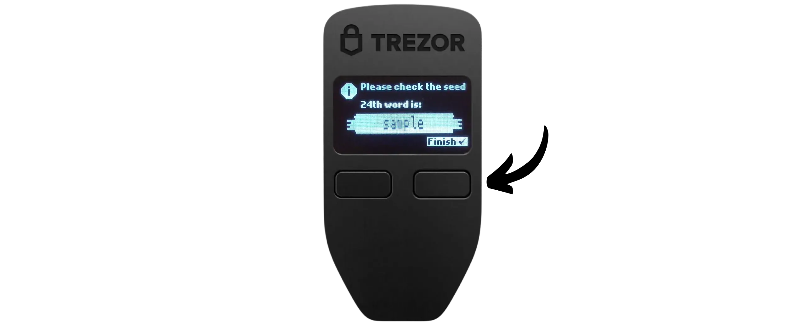

## Mengatur kode PIN

Berikutnya ada langkah untuk membuat PIN. PIN ini akan membuka kunci Trezor kamu. Karena itu, PIN memberi perlindungan terhadap akses fisik yang tidak sah. PIN tidak ikut dalam proses derivasi kunci kriptografi wallet kamu. Jadi, bahkan tanpa akses ke PIN, kalau kamu masih punya mnemonic 12 kata, kamu tetap bisa memulihkan akses ke bitcoin kamu.

Di Trezor Suite, klik "*Lanjutkan ke PIN*", lalu klik tombol "*Setel PIN*".

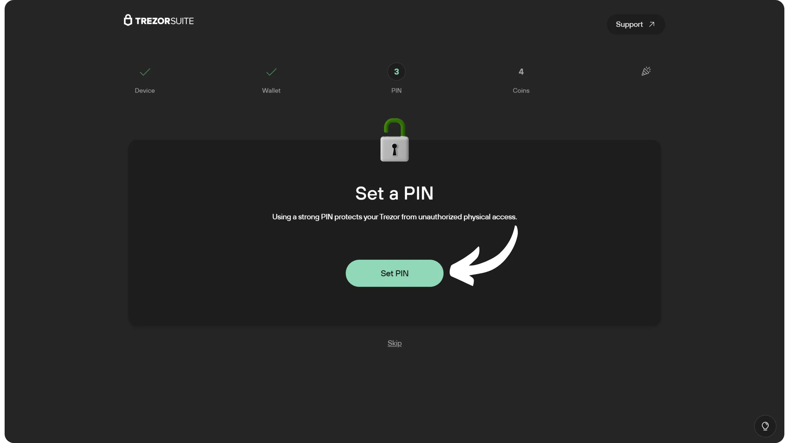

Konfirmasikan pada Model Satu.

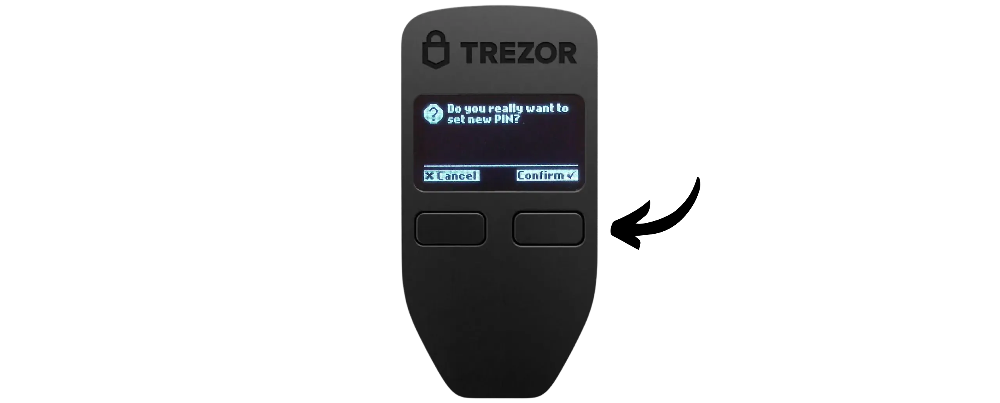

Aku sarankan kamu pilih PIN yang seacak mungkin. Simpan PIN ini di tempat yang terpisah dari penyimpanan Trezor kamu, misalnya di dalam password manager. Kamu bisa buat PIN antara 8 sampai 50 digit. Aku sarankan kamu pakai PIN sepanjang mungkin supaya lebih aman.

PIN harus dimasukkan di Trezor Suite lewat komputer dengan cara mengklik titik-titik yang sesuai dengan angka, mengikuti konfigurasi keyboard yang ditampilkan di layar Trezor Model One.

Metode input PIN khusus ini wajib kamu lakukan setiap kali membuka kunci Trezor Model One, baik lewat Trezor Suite maupun Sparrow Wallet.

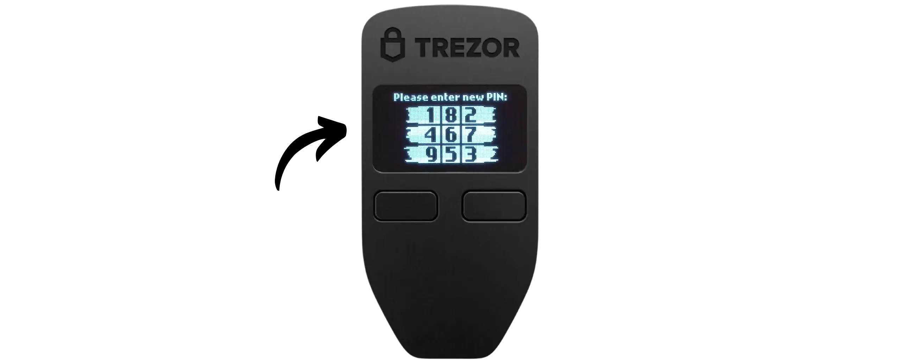

Setelah selesai, klik tombol "*Masukkan PIN*".

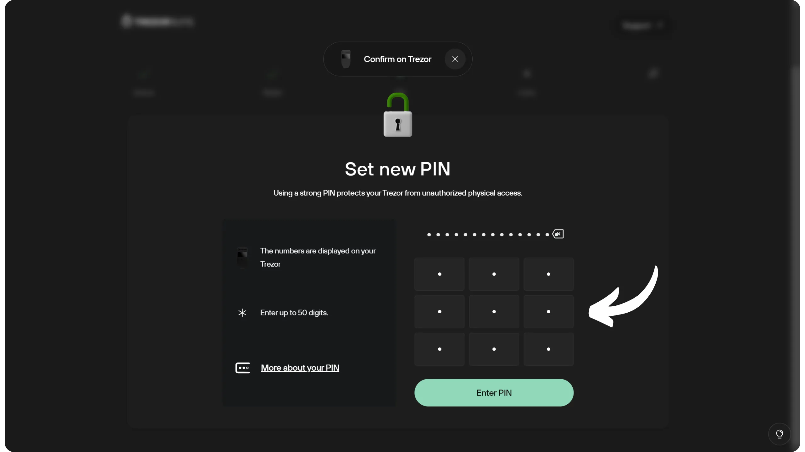

Tuliskan kembali PIN kamu untuk mengonfirmasi.

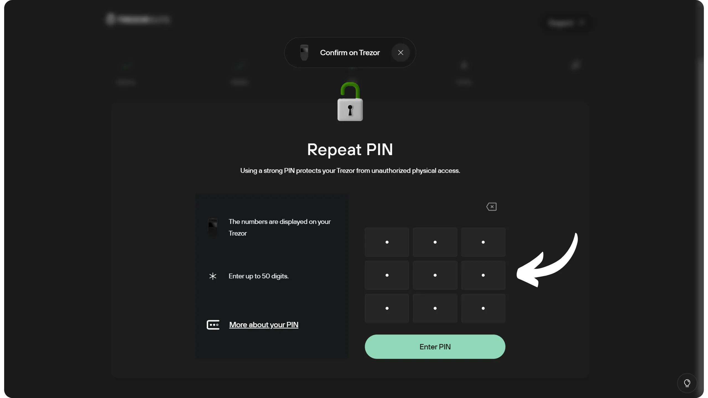

Pada Trezor Suite, klik tombol "*Selesaikan pengaturan*".

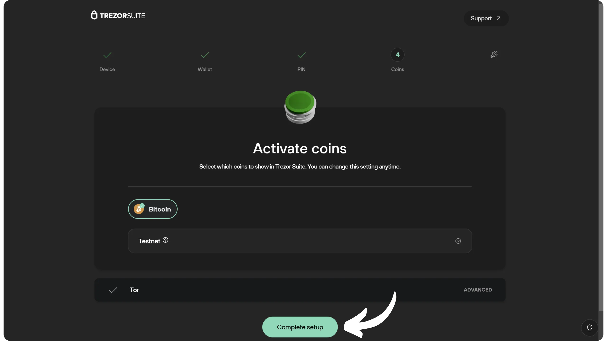

Konfigurasi Model One sekarang sudah selesai. Jika mau, kamu dapat mengubah nama dan halaman beranda Hardware Wallet.

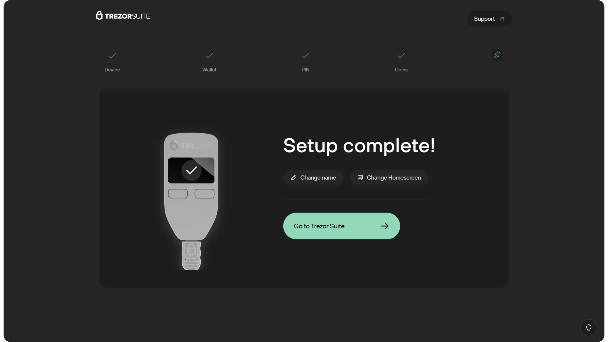

Kita nggak akan pakai Trezor Suite lagi, kecuali kalau kamu mau update firmware secara berkala atau menjalankan tes pemulihan. Sekarang kita akan pakai Sparrow untuk mengelola portofolio, karena software ini memang cocok khusus untuk Bitcoin.

## Menyiapkan portofolio di Sparrow Wallet

Mulai dengan mengunduh dan menginstal Sparrow Wallet [dari situs web resmi](https://sparrowwallet.com/) kalau kamu belum menginstalnya.

Setelah Sparrow terbuka, pastikan software ini terhubung ke node Bitcoin, yang ditandai dengan tanda centang di sudut kanan bawah antarmuka. Kalau kamu ada kendala saat menghubungkan Sparrow, aku sarankan kamu baca bagian awal tutorial ini:

https://planb.academy/tutorials/wallet/desktop/sparrow-c674e2ac-d46f-4c82-92a7-7d1b0e262f5d

Klik tab "*File*", lalu pilih "*New Wallet*".

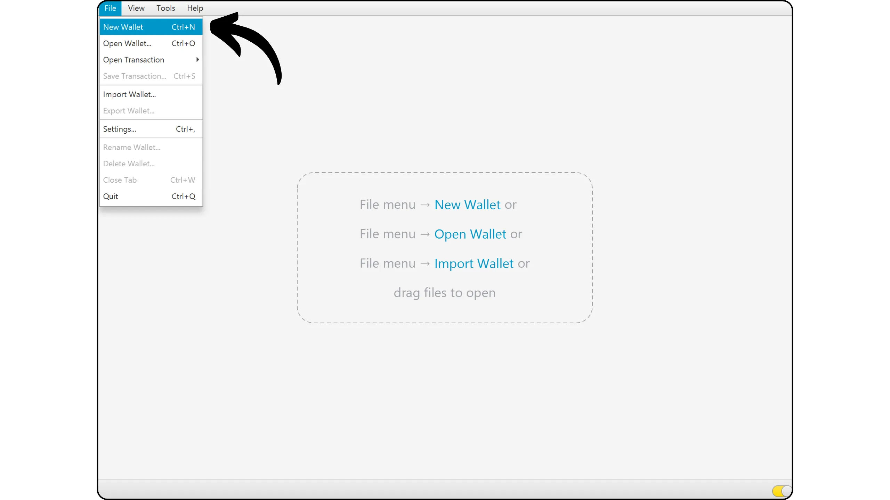

Beri nama portofolio, lalu klik "*Buat Wallet*".

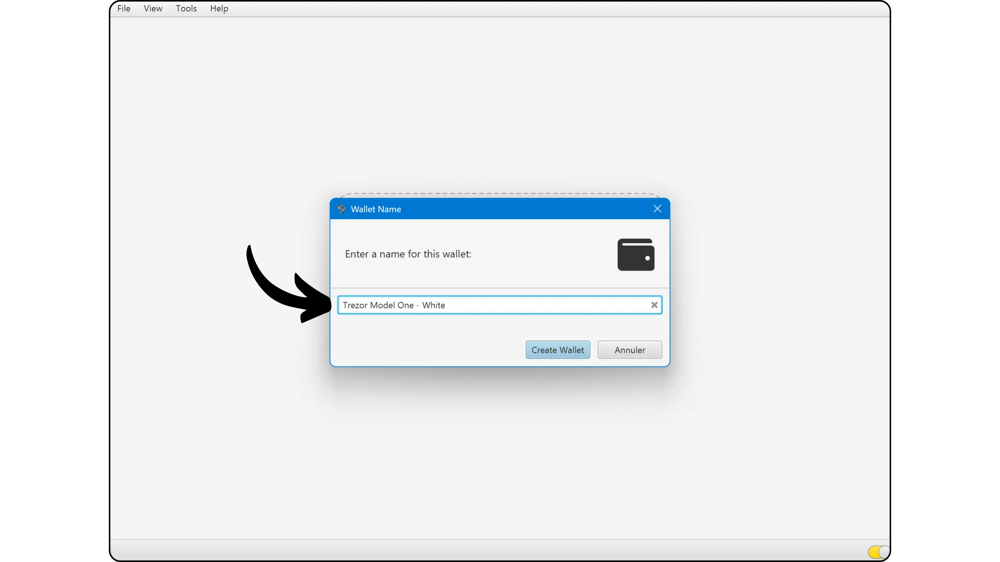

Pada menu drop-down "*Jenis Skrip*", pilih jenis skrip yang akan digunakan untuk mengamankan bitcoin kamy. Aku merekomendasikan "*Taproot*", atau jika tidak, "*Native SegWit*".

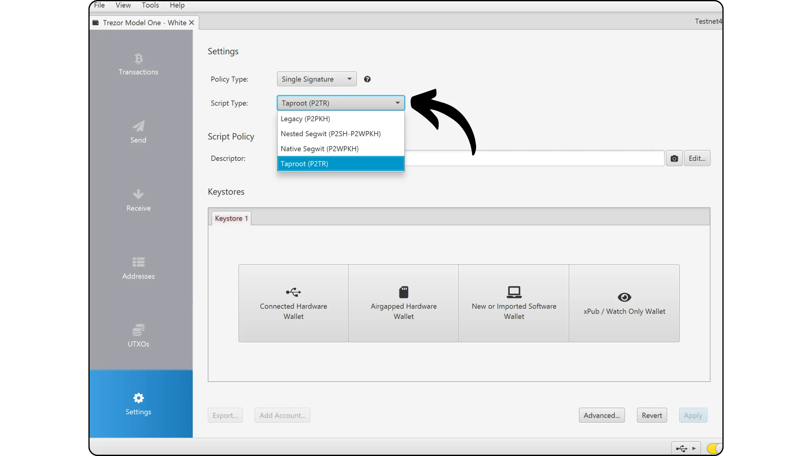

Klik pada tombol "*Terhubung Hardware Wallet*". Model One Anda tentu saja harus terhubung ke komputer.

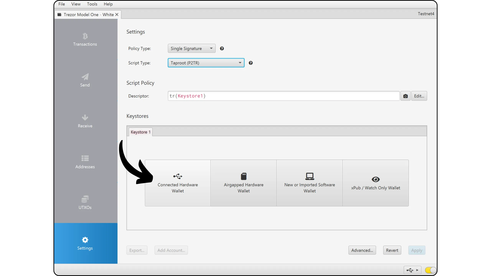

Klik tombol "*Pindai*". Model One kamu akan muncul di daftar.

Saat kamu menghubungkan Model One ke komputer dan Sparrow terbuka, kamu akan diminta untuk memasukkan passphrase BIP39 di Sparrow. Opsi lanjutan ini akan dibahas di tutorial berikutnya. Untuk sekarang, kamu cukup pilih "*Toggle passphrase Off*" supaya Trezor tidak meminta kamu memasukkan passphrase setiap kali perangkat dinyalakan.

https://planb.academy/tutorials/wallet/backup/trezor-passphrase-0474b5bf-496f-4f97-aefe-445368fdca42

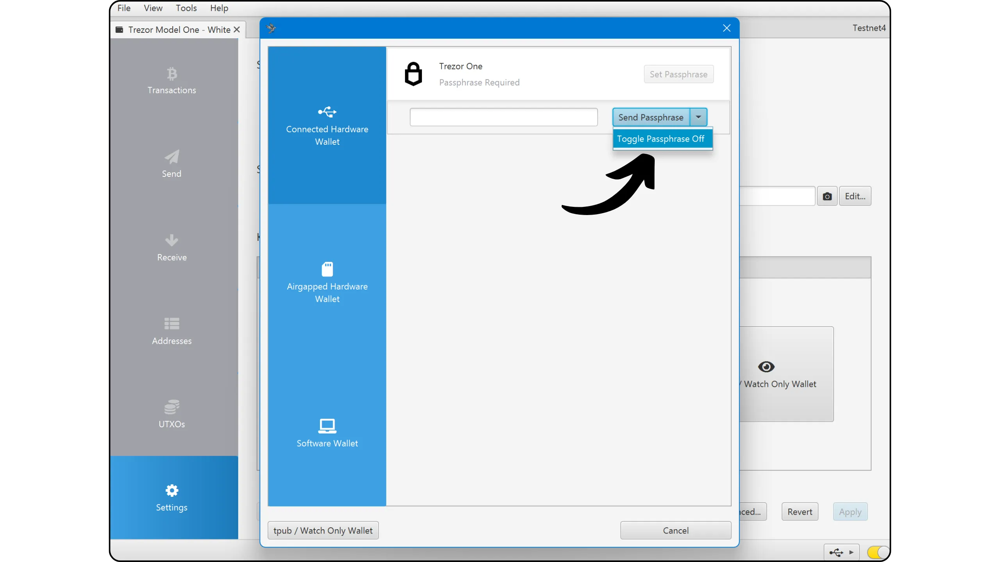

Klik "*Import Keystore*".

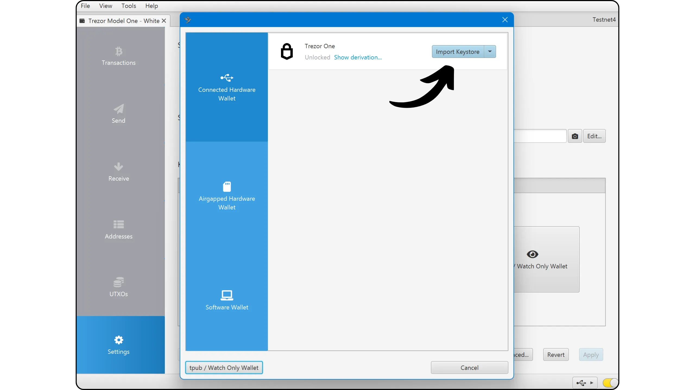

Sekarang kamu bisa melihat detail wallet kamu, termasuk extended public key dari akun pertama. Klik tombol "*Apply*" untuk menyelesaikan pembuatan wallet.

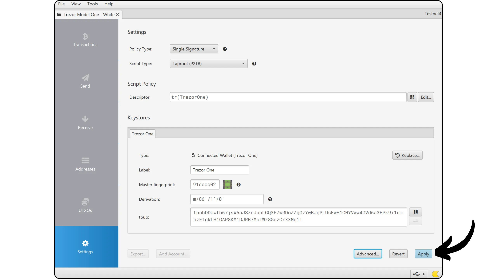

Pilih kata sandi yang kuat untuk mengamankan akses ke Sparrow Wallet. Kata sandi ini bakal menjaga akses ke data Sparrow, termasuk kunci publik, alamat, label, dan riwayat transaksi kamu supaya tidak bisa diakses orang yang tidak berwenang.

Aku sarankan kamu menyimpan kata sandi ini di password manager supaya tidak lupa.

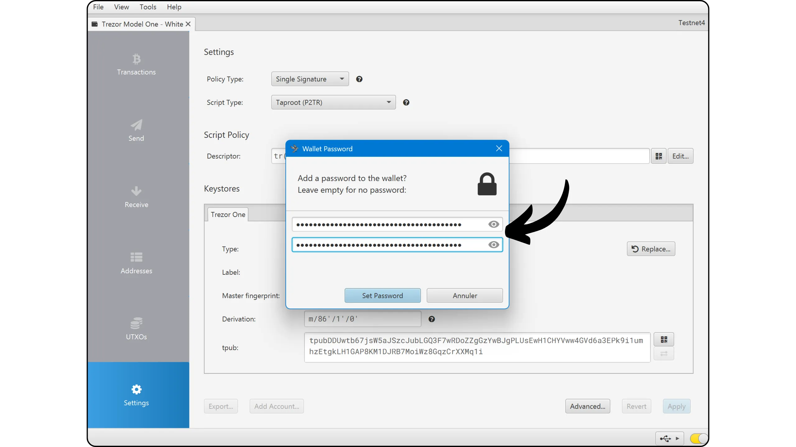

Dan sekarang, portofolio kamu sudah diimpor ke dalam Sparrow Wallet!

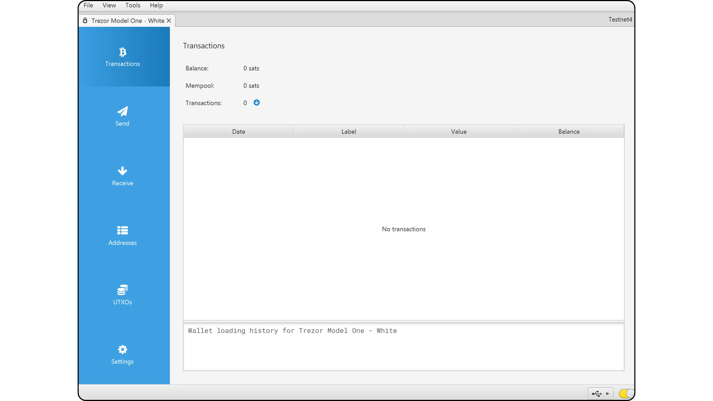

Sebelum kamu menerima bitcoin pertama di wallet, **aku sangat sarankan kamu lakukan tes pemulihan kosong dulu**. Catat beberapa informasi referensi, seperti xpub kamu, lalu reset Trezor Model One saat wallet masih kosong. Setelah itu, coba pulihkan wallet di Trezor pakai cadangan kertas yang sudah kamu buat. Cek apakah xpub yang muncul setelah pemulihan sama dengan yang sudah kamu catat sebelumnya. Kalau cocok, berarti cadangan kamu bisa diandalkan.

Untuk tahu lebih detail tentang cara melakukan tes pemulihan, kamu bisa baca tutorial ini:

https://planb.academy/tutorials/wallet/backup/recovery-test-5a75db51-a6a1-4338-a02a-164a8d91b895

## Cara menerima bitcoin dengan Trezor Model One

Pada Sparrow, klik tab "*Receive*".

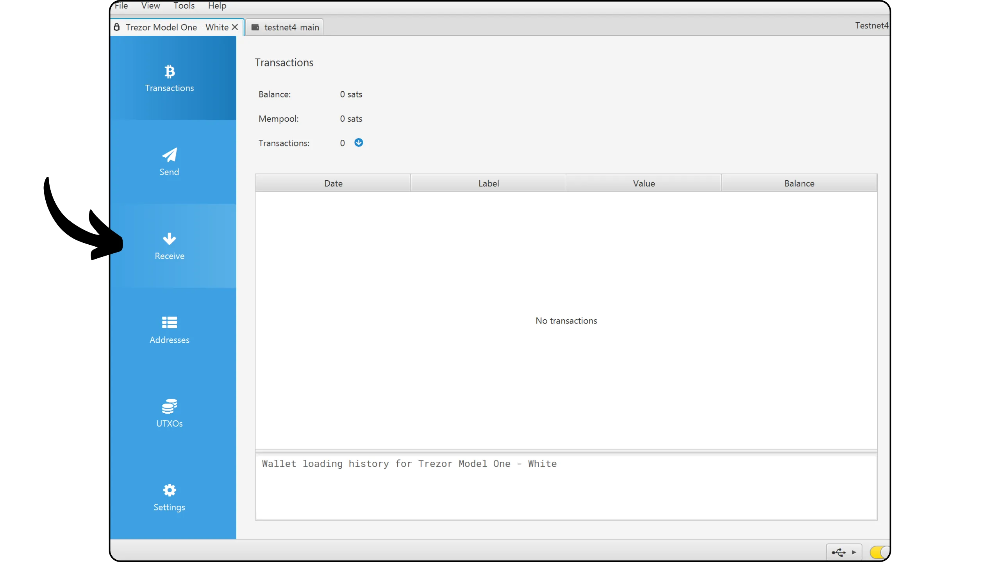

Sebelum kamu pakai alamat yang diusulkan Sparrow, cek dulu di layar Trezor kamu. Praktik ini memastikan alamat yang tampil di Sparrow tidak palsu, dan bahwa hardware wallet memang menyimpan private key yang dibutuhkan untuk membelanjakan bitcoin yang terikat dengan alamat itu. Ini membantu kamu menghindari beberapa jenis serangan.

Untuk melakukan pengecekan ini, klik tombol "*Display Address*".

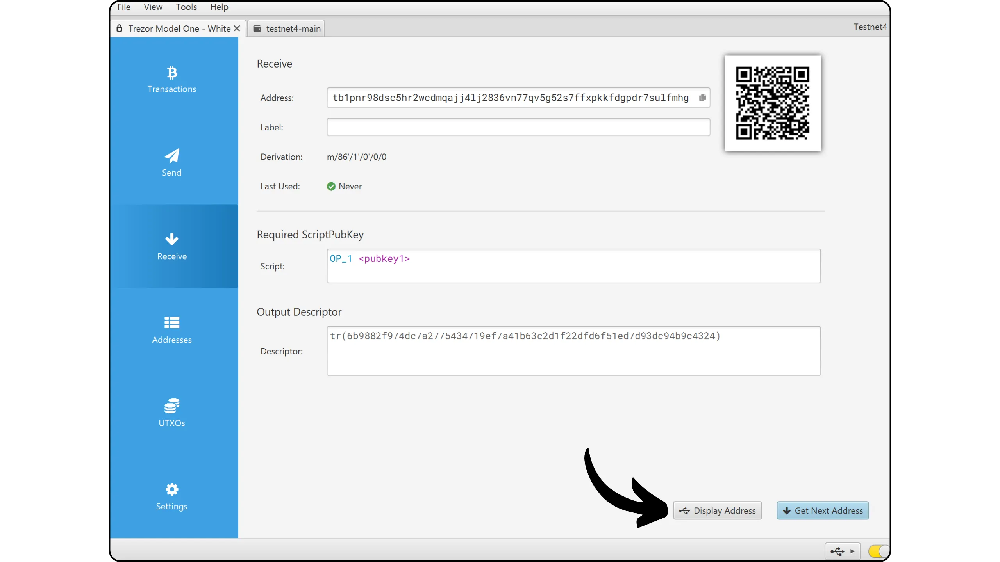

Periksa apakah alamat yang muncul di Trezor kamu sama dengan yang ada di Sparrow Wallet. Sebaiknya kamu juga cek ini sebelum mengirimkan alamat ke pengirim, supaya kamu yakin alamat itu valid dan tidak dimodifikasi.

Kalau sudah sesuai, kamu bisa tekan tombol kanan untuk mengonfirmasi.

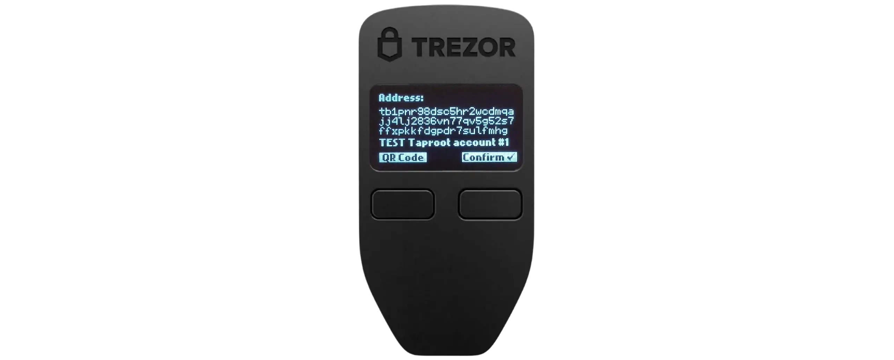

Kamu juga bisa menambahkan "*Label*" untuk menjelaskan sumber bitcoin yang diamankan dengan alamat ini. Ini praktik yang bagus karena membantu kamu mengelola UTXO dengan lebih rapi dan terorganisir.

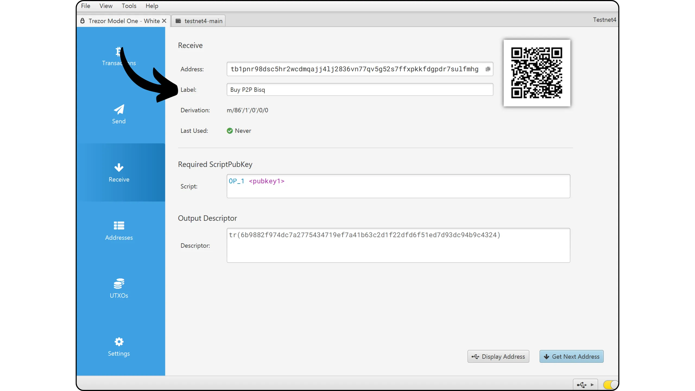

Kamu kemudian dapat menggunakan Address ini untuk menerima bitcoin.

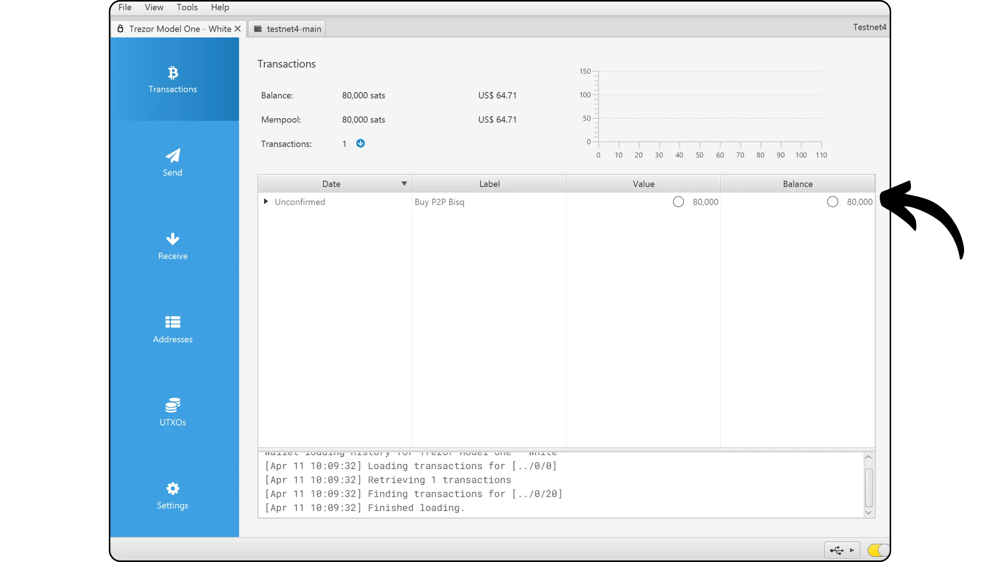

## Cara mengirim bitcoin dengan Trezor Model One

Sekarang setelah kamu menerima sats pertama di wallet yang diamankan Model One, kamu juga bisa membelanjakannya. Hubungkan Trezor ke komputer, buka Sparrow Wallet, lalu masuk ke tab "*Kirim*" untuk membuat transaksi baru.

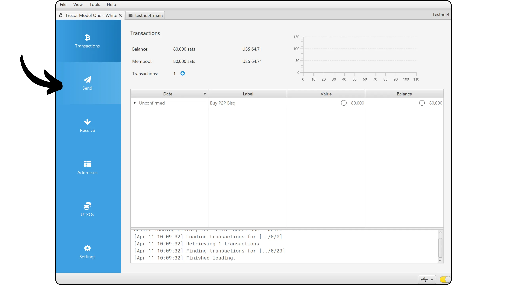

Kalau kamu mau pakai *Coin Control*, yaitu memilih UTXO secara spesifik yang ingin dipakai dalam transaksi, buka tab "*UTXOs*". Pilih UTXO yang ingin kamu gunakan, lalu klik "*Kirim Terpilih*". Kamu akan diarahkan ke layar yang sama di tab "*Kirim*", tapi dengan UTXO yang sudah dipilih untuk transaksi itu.

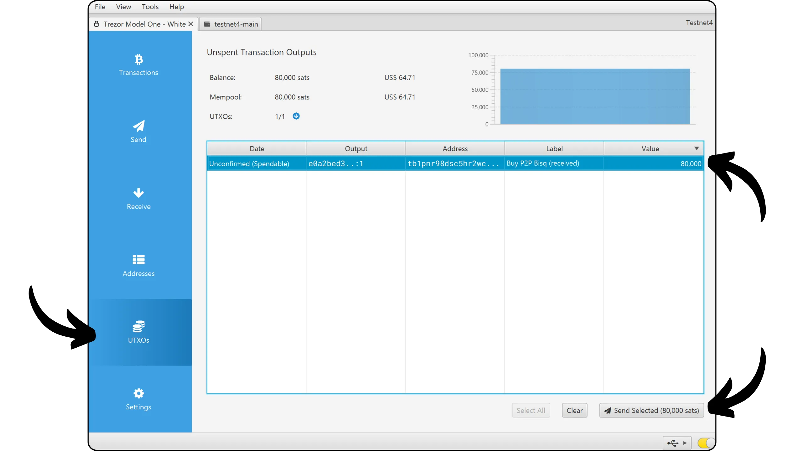

Masukkan alamat tujuan Address. Kamu juga dapat memasukkan beberapa alamat dengan mengeklik tombol "*+ Tambah*".

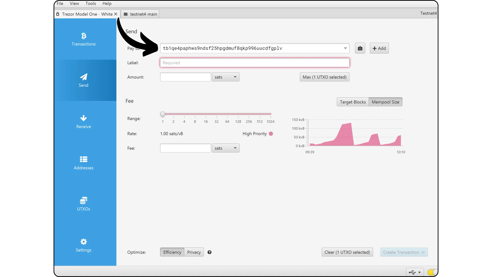

Tuliskan "*Label*" untuk mengingat tujuan pengeluaran ini.

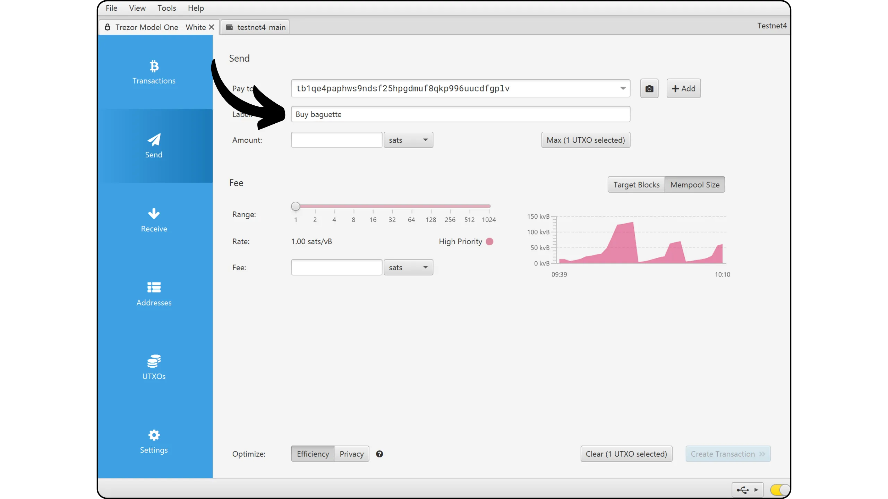

Pilih jumlah yang akan dikirim ke Address ini.

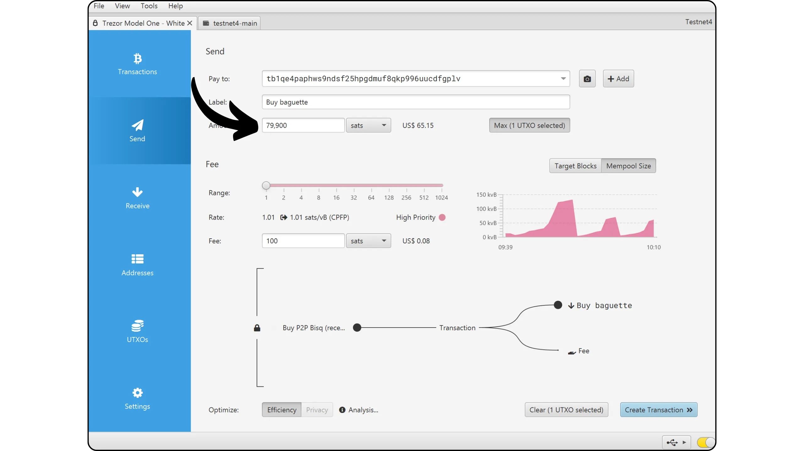

Sesuaikan tarif biaya transaksi kamu sesuai dengan pasar saat ini. Sebagai contoh, kamu dapat menggunakan [Mempool.space](https://Mempool.space/) untuk memilih tarif biaya yang sesuai.

Pastikan semua parameter transaksi kamu sudah benar, lalu klik "*Buat Transaksi*".

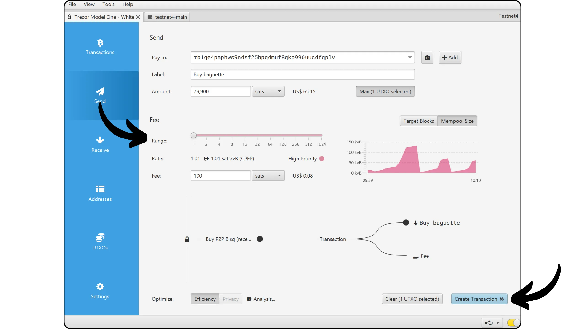

Jika semuanya sudah sesuai dengan keinginan kamu, klik "*Finalisasi Transaksi untuk Penandatanganan*".

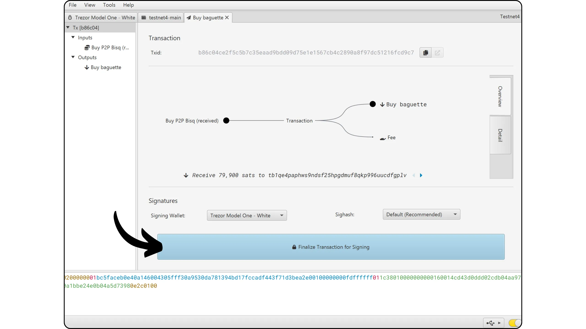

Klik "*Tanda Tangan*".

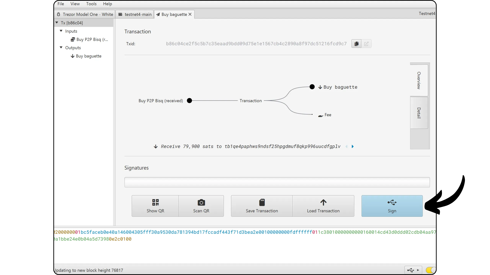

Klik "*Sign*" di samping Trezor Model One kamu.

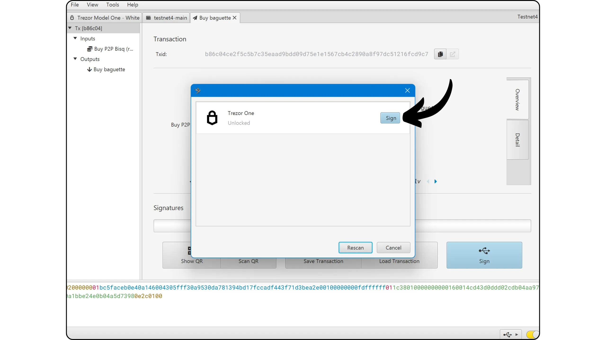

Periksa parameter transaksi di layar hardware wallet kamu, termasuk alamat penerima, jumlah yang dikirim, dan biaya. Setelah transaksi diverifikasi di Trezor, tekan tombol kanan untuk menandatanganinya.

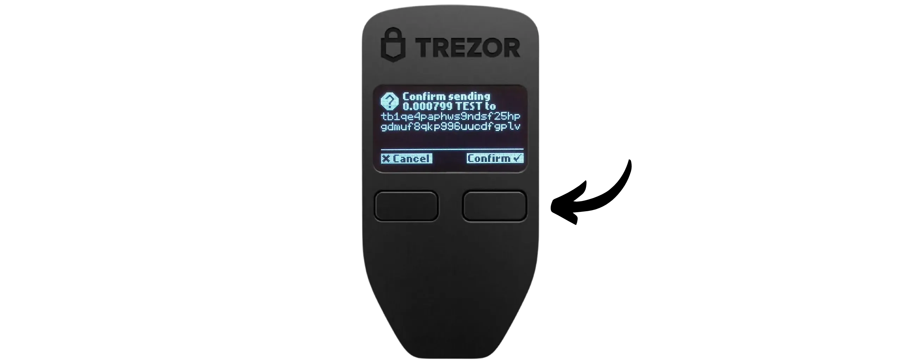

Transaksi kamu sekarang sudah ditandatangani. Cek sekali lagi untuk memastikan semuanya sudah benar, lalu klik "*Broadcast Transaction*" untuk menyiarkannya ke jaringan Bitcoin.

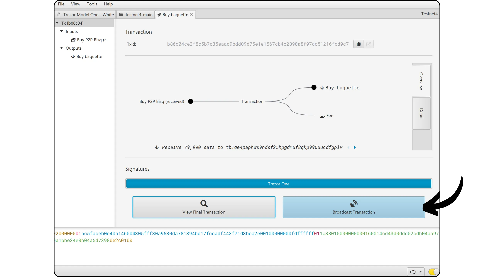

Kamu bisa menemukannya di tab "*Transactions*" pada Sparrow Wallet.

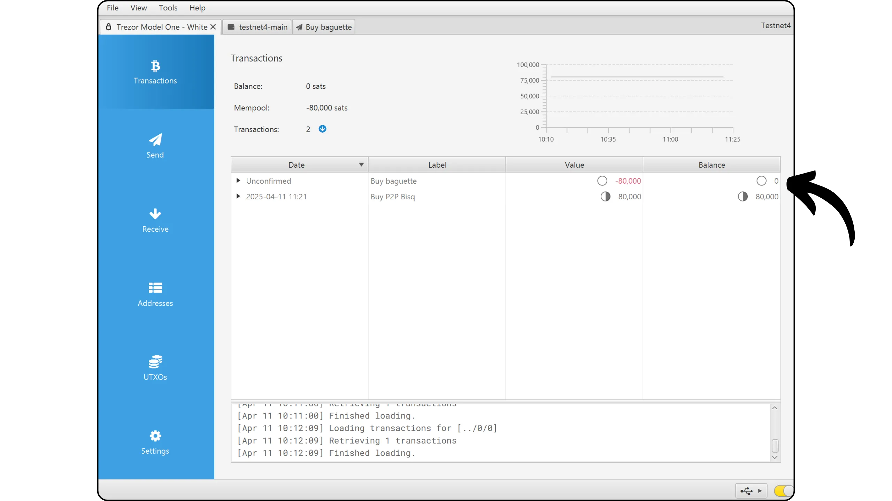

Selamat, kamu sekarang sudah menguasai penggunaan dasar Trezor Model One dengan Sparrow Wallet! Kalau kamu mau belajar lebih jauh, aku rekomendasikan tutorial lengkap tentang penggunaan Trezor hardware wallet dengan passphrase BIP39 untuk memperkuat keamanan kamu:

https://planb.academy/tutorials/wallet/backup/trezor-passphrase-0474b5bf-496f-4f97-aefe-445368fdca42

Kalau kamu merasa tutorial ini bermanfaat, aku akan sangat berterima kasih kalau kamu mau kasih jempol hijau di bawah ini. Jangan ragu juga untuk membagikan artikel ini ke jejaring sosial kamu. Terima kasih banyak!
