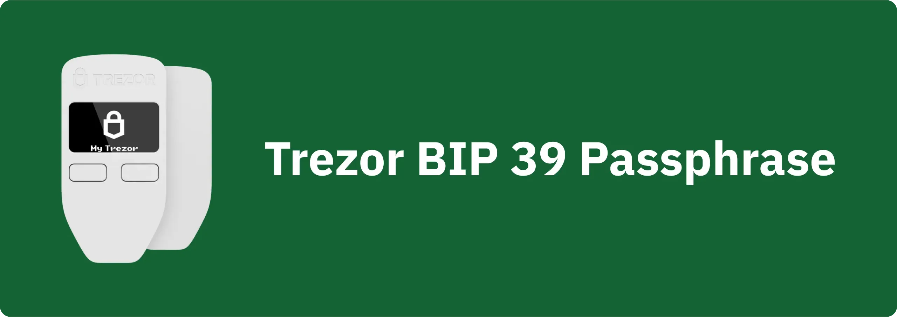

Passphrase BIP39 adalah kata sandi opsional yang digabungkan dengan seedphrase, berfungsi sebagai lapisan keamanan tambahan untuk wallet Bitcoin yang bersifat deterministik dan hierarkis. Dalam tutorial ini, kita bakal bareng-bareng belajar cara mengatur passphrase di Bitcoin Wallet dengan aman pakai Trezor (Safe 3, Safe 5, dan Model One).

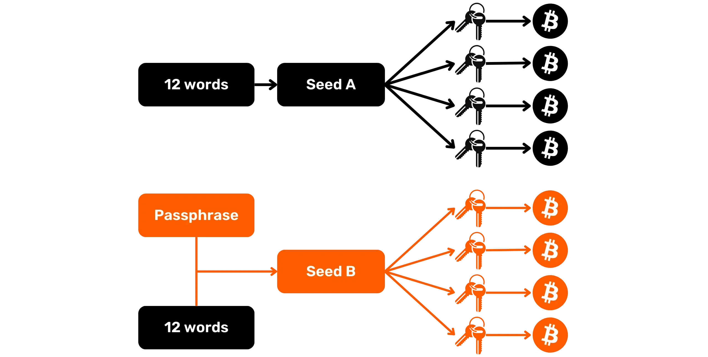

Sebelum mulai tutorial ini, kalau kamu belum terbiasa dengan konsep passphrase, cara kerjanya, dan dampaknya terhadap Bitcoin Wallet kamu, aku sangat nyaranin buat baca dulu artikel teori lain di mana aku jelasin semuanya. Ini penting banget, karena pakai passphrase tanpa benar-benar paham cara kerjanya bisa bikin bitcoin kamu dalam bahaya.

https://planb.network/tutorials/wallet/backup/passphrase-a26a0220-806c-44b4-af14-bafdeb1adce7

Passphrase di Trezor ditangani dengan cara klasik kalau kamu memilih standar BIP39 saat konfigurasi (dan ini yang aku saranin kalau kamu nggak butuh Multi-share Backup). Keunggulan Trezor adalah kamu bisa masukin passphrase langsung lewat Hardware Wallet, atau lewat keyboard komputer dengan aplikasi Trezor Suite. Pilihan kedua ini jauh lebih nggak aman, karena komputer punya permukaan serangan yang jauh lebih luas dibanding Hardware Wallet. Tapi, ngetik passphrase rumit biasanya memang lebih cepat di keyboard biasa ketimbang di Hardware Wallet, yang kadang bikin orang lebih semangat pakai kata sandi kuat. Jadi, tetap lebih baik pakai passphrase—meskipun harus diketik di komputer—daripada nggak pakai sama sekali. Meski begitu, kamu harus tetap waspada karena cara ini ningkatin risiko serangan brute force.

Opsi-opsi ini nggak tersedia di semua software manajemen wallet yang kompatibel sama Trezor. Contohnya, buat Model One, passphrase masih bisa dimasukin lewat keyboard di Sparrow Wallet. Tapi buat Model T, Safe 3, dan Safe 5, kamu harus pakai Trezor Suite atau masukin langsung di Hardware Wallet, soalnya opsi masukin lewat Sparrow udah dinonaktifin sama HWI beberapa tahun lalu.

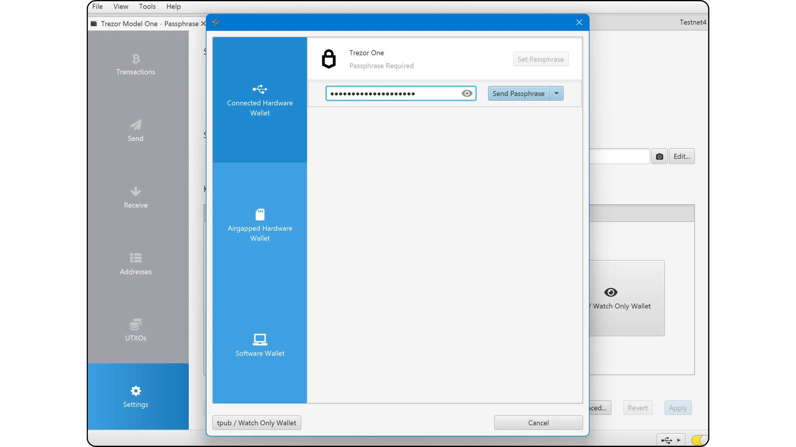

Di Trezor Suite, kamu punya dua cara buat ngatur permintaan passphrase. Kamu bisa aktifin opsi "*passphrase*" di tab "*Perangkat*". Kalau ini diaktifin, Trezor Suite dan semua software manajemen wallet lainnya bakal otomatis minta kamu masukin passphrase setiap kali mulai. Kalau kamu lebih milih pendekatan yang lebih fleksibel, biarin aja pengaturannya di "*Standard*". Dalam mode ini, kamu harus masuk ke menu Hardware Wallet secara manual di pojok kiri atas, lalu klik tombol "*+ passphrase*" setiap kali kamu mulai.

Sebelum mulai tutorial ini, pastiin dulu kamu udah inisialisasi Trezor kamu dan bikin seedphrase. Kalau belum, dan Trezor kamu masih baru, ikuti dulu tutorial khusus sesuai model yang ada di Plan ₿ Network. Setelah langkah itu kelar, baru deh kamu balik lagi ke tutorial ini.

https://planb.network/tutorials/wallet/hardware/trezor-safe-5-4413308a-a1b5-4ba4-bc49-72ae661cc4e0

https://planb.network/tutorials/wallet/hardware/trezor-safe-3-51d0d669-5d23-47c2-beb6-cc6fa0fb0ea0

https://planb.network/tutorials/wallet/hardware/trezor-model-one-5c250c49-ce3b-4c63-bd05-4600d7c11a02

## Menambahkan passphrase ke Safe 3 atau Safe 5

Setelah kamu bikin Wallet, nyimpen seedphrase, dan ngatur PIN, kamu bakal dibawa ke menu utama Trezor Suite. Di pojok kiri atas, bakal muncul jendela yang minta kamu buat ngaktifin passphrase BIP39.

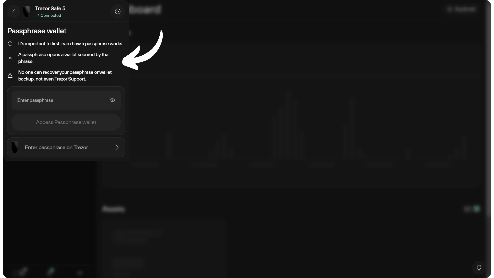

Kalau jendela itu nggak muncul, kamu perlu ngaktifin opsi "passphrase" secara manual di tab pengaturan "Device".

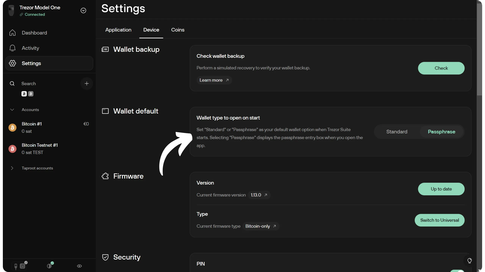

Jendela ini bakal minta kamu masukin passphrase. Pilih passphrase yang kuat dan langsung bikin cadangan fisiknya, misalnya ditulis di kertas atau diukir di logam. Di contoh ini, aku pakai passphrase: fH3&kL@9mP#2sD5qR!82. Ini cuma contoh aja; aku saranin kamu pilih passphrase yang lebih panjang. Idealnya antara 30–40 karakter, mirip kayak password kuat pada umumnya.

Tentu aja, jangan pernah bagiin passphrase kamu di Internet kayak yang aku lakuin di tutorial ini. Contoh wallet ini cuma dipakai di Testnet dan bakal dihapus setelah tutorial selesai.

Kalau kamu mau rekomendasi lebih detail tentang cara milih passphrase, aku saranin baca artikel lain ini:

https://planb.network/tutorials/wallet/backup/passphrase-a26a0220-806c-44b4-af14-bafdeb1adce7

Kalau kamu mau masukin passphrase lewat keyboard komputer, ketik aja di kolom yang tersedia, lalu klik "*Akses passphrase Wallet*".

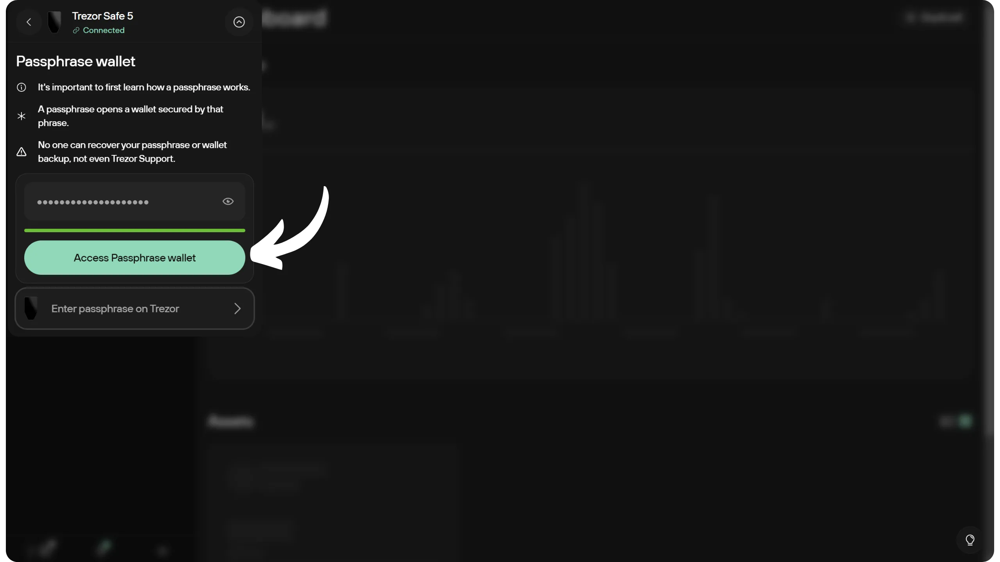

Hardware Wallet kamu kemudian bakal nampilin passphrase yang udah kamu masukin. Pastikan cadangan fisik kamu (di kertas atau logam) udah benar-benar sesuai sebelum kamu klik layar buat lanjut.

Ini bakal ngasih kamu akses ke wallet kamu yang udah dilindungi passphrase.

Kalau kamu lebih milih ningkatin keamanan dengan masukin passphrase langsung di Trezor, saat diminta tinggal klik "*Masukkan passphrase pada Trezor*".

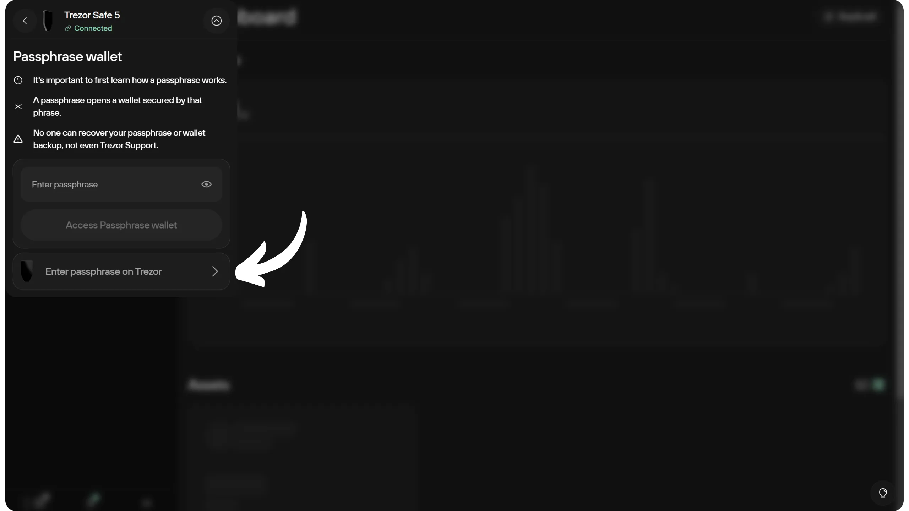

Keyboard T9 bakal muncul di Trezor kamu, dan dari situ kamu bisa masukin passphrase. Setelah selesai ngetik, klik tanda centang hijau buat nerapin passphrase ke wallet kamu.

Setelah itu, kamu bakal punya akses ke wallet yang aman dengan passphrase.

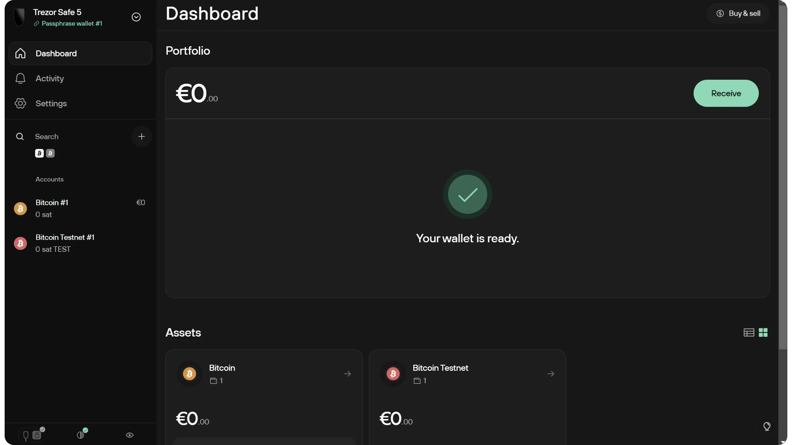

Kalau pakai Sparrow Wallet, prosedurnya mirip, tapi khusus untuk Model T, Safe 3, dan Safe 5, passphrase wajib dimasukin lewat Hardware Wallet, bukan lewat keyboard komputer.

Setiap kali Sparrow Wallet butuh akses ke Trezor kamu, dan passphrase belum diterapin sejak terakhir kali start-up, kamu harus masukin passphrase itu pakai keyboard T9.

## Menambahkan passphrase ke Model Satu

Di Model One, penggunaan passphrase BIP39 hampir jadi hal wajib. Soalnya perangkat ini nggak punya Secure Element, jadi relatif gampang buat nyedot informasi sensitif. Artinya, perangkat ini nggak tahan sama serangan fisik. Tapi karena passphrase nggak pernah disimpen di perangkat setelah dimatikan, pakai passphrase yang kuat (susah dibobol) bisa ngelindungin kamu dari sebagian besar serangan fisik yang dikenal di model ini.

Di Model One juga nggak ada opsi buat masukin passphrase langsung di Hardware Wallet. Kamu harus masukin lewat keyboard komputer.

Setelah kamu bikin Wallet, nyimpen seedphrase, dan ngatur PIN, kamu bakal dibawa ke menu utama Trezor Suite. Di pojok kiri atas, bakal muncul jendela yang ngajak kamu buat ngaktifin passphrase BIP39.

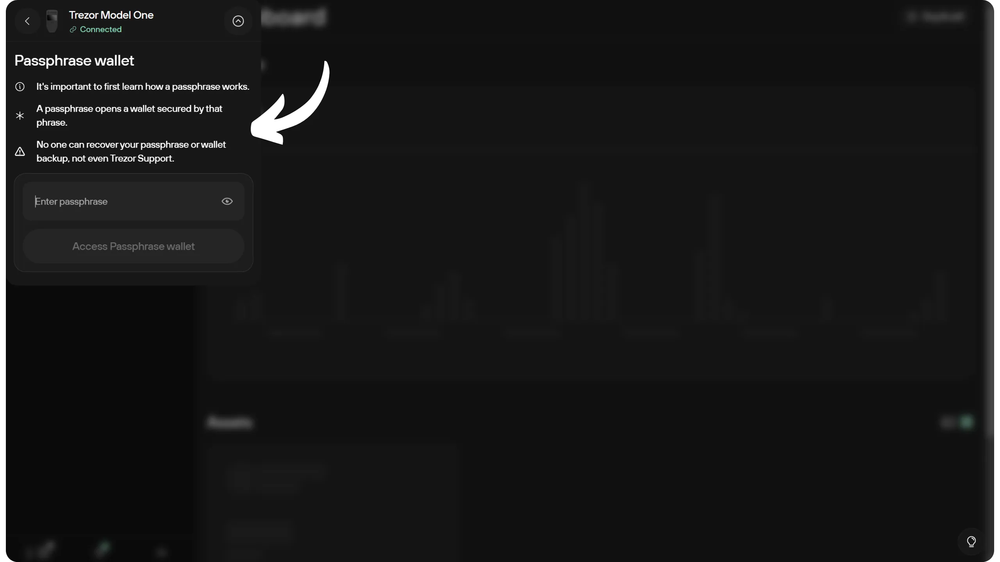

Kalau jendela itu nggak muncul, kamu perlu ngaktifin opsi "*passphrase*" di tab "*Device*" pada menu pengaturan.

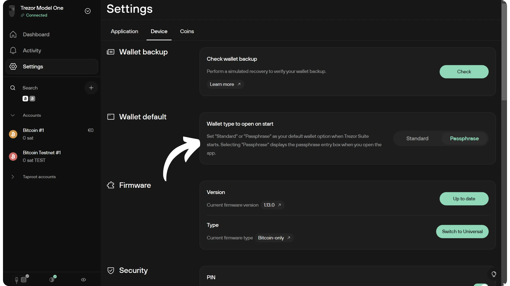

Jendela ini bakal minta kamu masukin passphrase. Pilih passphrase yang kuat dan langsung bikin cadangan fisiknya, misalnya ditulis di kertas atau diukir di logam. Di contoh ini, aku pakai passphrase: fH3&kL@9mP#2sD5qR!82. Ini cuma contoh aja; aku saranin kamu pilih passphrase yang lebih panjang, idealnya 30–40 karakter, biar setara sama password kuat yang bagus.

Kalau kamu mau rekomendasi lebih detail soal cara milih passphrase, aku saranin kamu baca artikel lain ini:

https://planb.network/tutorials/wallet/backup/passphrase-a26a0220-806c-44b4-af14-bafdeb1adce7

Masukin passphrase kamu ke kolom yang tersedia, lalu klik tombol "*Akses passphrase Wallet*".

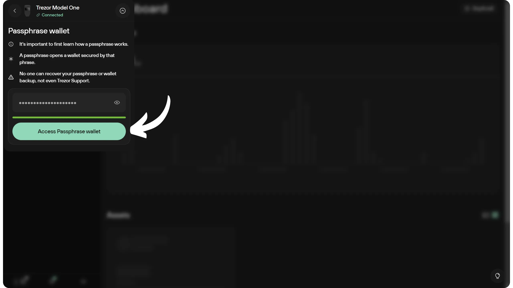

Hardware Wallet kamu bakal nampilin passphrase kamu. Pastikan datanya cocok sama cadangan fisik kamu (kertas atau logam), lalu klik tombol kanan buat lanjut.

Ini bakal ngebawa kamu ke wallet kamu yang udah dilindungi passphrase.

Kalau mau pakai Sparrow Wallet setelahnya, prosedurnya tetap sama. Setiap kali Sparrow butuh akses ke Hardware Wallet kamu, dan passphrase belum dimasukin sejak terakhir kali perangkat dinyalain, kamu harus masukin lagi.

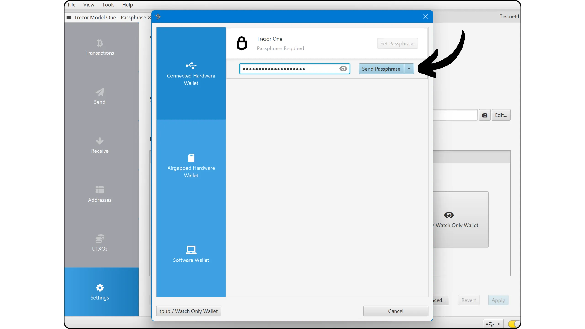

Selamat, sekarang kamu udah siap pakai passphrase BIP39 di hardware wallet Trezor. Kalau kamu mau ningkatin keamanan wallet kamu ke level berikutnya, cek juga tutorial tentang sistem cadangan Multi-share Trezor (Shamir’s Secret Sharing).

https://planb.network/tutorials/wallet/backup/trezor-shamir-backup-7f98b593-face-48fb-a643-0e811b87c94e

Kalau kamu ngerasa tutorial ini bermanfaat, aku bakal seneng banget kalau kamu kasih jempol hijau di bawah. Jangan ragu juga buat share artikel ini di sosial media kamu. Makasih banyak!
