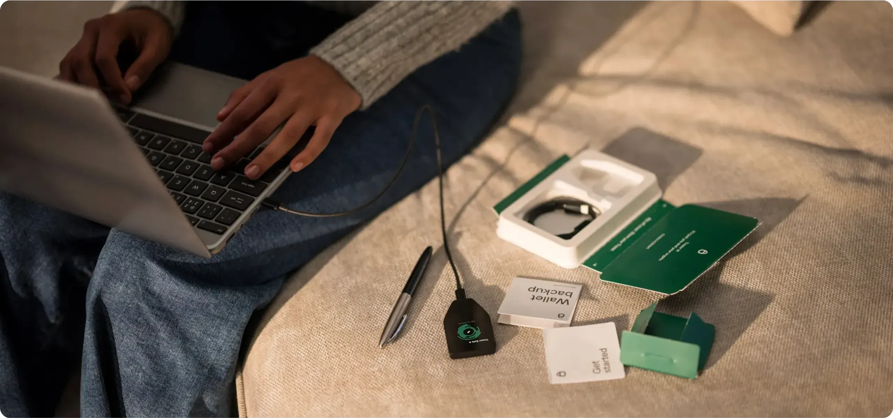

*Kredit gambar: [Trezor.io](https://trezor.io/)*

Trezor Safe 5 adalah Hardware Wallet generasi terbaru yang dirancang oleh SatoshiLabs dan diluncurkan pada tahun 2024. Diposisikan sebagai versi high-end dari Safe 3, dengan fokus pada ergonomi dan daya tahan. Perangkat ini membawa peningkatan keamanan yang sama seperti pendahulunya, Safe 3, dan menawarkan pembaruan signifikan dibandingkan Model One dan Model T.

Dengan harga €169, Safe 5 masuk ke kategori Hardware Wallet kelas atas, bersaing dengan model seperti Coldcard, Ledger Nano X dan Flex, Jade Plus, Passport, dan Bitbox.

Safe 5 dibekali layar sentuh berwarna berukuran 1,54 inci yang dilindungi oleh *Gorilla Glass 3*, sehingga lebih tahan terhadap guncangan dan goresan. Perangkat ini juga dilengkapi mesin haptic *Trezor Touch* yang memberikan getaran halus saat disentuh. Seperti Safe 3, perangkat ini sudah menggunakan Secure Element dan beroperasi melalui koneksi USB-C, serta memiliki tambahan port Micro SD.

Perbedaan utama antara Safe 3 dan Safe 5 terletak pada kualitas perangkatnya, bukan pada aspek keamanan. Safe 5 secara signifikan meningkatkan pengalaman pengguna dengan pengoperasian yang lebih mulus dan layar yang lebih nyaman. Dari sisi keamanan, keduanya berada pada level yang setara.

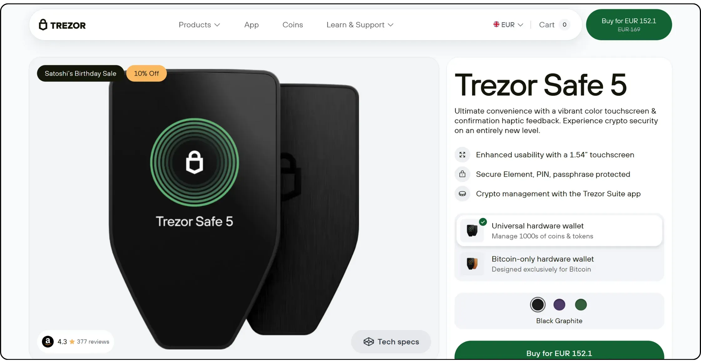

Safe 5 punya semua fitur penting yang kamu harapkan dari Hardware Wallet yang bagus, termasuk integrasi passphrase BIP39 yang sangat baik. Namun, perangkat ini belum mendukung Miniscript.

Model ini sangat cocok untuk pengguna pemula dan menengah. Di sisi lain, mungkin belum memenuhi semua ekspektasi pengguna tingkat lanjut yang mencari fitur lebih spesifik seperti yang tersedia pada perangkat seperti Coldcard. Meski begitu, kalau kamu tidak membutuhkan opsi tingkat lanjut tersebut, Trezor Safe 5 bisa jadi pilihan yang sangat tepat.

## Model keamanan Trezor Safe 5

Seperti Safe 3, Trezor Safe 5 sudah dilengkapi **Secure Element** bersertifikasi EAL6+, sebuah peningkatan signifikan dibanding model sebelumnya seperti Model One dan Model T. Chip yang digunakan adalah OPTIGA Trust M V3. Chip ini tidak menyimpan seedphrase secara langsung, tetapi berfungsi sebagai komponen kriptografi untuk mengamankan akses ke seedphrase. Secure Element menyimpan rahasia yang hanya bisa diakses setelah kamu memasukkan PIN dengan benar. Rahasia ini kemudian digunakan untuk mendekripsi seedphrase yang disimpan dalam bentuk terenkripsi di memori utama perangkat.

Sistem keamanan hibrida ini memberikan perlindungan fisik yang lebih baik, terutama terhadap serangan ekstraksi atau analisis invasif, yang sebelumnya menjadi titik lemah pada Model One, khususnya dalam manajemen PIN. Kerentanan tersebut kini dapat diminimalkan berkat penggunaan Secure Element. Model ini juga tetap mempertahankan arsitektur perangkat lunak sumber terbuka. Kode yang mengelola pembuatan dan penggunaan kunci privat tetap bisa diakses dan diverifikasi sepenuhnya. Chip OPTIGA hanya menangani kode PIN, yang berada di luar manajemen kunci pada Bitcoin Wallet. Fungsinya terbatas pada melepaskan rahasia yang digunakan untuk mendekripsi seedphrase. Selain itu, OPTIGA Trust M V3 menggunakan lisensi yang relatif bebas, sehingga memungkinkan SatoshiLabs mempublikasikan potensi kerentanan tanpa terikat NDA.

Model keamanan ini bisa dibilang sebagai salah satu kompromi terbaik yang tersedia di pasaran saat ini. Pendekatan ini menggabungkan keunggulan Secure Element dengan transparansi perangkat lunak sumber terbuka. Sebelumnya, pengguna harus memilih antara keamanan fisik berbasis chip atau transparansi open-source. Dengan Trezor Safe, kamu bisa mendapatkan keduanya.

Dalam tutorial ini, kamu akan mempelajari cara mengonfigurasi dan menggunakan Trezor Safe 5 dengan aman.

## Membongkar Kotak Brankas Trezor Safe 5

Saat kamu menerima Safe 5, pastikan kotak dan seal dalam kondisi utuh untuk memastikan paket belum pernah dibuka. Pemeriksaan perangkat lunak terhadap keaslian dan integritas perangkat juga akan dilakukan ketika perangkat dipasang nanti.

Isi kotak meliputi:

- Trezor Safe 5;
- Kantung berisi kartu untuk mencatat seedphrase, stiker, dan instruksi mnemonic;
- Kabel USB-C ke USB-C.

Saat pertama kali dibuka, Trezor Safe 5 harus masih dilapisi plastik pelindung, dan port USB-C diamankan dengan seal hologram. Pastikan semuanya masih terpasang dengan baik.

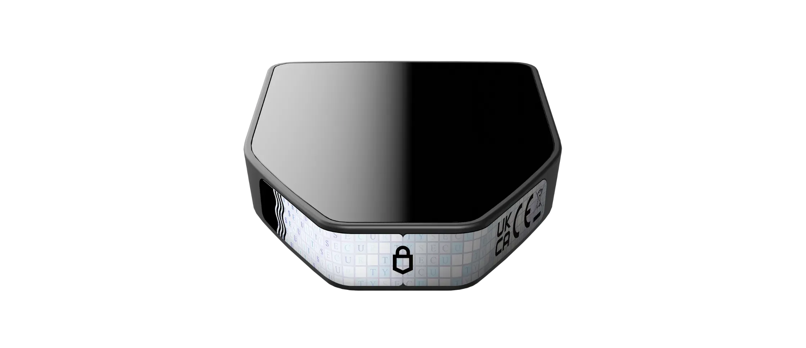

Navigasi pada perangkat ini cukup intuitif:

- Sentuh bagian bawah layar untuk bergerak maju;
- Geser ke bawah untuk kembali ;
- Tekan dan tahan layar untuk mengonfirmasi operasi.

## Prasyarat

Untuk tutorial ini, aku akan menunjukkanmu bagaimana cara menggunakan Trezor Safe 5 dengan [perangkat lunak manajemen portofolio Sparrow Wallet](https://sparrowwallet.com/download/). Jika kamu belum menginstal perangkat lunak ini, silakan lakukan sekarang. Jika kamu membutuhkan bantuan, kami juga memiliki tutorial terperinci tentang cara mengonfigurasi Sparrow Wallet:

https://planb.academy/tutorials/wallet/desktop/sparrow-c674e2ac-d46f-4c82-92a7-7d1b0e262f5d

Kamu juga memerlukan perangkat lunak Trezor Suite untuk mengonfigurasi Safe 5, memeriksa keasliannya, dan menginstal firmware. Kita hanya akan menggunakan perangkat lunak ini untuk tahap tersebut saja, dan setelahnya hanya diperlukan saat ada pembaruan firmware. Untuk pengelolaan Wallet sehari-hari, kita akan menggunakan Sparrow Wallet secara eksklusif, karena sudah dioptimalkan untuk Bitcoin dan tetap mudah digunakan, bahkan untuk pemula. Sparrow hanya mendukung Bitcoin, bukan altcoin.

[Unduh Trezor Suite dari situs web resmi](https://trezor.io/trezor-suite)

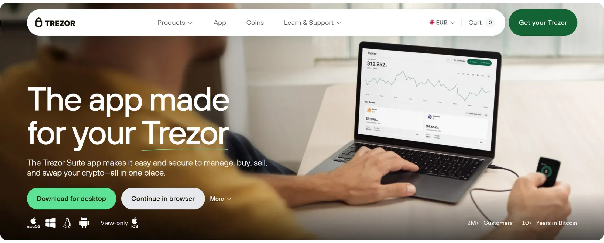

Untuk kedua program ini, aku sangat menyarankan agar kamu memverifikasi keasliannya dengan GnuPG dan memastikan integritasnya melalui hash sebelum menginstalnya di komputermu. Kalau kamu belum tahu caranya, kamu bisa mengikuti tutorial berikut ini:

https://planb.academy/tutorials/computer-security/data/integrity-authenticity-21d0420a-be02-4663-94a3-8d487f23becc

## Memulai Trezor Safe 5

Hubungkan Safe 5 ke komputer kamu yang sudah terinstal Trezor Suite dan Sparrow Wallet.

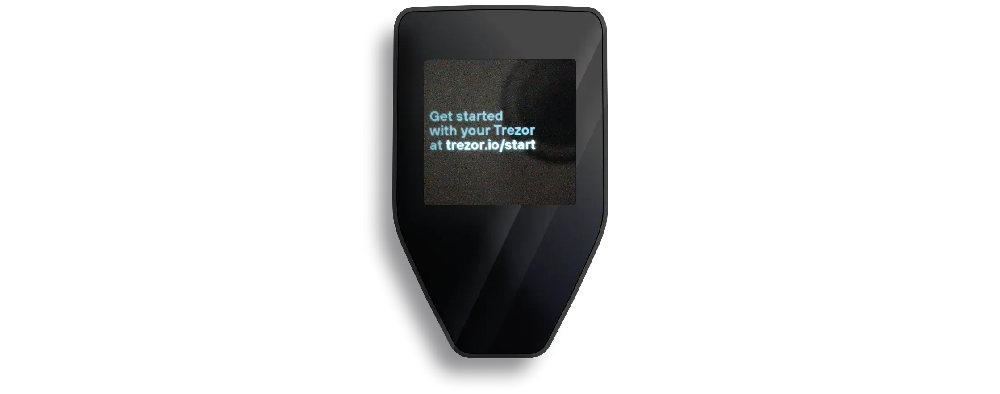

Buka Trezor Suite, lalu klik "*Setup my Trezor*".

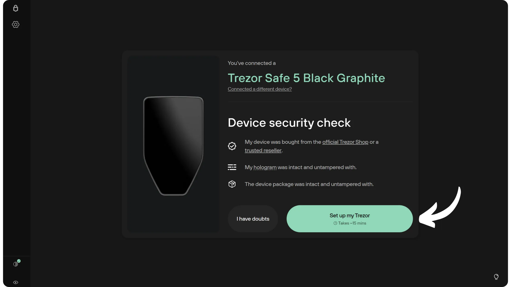

Pilih "*Firmware khusus Bitcoin*", lalu klik "*Instal Bitcoin saja*".

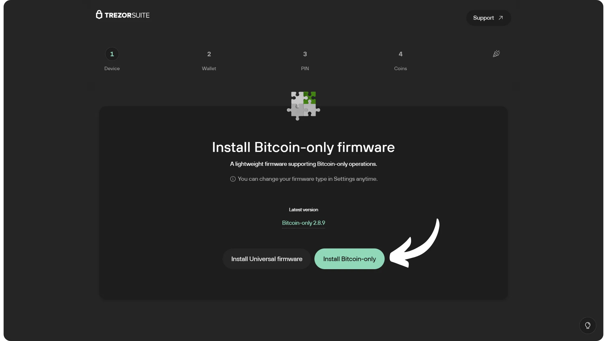

Trezor Suite kemudian akan menginstal firmware pada Brankas 5 kamu. Mohon tunggu selama proses instalasi.

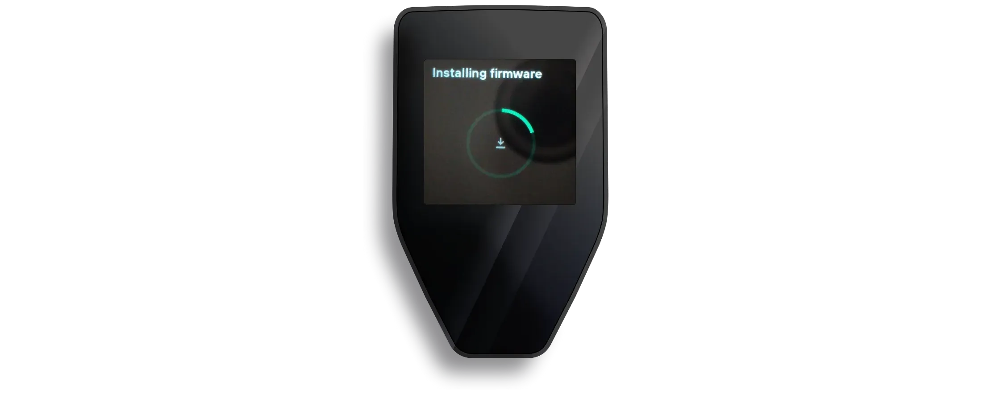

Klik "*Lanjutkan*".

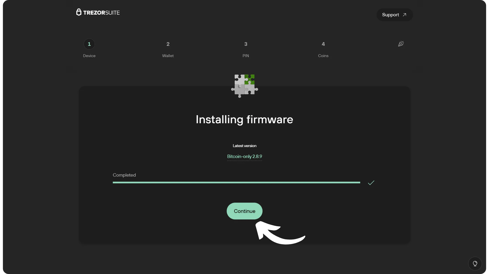

Kemudian lanjutkan ke uji keaslian untuk memastikan Hardware Wallet kamu tidak palsu atau disusupi.

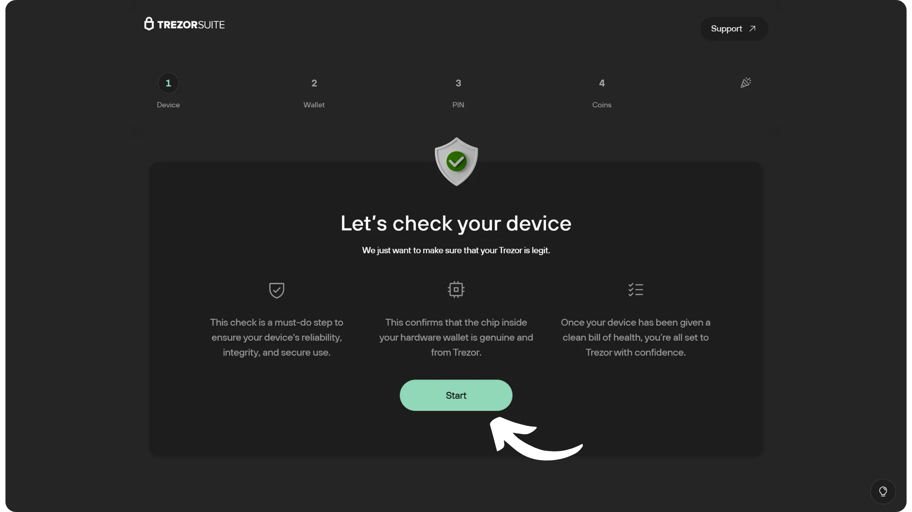

Pada Safe 5 kamu, tekan layar untuk mengonfirmasi.

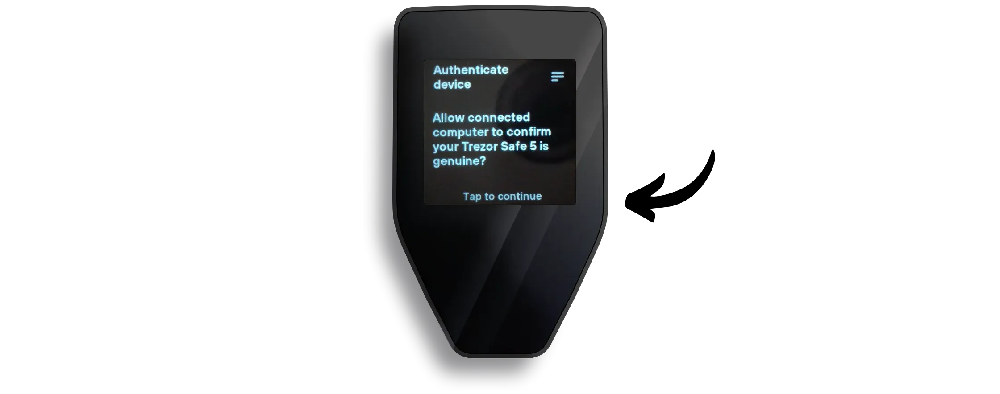

Jika Trezor kamu asli, pesan konfirmasi akan muncul di Trezor Suite.

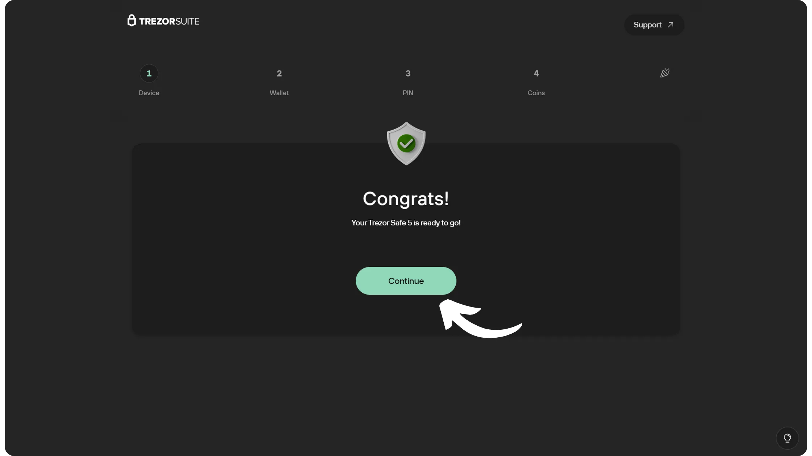

Kamu kemudian dapat melewati jendela dengan petunjuk pengoperasian dasar.

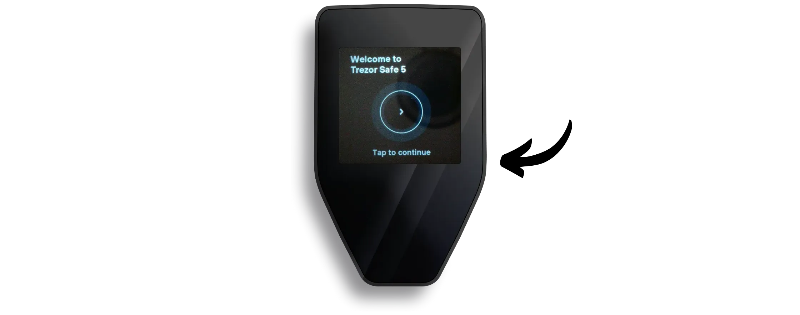

## Menciptakan portofolio Bitcoin

Pada Trezor Suite, klik tombol "*Buat Wallet baru*".

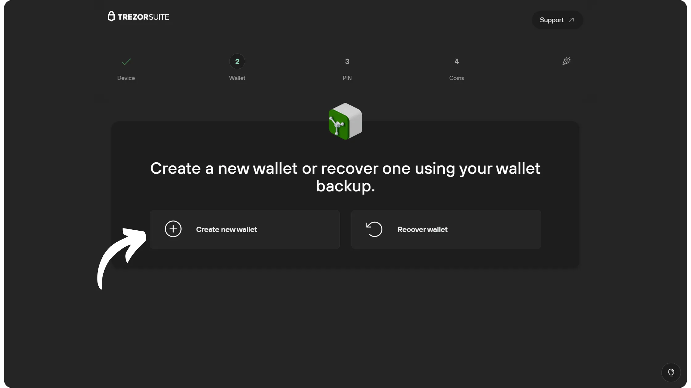

Untuk membuat BIP39 Wallet standar, mulai dengan memilih "*Jenis cadangan Wallet warisan*" dari menu tarik-turun, lalu pilih antara mnemonic 12 atau 24 kata, meskipun saat ini 12 kata sudah direkomendasikan. Opsi ini akan memungkinkan kamu membuat Wallet single-signature klasik. Aku menyarankan kamu memilih parameter yang sesuai dengan BIP39 di sini agar proses pemulihan lebih mudah dan tidak terikat pada lingkungan tertentu. Untuk menyelesaikannya, klik "*Buat Wallet*".

Kalau kamu ingin mempelajari lebih lanjut tentang opsi pencadangan lain yang tersedia di Trezor, termasuk *Cadangan Multi-Bagi*, aku sarankan kamu juga membaca tutorial berikut ini:

https://planb.academy/tutorials/wallet/backup/trezor-shamir-backup-7f98b593-face-48fb-a643-0e811b87c94e

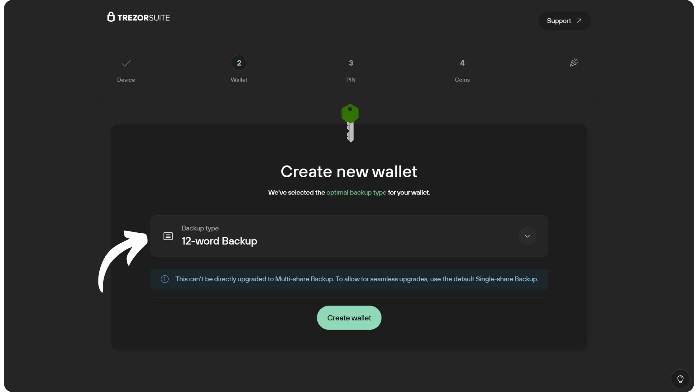

Terima persyaratan penggunaan pada Hardware Wallet.

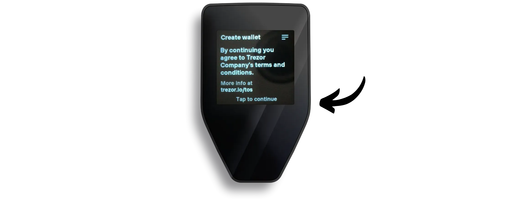

Tekan dan tahan layar untuk membuat portofolio baru.

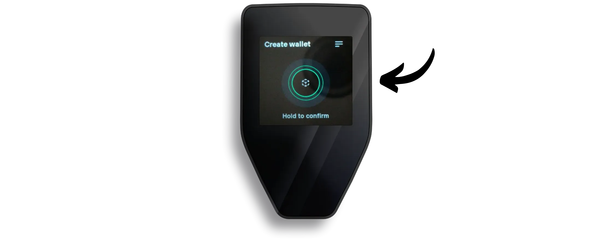

Di Trezor Suite, klik "*Lanjutkan pencadangan*".

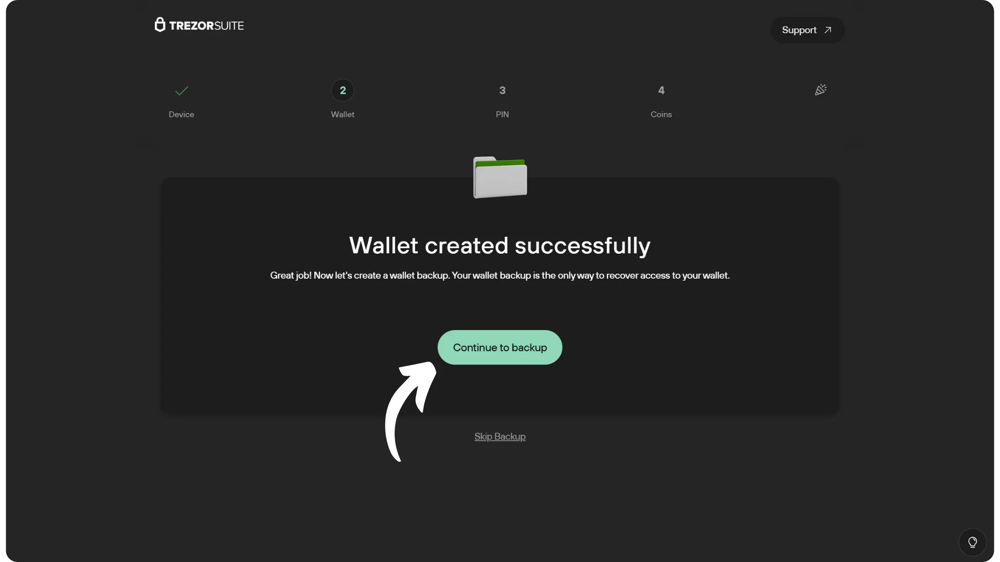

Perangkat lunak ini akan memberikan petunjuk tentang cara mengelola mnemonic kamu dengan benar.

Mnemonic ini memberi kamu akses penuh dan tanpa batas ke semua bitcoin yang kamu miliki. Siapa pun yang mengetahui frasa ini bisa mencuri dana kamu, bahkan tanpa akses fisik ke Trezor Safe 5.

Frasa 12 kata ini memungkinkan kamu memulihkan akses ke bitcoin jika terjadi kehilangan, pencurian, atau kerusakan pada Hardware Wallet. Karena itu, sangat penting untuk menyimpannya dengan hati-hati dan menaruhnya di tempat yang aman.

Kamu bisa menuliskannya pada kartu yang disertakan di dalam kotak. Untuk keamanan tambahan, aku sangat menyarankan agar kamu mengukirnya pada pelat baja tahan karat supaya tetap terlindungi dari risiko kebakaran, banjir, atau keruntuhan bangunan.

Setelah memahami petunjuknya, klik tombol "*Buat cadangan Wallet*".

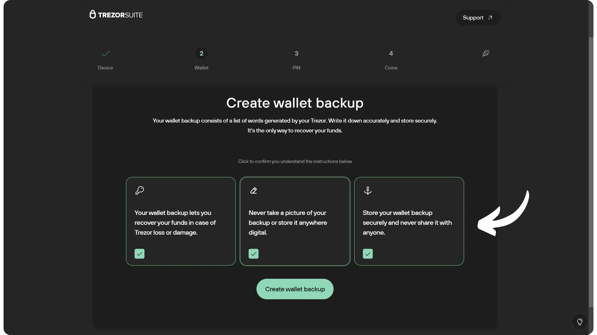

Safe 5 akan menghasilkan mnemonic kamu menggunakan generator angka acak. Pastikan kamu tidak sedang diawasi saat proses ini berlangsung. Tuliskan kata-kata yang ditampilkan di layar pada media fisik pilihan kamu. Bergantung pada strategi keamanan yang kamu terapkan, kamu bisa mempertimbangkan untuk membuat beberapa salinan fisik lengkap dari frasa tersebut, namun yang paling penting jangan pernah membagikannya ke siapa pun. Pastikan setiap kata diberi nomor dan ditulis dalam urutan yang benar.

**Tentu saja, kamu tidak boleh membagikan kata-kata ini di Internet, seperti yang aku lakukan dalam tutorial ini. Contoh Wallet ini hanya akan digunakan di Testnet dan akan dihapus pada akhir tutorial**

Untuk informasi lebih lanjut tentang cara yang tepat dalam menyimpan dan mengelola mnemonic kamu, aku sangat merekomendasikan mengikuti tutorial lainnya, terutama jika kamu masih pemula:

https://planb.academy/tutorials/wallet/backup/backup-mnemonic-22c0ddfa-fb9f-4e3a-96f9-46e2a7954270

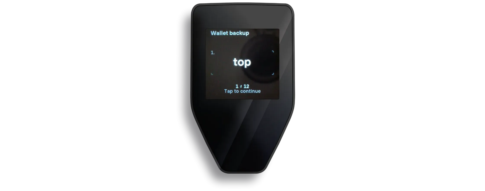

Untuk beralih ke kata berikutnya, klik di bagian bawah layar. Kamu dapat mundur dengan menggeser ke bawah. Setelah kamu menuliskan semua kata, pertahankan jari kamu pada layar untuk melanjutkan ke langkah berikutnya.

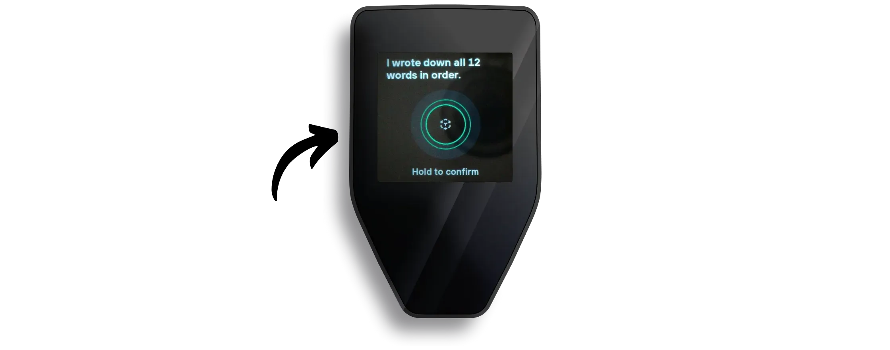

Pilih kata-kata dalam frasa Mnemonic kamu sesuai dengan urutannya untuk mengonfirmasi bahwa kamu telah menuliskannya dengan benar.

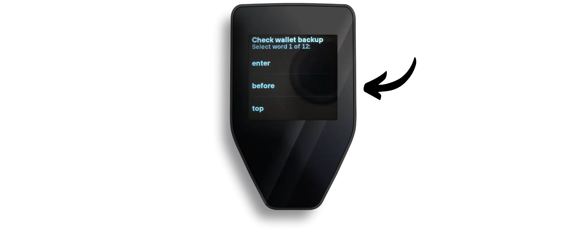

Setelah prosedur verifikasi ini selesai, klik pada layar untuk melanjutkan.

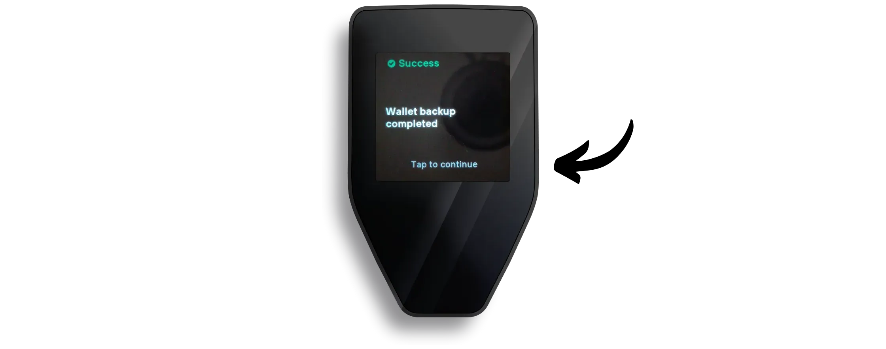

## Mengatur kode PIN

Berikutnya adalah langkah pembuatan kode PIN. Kode PIN ini berfungsi untuk membuka kunci Trezor kamu, sehingga memberikan perlindungan terhadap akses fisik yang tidak sah. PIN ini tidak terlibat dalam proses penurunan kunci kriptografi pada Wallet kamu. Artinya, tanpa akses ke kode PIN sekalipun, kepemilikan mnemonic 12 kata kamu tetap memungkinkan kamu untuk memulihkan akses ke bitcoin kamu.

Pada Trezor Suite, klik "*Lanjutkan ke PIN*", lalu pada tombol "*Setel PIN*".

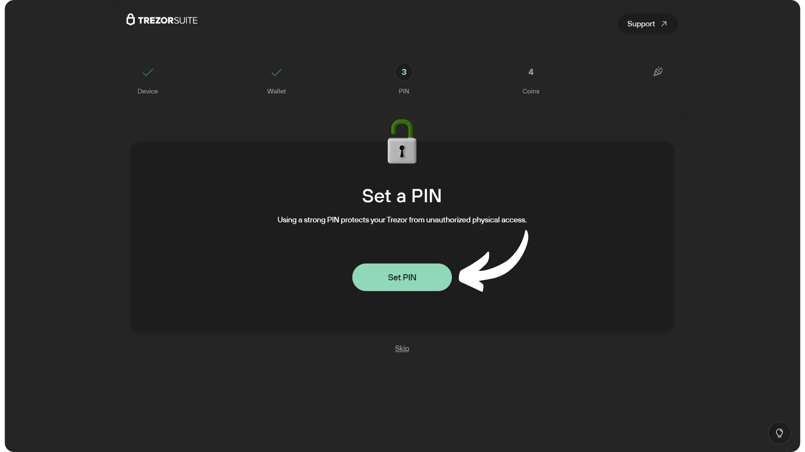

Konfirmasikan dengan Safe 5.

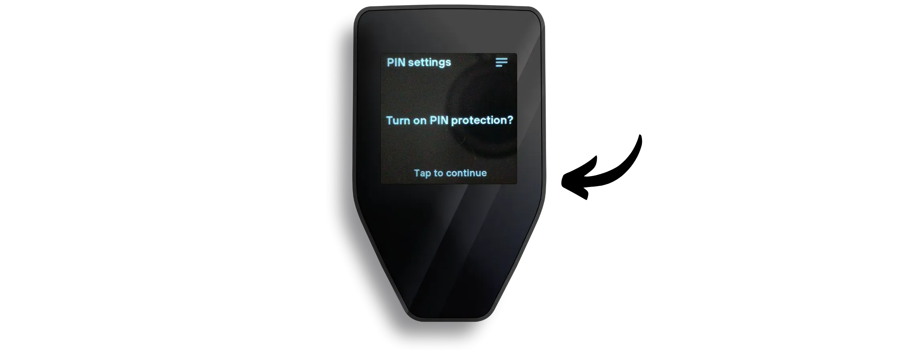

Kami menyarankan kamu memilih kode PIN yang seacak mungkin. Pastikan kamu menyimpan kode ini di lokasi yang terpisah dari tempat penyimpanan Trezor kamu, misalnya di dalam password manager. Kamu bisa menentukan kode PIN antara 8 hingga 50 digit. Aku menyarankan kamu memilih PIN sepanjang mungkin untuk meningkatkan tingkat keamanan.

Gunakan panel sentuh untuk memasukkan PIN kamu.

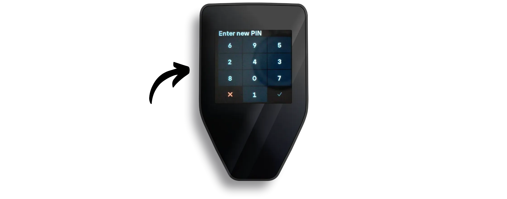

Setelah selesai, klik tanda centang Green di kanan bawah, lalu konfirmasikan PIN kamu untuk kedua kalinya.

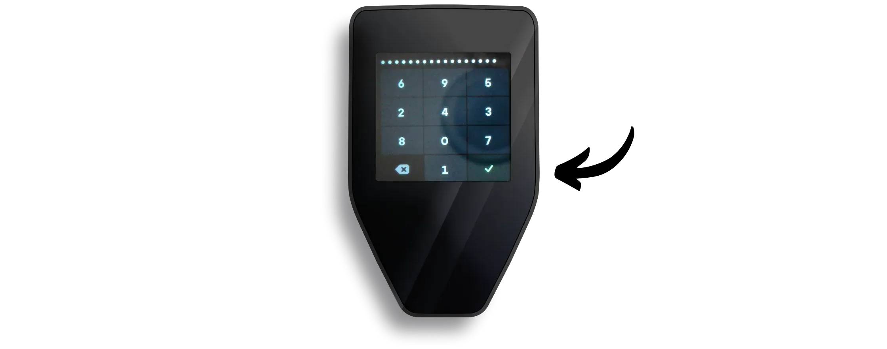

Kode PIN kamu telah terdaftar.

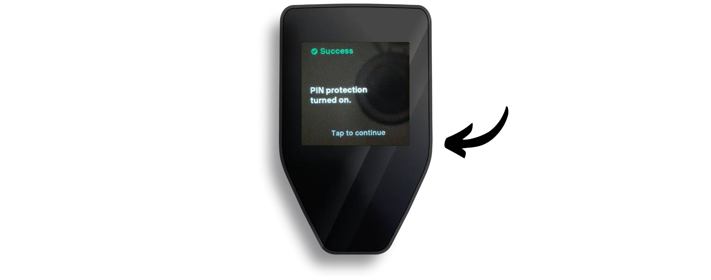

Pada Trezor Suite, klik tombol "*Selesaikan pengaturan*".

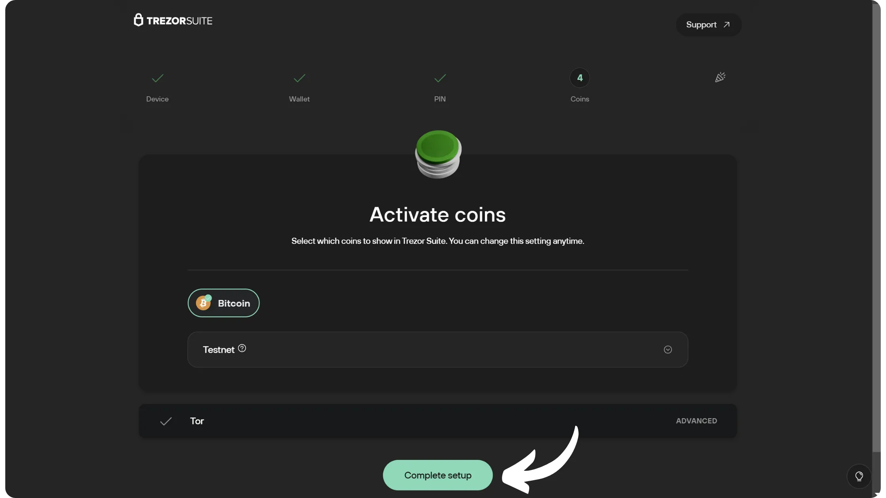

Konfigurasi Safe 5 kamu sekarang sudah selesai. Jika mau, kamu dapat mengubah nama dan halaman beranda Hardware Wallet.

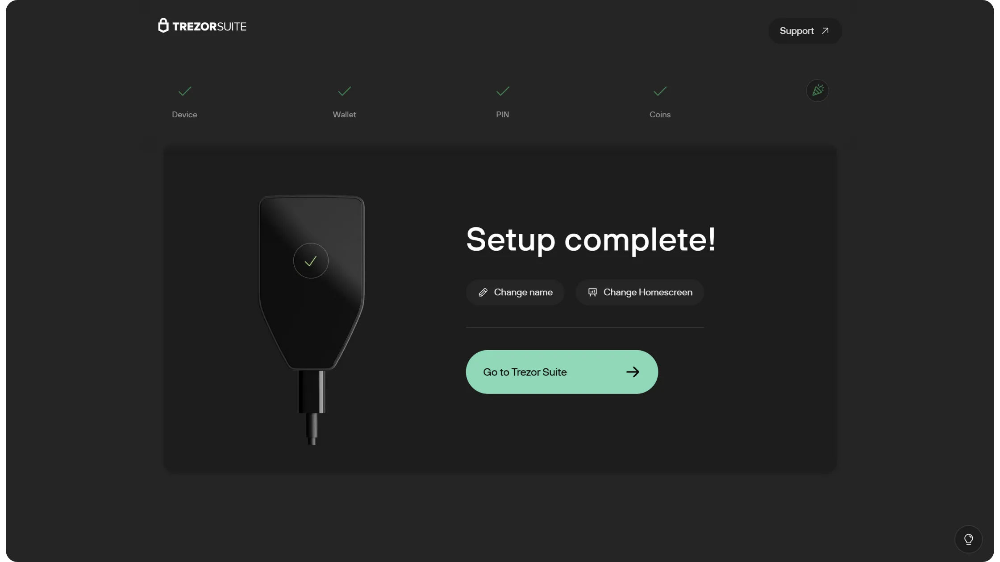

Kita tidak akan membutuhkan perangkat lunak Trezor Suite lagi, kecuali untuk melakukan pembaruan firmware secara berkala pada Hardware Wallet atau jika kamu ingin menjalankan tes pemulihan. Sekarang kita akan menggunakan Sparrow untuk mengelola Wallet, karena perangkat lunak ini memang dirancang khusus untuk penggunaan Bitcoin saja.

## Menyiapkan portofolio pada Sparrow Wallet

Mulailah dengan mengunduh dan menginstal Sparrow Wallet [dari situs web resmi](https://sparrowwallet.com/) di komputer kamu, jika kamu belum melakukannya.

Setelah kamu membuka Sparrow Wallet, pastikan perangkat lunak ini sudah terhubung ke node Bitcoin, yang ditandai dengan tanda centang di sudut kanan bawah interface. Kalau kamu mengalami masalah saat menghubungkan Sparrow, aku sarankan kamu membaca bagian awal tutorial ini:

https://planb.academy/tutorials/wallet/desktop/sparrow-c674e2ac-d46f-4c82-92a7-7d1b0e262f5d

Klik pada tab "*File*", kemudian pada "*New Wallet*".

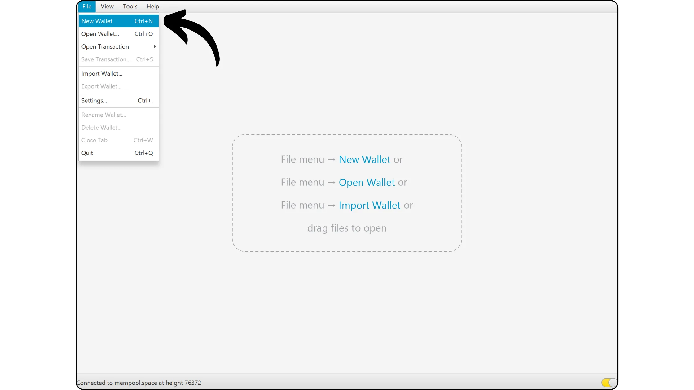

Beri nama portofolio kamu, lalu klik "*Buat Wallet*".

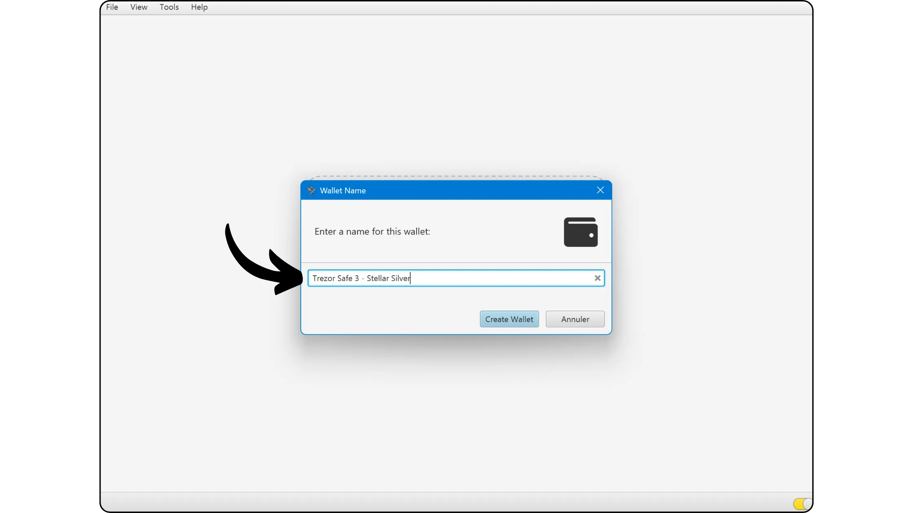

Pada menu drop-down "*Jenis Skrip*", pilih jenis skrip yang akan digunakan untuk mengamankan bitcoin kamu. Aku merekomendasikan "*Taproot*", atau jika tidak, "*Native SegWit*".

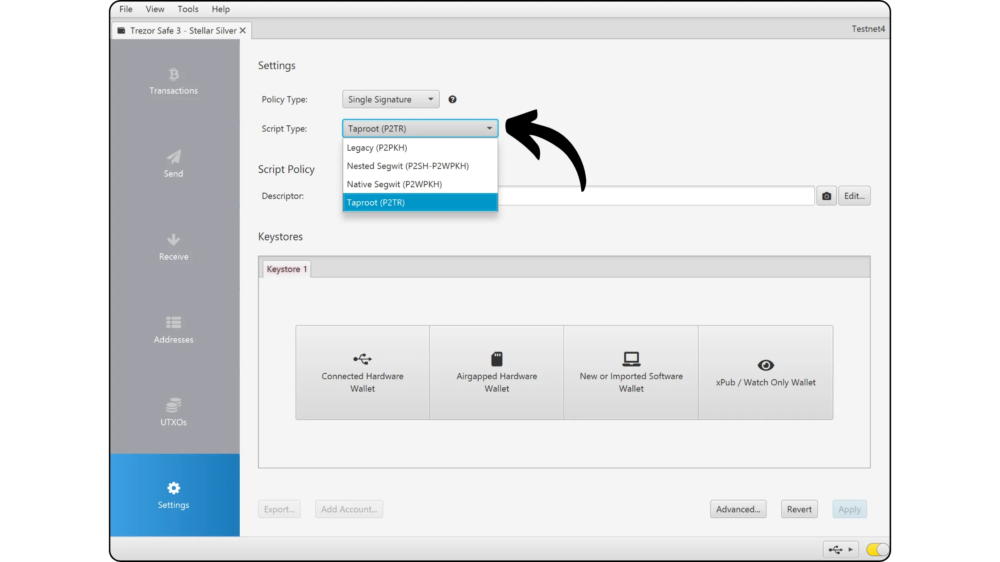

Klik pada tombol "*Terhubung Hardware Wallet*". Brankas Anda tentu saja harus terhubung ke komputer dan tidak terkunci.

Saat kamu menghubungkan Safe 5 ke komputer dengan Sparrow Wallet yang sudah terbuka, kamu akan diminta memasukkan passphrase BIP39 di layar Hardware Wallet. Opsi lanjutan ini akan dibahas dalam tutorial berikutnya. Untuk sekarang, cukup klik tanda centang hijau di sudut kanan atas untuk mengonfirmasi bahwa kamu ingin menggunakan passphrase kosong, yaitu tanpa passphrase. Agar Trezor kamu tidak meminta passphrase setiap kali dinyalakan, buka Trezor Suite, masuk ke pengaturan, lalu ubah opsi di "*Device*" > "*Default Wallet*" menjadi "*Standard*", bukan "*passphrase*".

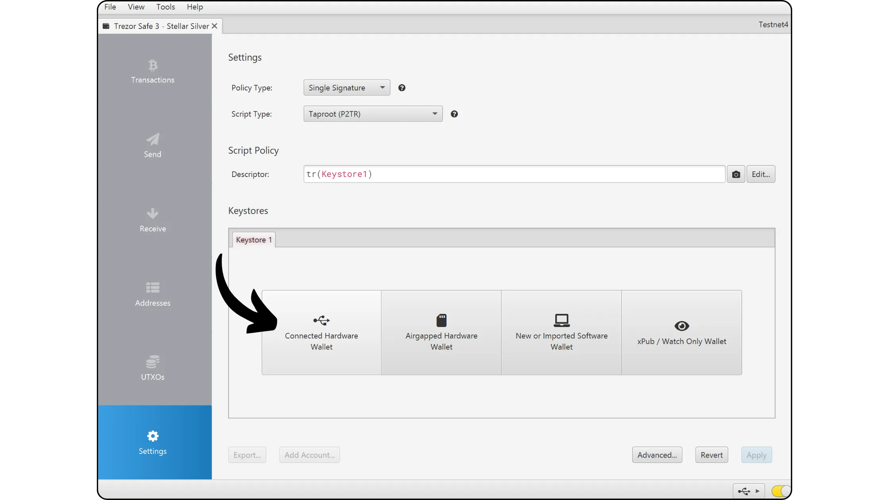

Klik pada tombol "*Pindai*". Brankas 5 kamu akan muncul. Klik "*Import Keystore*".

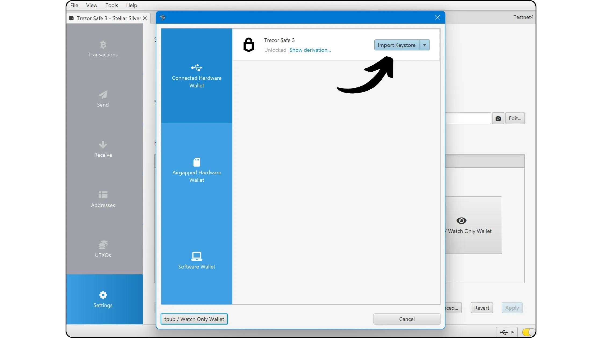

Anda sekarang dapat melihat detail Wallet kamu, termasuk kunci publik yang diperpanjang dari akun pertama kamu. Klik pada tombol "*Apply*" untuk menyelesaikan pembuatan Wallet.

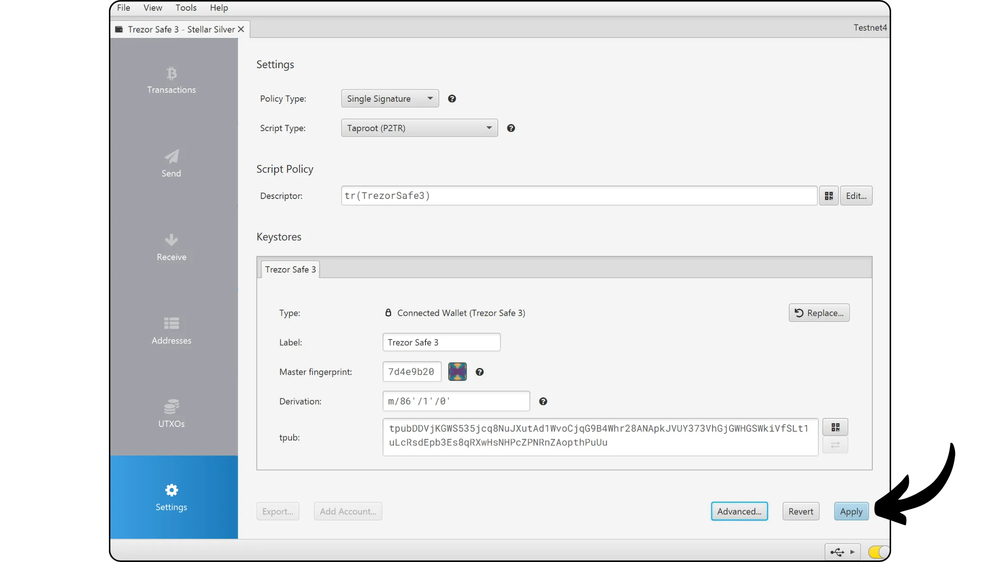

Pilih kata sandi yang kuat untuk mengamankan akses ke Sparrow Wallet. Kata sandi ini akan memastikan data Sparrow Wallet kamu tetap aman, serta melindungi kunci publik, alamat, label, dan riwayat transaksi dari akses yang tidak sah.

Aku menyarankan kamu menyimpan kata sandi ini di dalam password manager supaya tidak lupa.

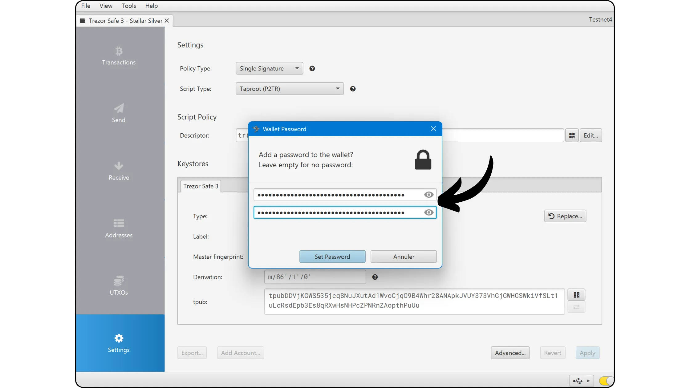

Dan sekarang, portofolio kamu sudah diimpor ke dalam Sparrow Wallet!

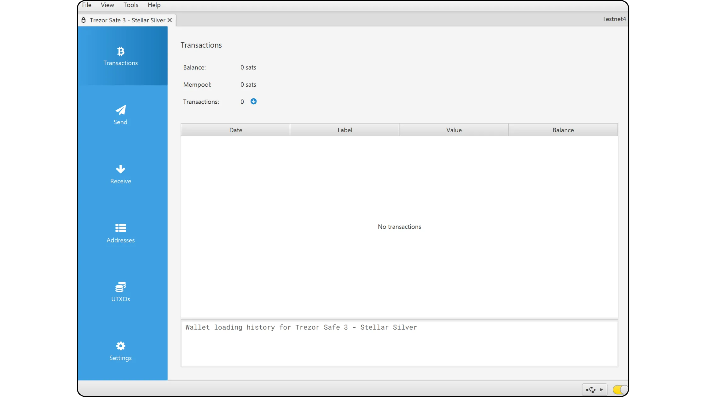

Sebelum kamu menerima bitcoin pertamamu di dalam Wallet, **aku sangat menyarankan kamu untuk melakukan tes pemulihan kosong**. Catat beberapa informasi referensi, seperti xpub kamu, lalu lakukan reset pada Trezor Safe 5 saat Wallet masih kosong. Setelah itu, coba pulihkan kembali Wallet kamu di Trezor menggunakan cadangan kertas yang sudah kamu buat. Periksa apakah xpub yang dihasilkan setelah pemulihan sama dengan yang kamu catat sebelumnya. Jika sama, kamu bisa yakin bahwa cadangan kertas kamu benar dan dapat diandalkan.

Untuk mempelajari lebih lanjut tentang cara melakukan tes pemulihan, aku sarankan kamu membaca tutorial berikut ini:

https://planb.academy/tutorials/wallet/backup/recovery-test-5a75db51-a6a1-4338-a02a-164a8d91b895

## Bagaimana cara menerima bitcoin dengan Trezor Safe 5?

Pada Sparrow, klik tab "*Receive*".

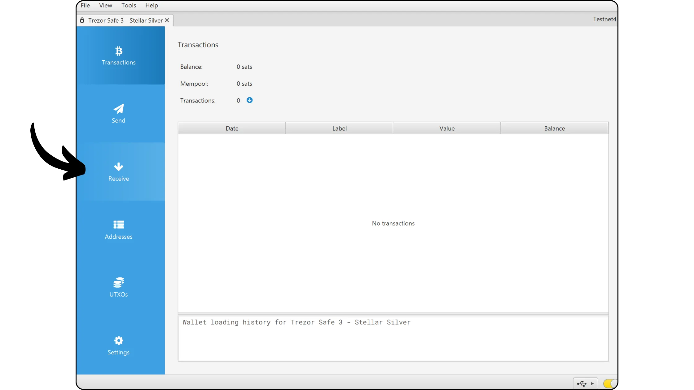

Sebelum menggunakan Address yang diusulkan oleh Sparrow Wallet, pastikan kamu memeriksanya langsung di layar Trezor. Praktik ini memungkinkan kamu mengonfirmasi bahwa Address yang ditampilkan di Sparrow bukan palsu, dan bahwa Hardware Wallet memang memegang private key yang diperlukan untuk membelanjakan bitcoin yang diamankan oleh Address tersebut. Langkah ini membantu kamu menghindari beberapa jenis serangan.

Untuk melakukan pemeriksaan ini, klik tombol "*Tampilkan Address*".

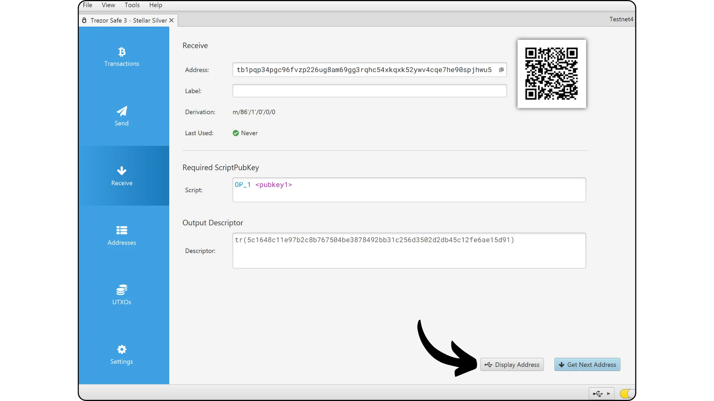

Periksa apakah Address yang ditampilkan di layar Trezor sesuai dengan yang ada di Sparrow Wallet. Kamu juga disarankan melakukan pemeriksaan ini sebelum membagikan Address tersebut ke pengirim, untuk memastikan keabsahannya. Setelah cocok, kamu bisa menekan layar untuk mengonfirmasi.

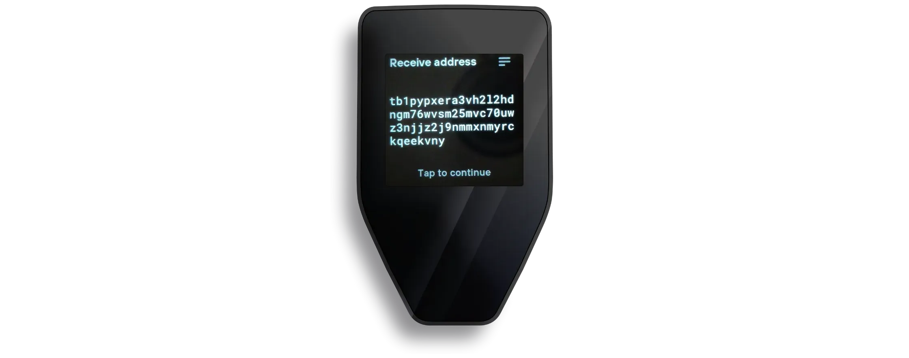

Kemudian kamu dapat menambahkan "*Label*" untuk mendeskripsikan sumber bitcoin yang akan diamankan dengan Address ini. Ini adalah praktik yang baik yang memungkinkanmu untuk mengelola UTXO dengan lebih baik.

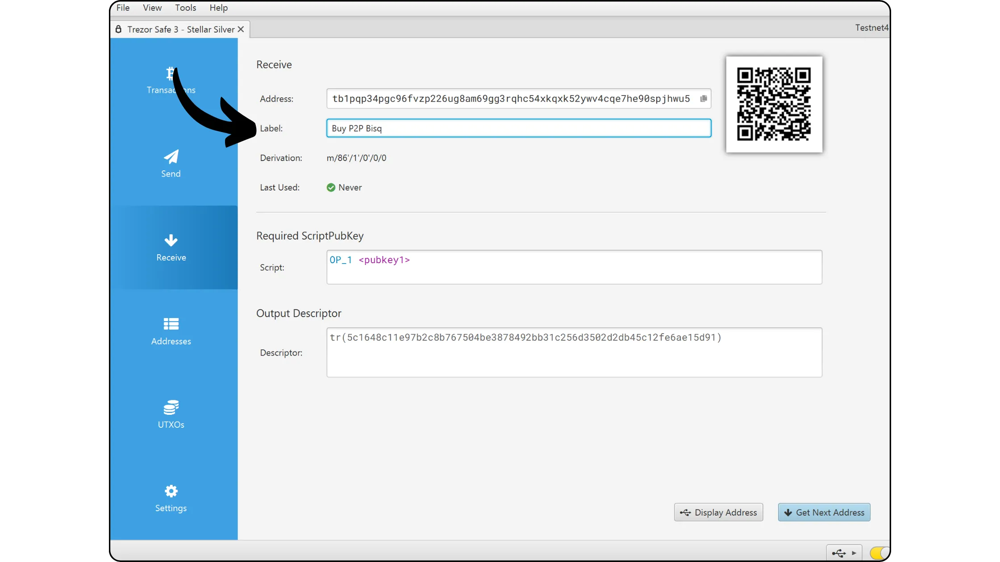

Kamu kemudian dapat menggunakan Address ini untuk menerima bitcoin.

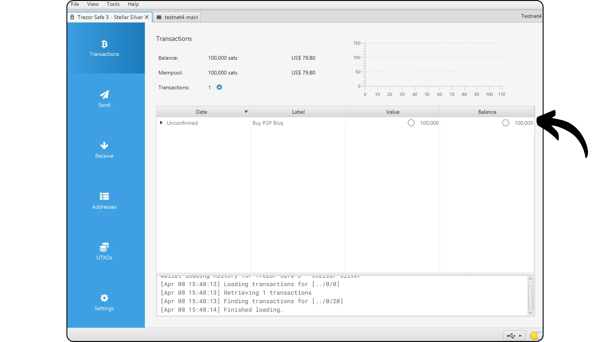

## Bagaimana cara mengirim bitcoin dengan Trezor Safe 5?

Sekarang setelah kamu menerima sats pertamamu di Wallet yang diamankan oleh Safe 5, kamu juga sudah bisa membelanjakannya. Hubungkan Trezor ke komputer, buka kunci dengan kode PIN, jalankan Sparrow Wallet, lalu buka tab "*Kirim*" untuk membuat transaksi baru.

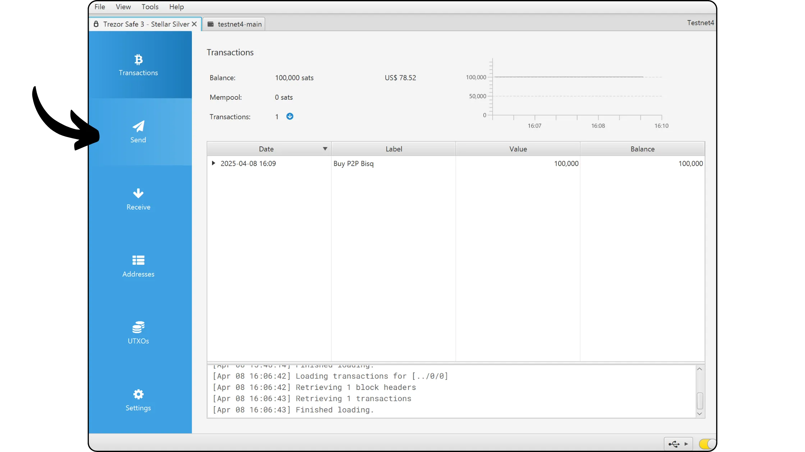

Jika kamu ingin menggunakan *Coin Control*, yaitu memilih secara spesifik UTXO mana yang akan dipakai dalam transaksi, buka tab "*UTXOs*". Pilih UTXO yang ingin kamu gunakan, lalu klik "*Kirim Terpilih*". Kamu akan diarahkan ke layar yang sama di tab "*Kirim*", tetapi dengan UTXO yang sudah dipilih untuk transaksi tersebut.

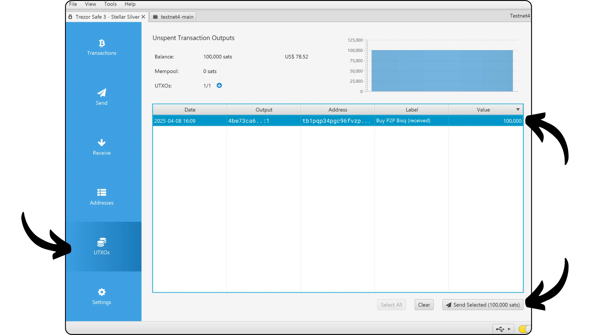

Masukkan alamat tujuan Address. Kamu juga dapat memasukkan beberapa alamat dengan mengeklik tombol "*+ Tambah*".

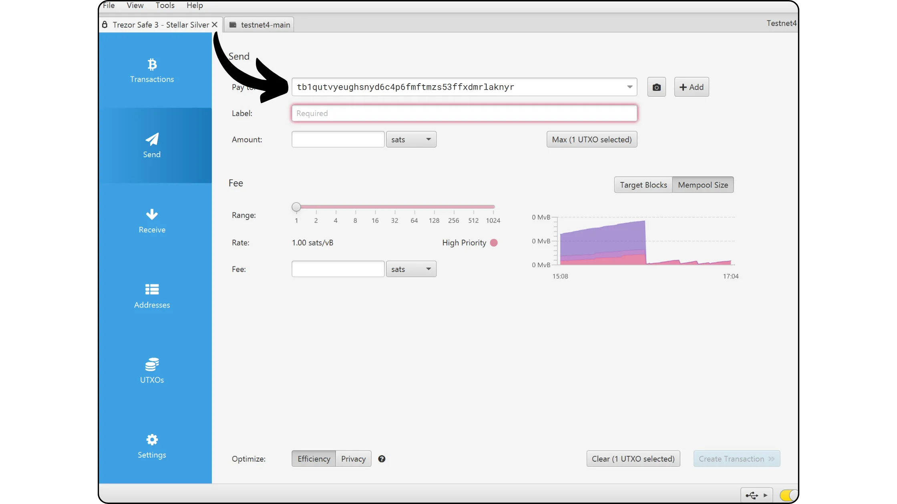

Tuliskan "*Label*" untuk mengingat tujuan pengeluaran ini.

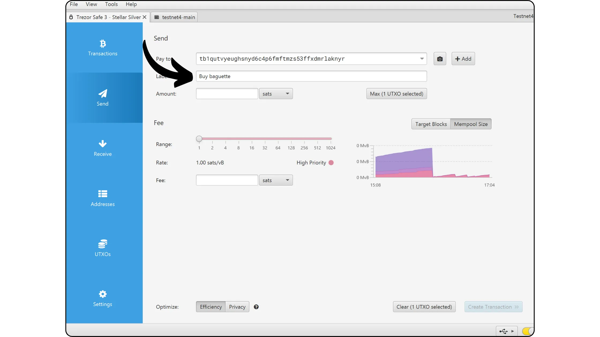

Pilih jumlah yang akan dikirim ke Address ini.

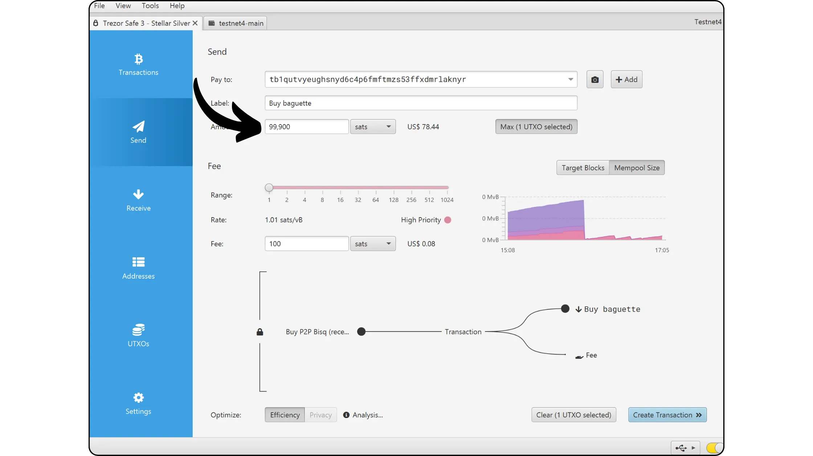

Sesuaikan tarif biaya transaksi kamu sesuai dengan pasar saat ini. Sebagai contoh, kamu dapat menggunakan [Mempool.space](https://Mempool.space/) untuk memilih tarif biaya yang sesuai.

Pastikan semua parameter transaksi kamu sudah benar, lalu klik "*Buat Transaksi*".

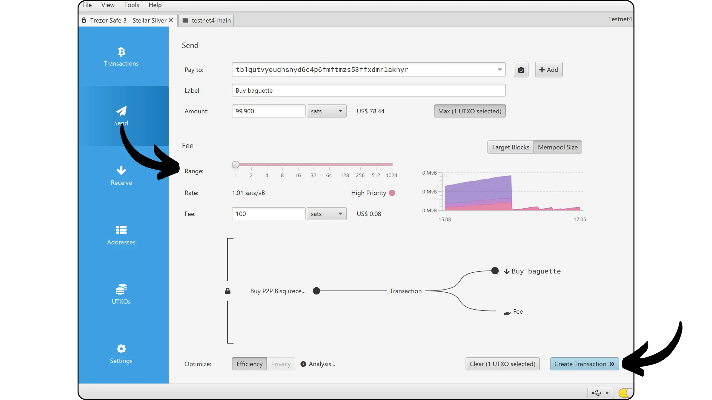

Jika semuanya sudah sesuai dengan keinginan kamu, klik "*Finalisasi Transaksi untuk Penandatanganan*".

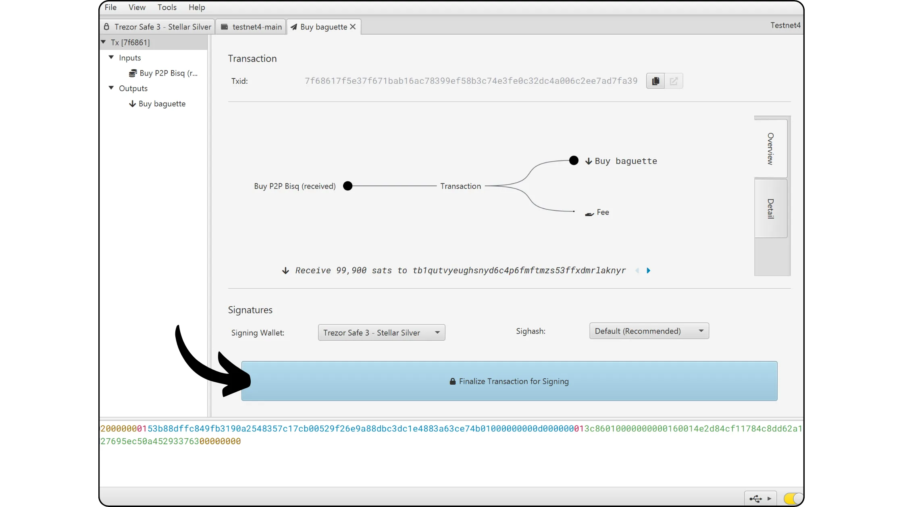

Klik "*Tanda Tangan*".

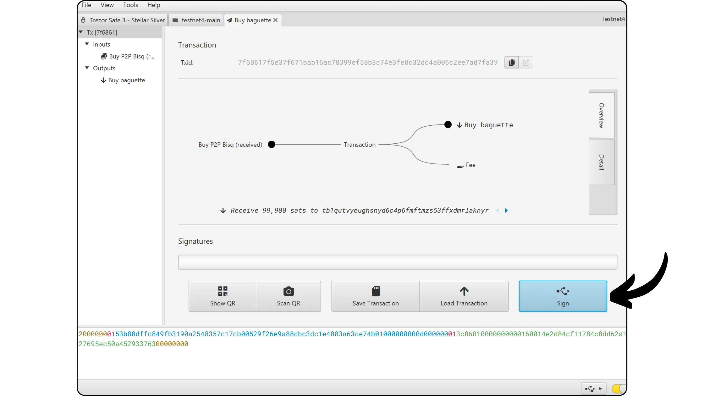

Klik "*Tanda Tangan*" di sebelah Trezor Safe 5.

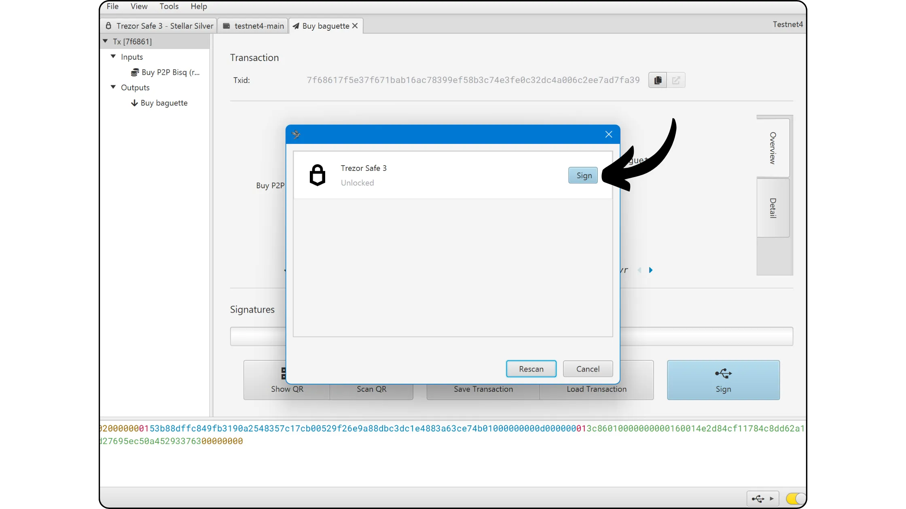

Periksa parameter transaksi pada layar Hardware Wallet kamu, termasuk penerima yang menerima Address, jumlah yang dikirim, dan biaya. Setelah transaksi diverifikasi di Trezor, tekan dan tahan layar untuk menandatanganinya.

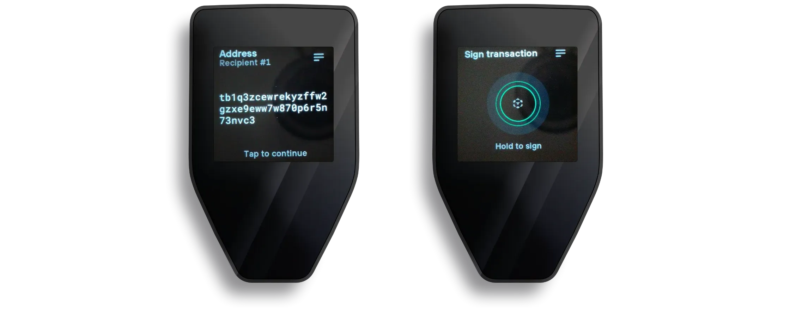

Transaksi kamu sekarang sudah ditandatangani. Periksa untuk terakhir kalinya apakah semuanya baik-baik saja, lalu klik "*Broadcast Transaction*" untuk menyiarkannya di jaringan Bitcoin.

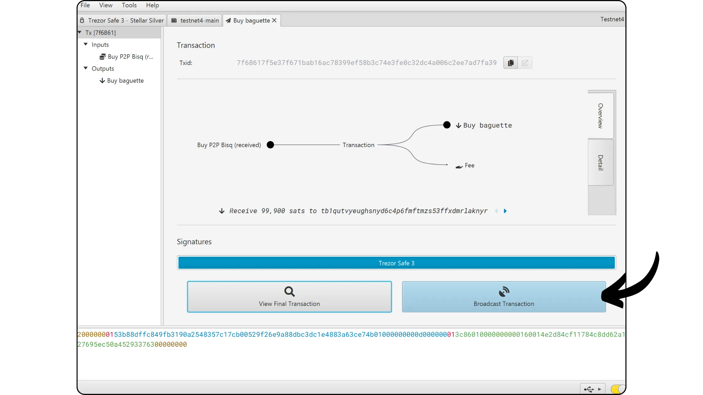

Kamu bisa menemukannya di tab "*Transactions*" pada Sparrow Wallet.

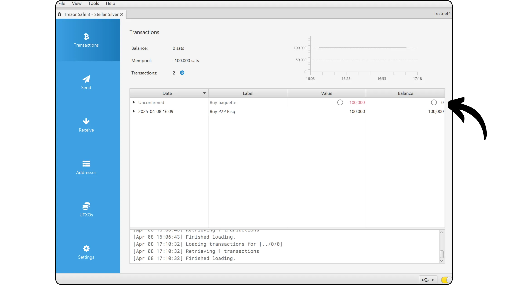

Selamat, sekarang kamu sudah menguasai penggunaan dasar Trezor Safe 5 dengan Sparrow Wallet. Untuk melangkah lebih jauh, aku merekomendasikan tutorial komprehensif tentang penggunaan Trezor Hardware Wallet dengan passphrase BIP39 agar keamanan kamu semakin meningkat:

https://planb.academy/tutorials/wallet/backup/trezor-passphrase-0474b5bf-496f-4f97-aefe-445368fdca42

Kalau kamu merasa tutorial ini bermanfaat, aku akan sangat berterima kasih kalau kamu mau memberikan jempol hijau di bawah ini. Jangan ragu juga untuk membagikan artikel ini di media sosial kamu. Terima kasih banyak!
