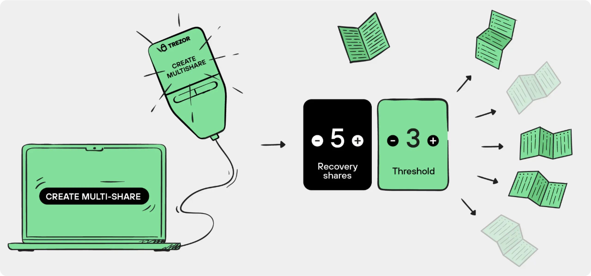
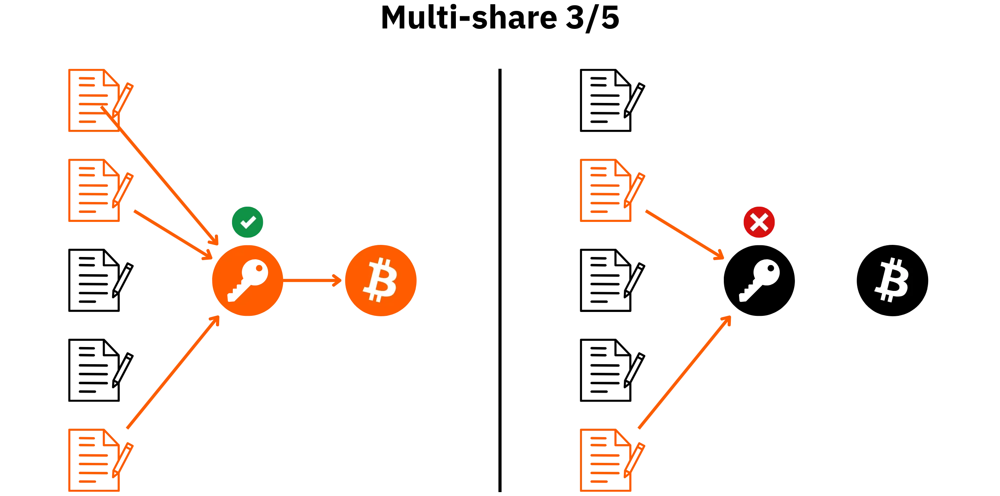
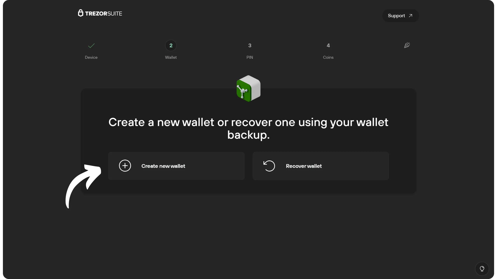
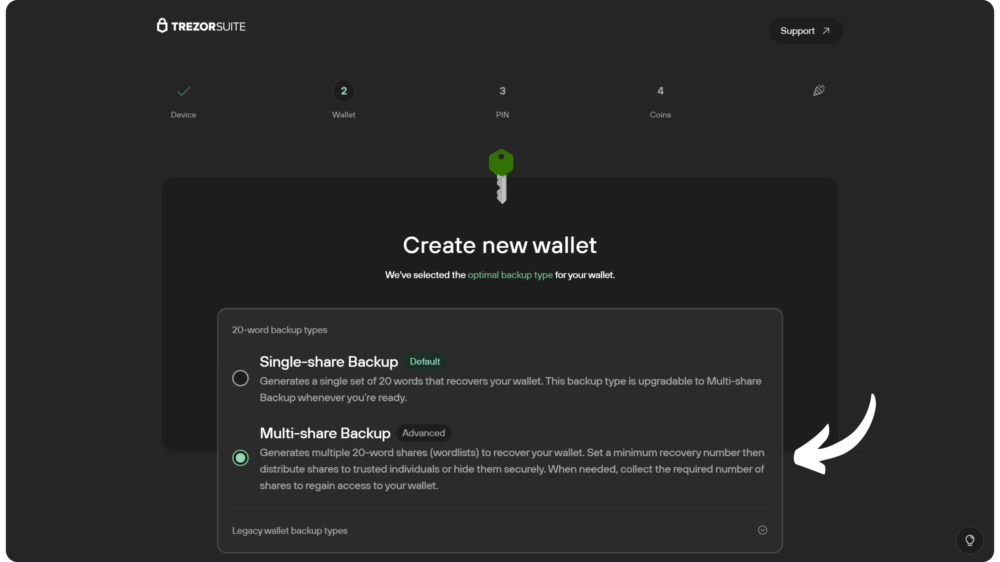
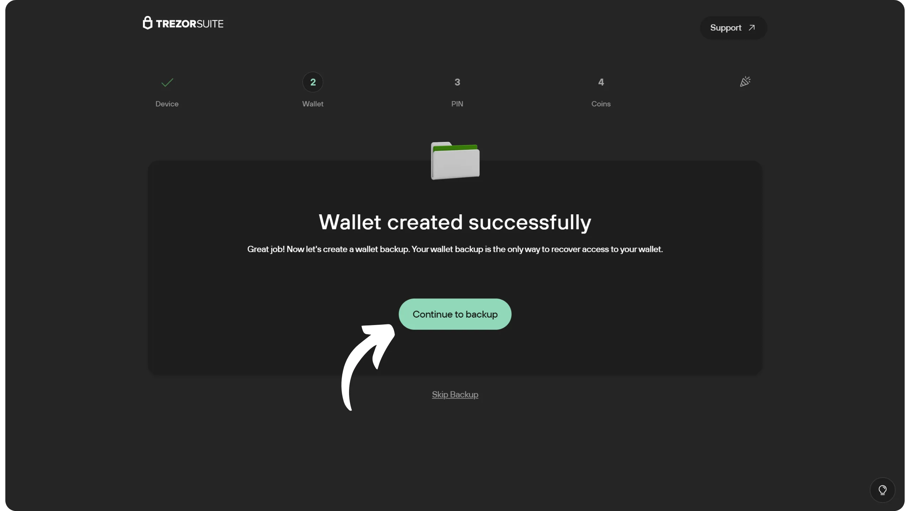
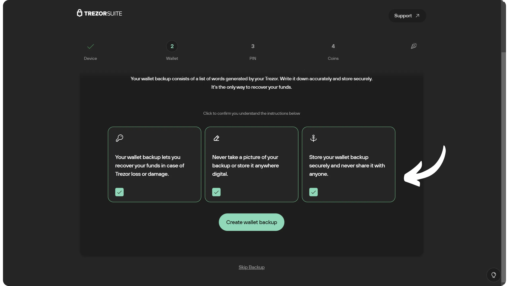
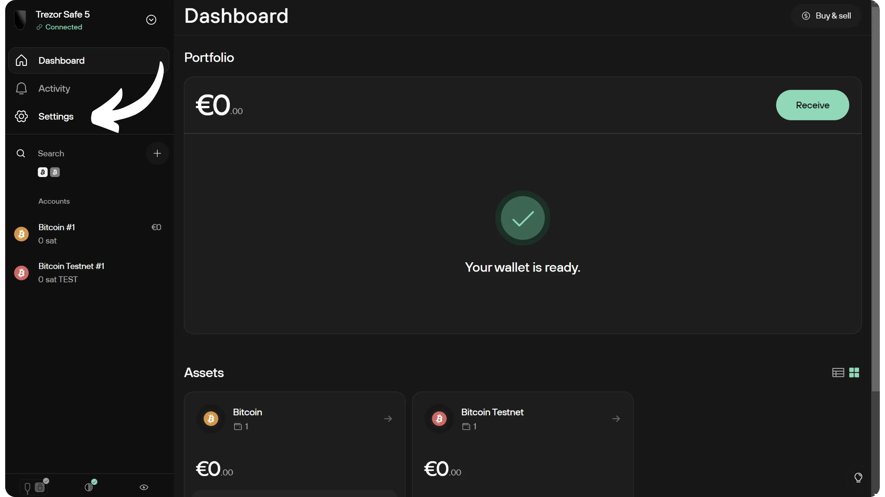
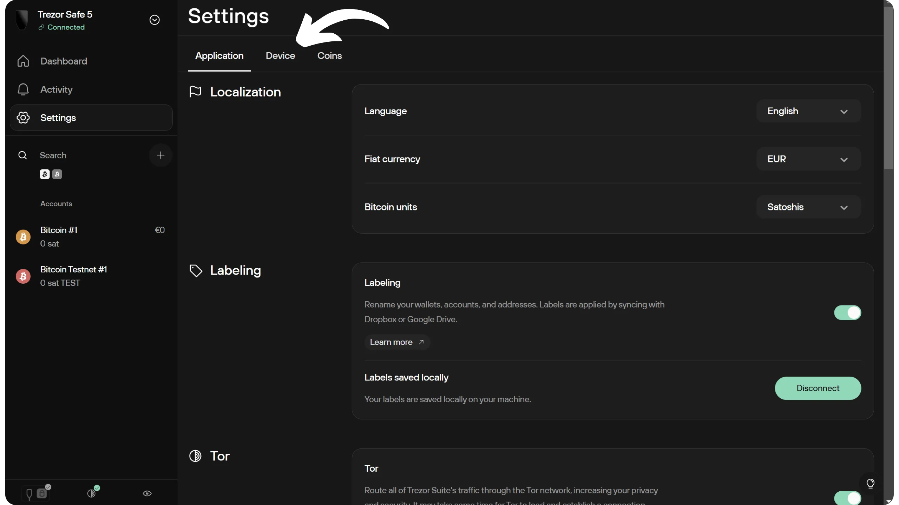
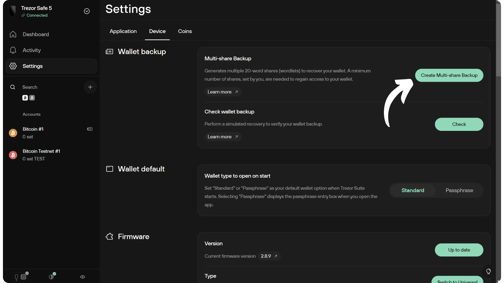
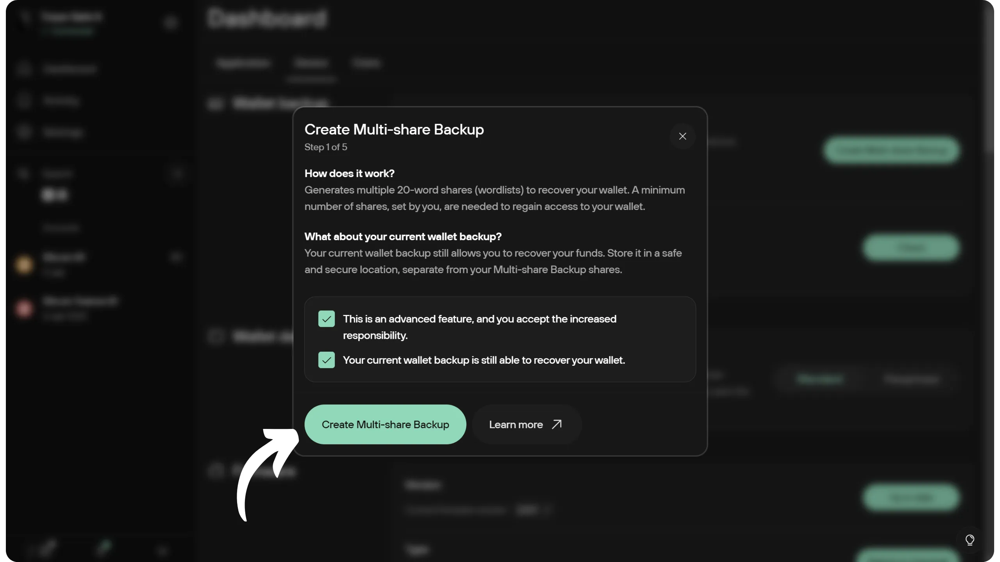

*Kredit gambar: [Trezor.io](https://trezor.io/)*

## Opsi pencadangan baru di Trezor

Sejak tahun 2023, Trezor memperkenalkan format cadangan baru yang disebut ***Cadangan Saham Tunggal***, yang secara bertahap menggantikan pendekatan klasik berbasis BIP39 yang digunakan pada sebagian besar Wallet. Berbeda dengan mnemonic 12 atau 24 kata tradisional, format baru ini menggunakan satu frasa 20 kata yang berasal dari standar yang dikembangkan oleh SatoshiLabs, yaitu **SLIP39**. Tujuannya adalah meningkatkan ketahanan dan keterbacaan cadangan, sekaligus memungkinkan migrasi yang lebih mulus ke model cadangan terdistribusi.

Model terdistribusi ini disebut ***Cadangan Multi-share***. Prinsip dasarnya sama, tetapi alih-alih menghasilkan satu mnemonic, sistem ini membaginya menjadi beberapa fragmen yang disebut ***share***, yang masing-masing juga berbentuk mnemonic. Untuk memulihkan Wallet, sejumlah *share* tertentu yang telah ditentukan oleh *ambang batas* harus digabungkan kembali. Misalnya, dalam skema 3 dari 5, maka 3 *share* dari total 5 *share* sudah cukup untuk memulihkan Wallet. Perlu dicatat bahwa sistem cadangan terdistribusi Trezor berbeda dengan Wallet Multisig. Untuk membelanjakan bitcoin, kamu tetap hanya memerlukan satu Hardware Wallet Trezor dan satu tanda tangan saja. Distribusi ini hanya berlaku pada level mnemonic sebagai cadangan, bukan pada proses penandatanganan transaksi.

Sistem ini mengatasi masalah single point of failure pada mnemonic tanpa konsekuensi rumit seperti pengelolaan Multisig atau penggunaan passphrase BIP39. Proses pemulihan tidak lagi bergantung pada satu informasi saja, tetapi pada beberapa bagian, dengan keuntungan tambahan berupa toleransi kehilangan berkat mekanisme ambang batas.

Pengguna yang sudah membuat Wallet dengan *Cadangan Single-share* bisa beralih ke *Cadangan Multi-share* kapan saja tanpa perlu memindahkan Wallet mereka. Address dan akun penerima akan tetap sama. Sistem *Multi-share* hanya memengaruhi bagian cadangan, sementara struktur Wallet lainnya tidak berubah.

Multi-share Backup tersedia di Trezor Model T, Safe 3, dan Safe 5. Fitur ini tidak didukung oleh Trezor Model One.

**Catatan penting:** Sistem *Multi-share* Trezor aman secara kriptografis karena menggunakan skema *Shamir's Secret Sharing*. Kami sangat menyarankan kamu untuk tidak mencoba membuat sistem serupa secara manual dengan membagi mnemonic BIP39 secara sendiri. Itu adalah praktik yang buruk dan secara signifikan meningkatkan risiko pencurian atau kehilangan bitcoin kamu. Mnemonic klasik harus selalu disimpan secara utuh.

## Shamir's Secret Sharing di SLIP39

Mekanisme kriptografi yang menjadi dasar *Multi-share* di Trezor adalah *Shamir's Secret Sharing Scheme* (SSSS). Prinsipnya seperti ini: informasi rahasia, dalam hal ini seed Wallet, diubah menjadi sebuah polinomial matematika. Beberapa titik dari polinomial tersebut kemudian dihitung, dan masing-masing menjadi satu share. Rahasia asli dapat direkonstruksi dengan melakukan interpolasi polinomial, yaitu dengan menggabungkan jumlah titik minimum sesuai ambang batas.

Tidak ada informasi rahasia yang bisa disimpulkan jika jumlah share yang dikumpulkan berada di bawah ambang batas, sehingga secara teoritis memberikan keamanan sempurna terhadap kebocoran informasi. Bahkan penyerang dengan kekuatan komputasi tak terbatas pun tidak dapat menebak seed jika ambang batas tidak terpenuhi.

SLIP39 menggunakan skema ini untuk mendistribusikan seed Wallet. Setiap share terdiri dari 20 kata yang diambil dari daftar 1024 kata, berbeda dengan daftar kata pada BIP39.

## Menyiapkan Cadangan Multi-share di Trezor

Saat membuat Wallet di Trezor, kamu memiliki tiga opsi:

- Menggunakan mnemonic klasik BIP39 dengan 12 atau 24 kata;
- Menggunakan mnemonic Single-share berbasis SLIP39;
- Mengonfigurasi beberapa mnemonic dalam skema Multi-share berbasis SLIP39.

Jika kamu memilih mnemonic Single-share SLIP39, kamu bisa meningkatkannya ke Multi-share di kemudian hari tanpa perlu mengatur ulang Wallet. Namun, jika kamu memulai dengan Wallet BIP39 klasik, kamu tidak bisa langsung mengonversinya ke Multi-share. Kamu harus membuat Wallet Multi-share baru dari awal, lalu memindahkan dana dari Wallet lama ke Wallet baru melalui satu atau beberapa transaksi Bitcoin. Proses ini lebih kompleks dan membutuhkan biaya transaksi. Jika ingin melakukan migrasi seperti ini, aku menyarankan kamu menggunakan Hardware Wallet Trezor baru agar tidak perlu memasukkan seed ke perangkat lunak Wallet.

Dalam tutorial ini, pertama-tama kita akan melihat cara mengatur Multi-share saat membuat Wallet baru. Setelah itu, kita akan membahas cara mengonversi Single-share menjadi Multi-share pada Wallet yang sudah ada.

Jika kamu memerlukan bantuan untuk pengaturan awal perangkat, tersedia juga tutorial terperinci untuk setiap model Trezor:

https://planb.academy/tutorials/wallet/hardware/trezor-safe-5-4413308a-a1b5-4ba4-bc49-72ae661cc4e0

https://planb.academy/tutorials/wallet/hardware/trezor-safe-3-51d0d669-5d23-47c2-beb6-cc6fa0fb0ea0

https://planb.academy/tutorials/wallet/hardware/trezor-model-one-5c250c49-ce3b-4c63-bd05-4600d7c11a02

### Pada portofolio baru

Sekarang kamu telah menyelesaikan konfigurasi awal Trezor dan siap untuk membuat portofolio. Di Trezor Suite, klik tombol "*Buat Wallet baru*".

Pilih opsi "*Cadangan Multi-Bagi*", lalu klik "*Buat Wallet*".

Terima persyaratan penggunaan di Trezor Anda dan konfirmasikan pembuatan portofolio.

Di Trezor Suite, klik "*Lanjutkan pencadangan*".

Baca instruksi dengan cermat, konfirmasikan, lalu klik "*Buat cadangan Wallet*".

Untuk informasi lebih lanjut tentang cara yang tepat dalam menyimpan dan mengelola mnemonic kamu, aku sangat merekomendasikan mengikuti tutorial berikut ini, terutama jika kamu masih pemula:

https://planb.academy/tutorials/wallet/backup/backup-mnemonic-22c0ddfa-fb9f-4e3a-96f9-46e2a7954270

Di Trezor, pilih jumlah total share yang ingin kamu konfigurasi. Konfigurasi yang paling umum adalah 2-dari-3 dan 3-dari-5. Pada contoh ini, aku akan membuat skema 2-dari-3, jadi aku memilih 3 share. Setiap share akan berupa mnemonic yang terdiri dari 20 kata.

*Untuk pengguna Safe 5, meskipun layar menampilkan "Ketuk untuk melanjutkan", sebenarnya kamu perlu menggeser ke atas untuk mengonfirmasi*

Kemudian konfirmasikan ambang batasnya, yaitu jumlah saham yang diperlukan untuk mendapatkan kembali akses ke Wallet dan bitcoin yang ada di dalamnya.

Trezor akan menghasilkan berbagai share kamu berupa mnemonic menggunakan generator angka acak. Pastikan kamu tidak diawasi selama proses ini berlangsung. Tuliskan kata-kata yang ditampilkan di layar pada media fisik pilihan kamu. Sangat penting untuk memastikan setiap kata diberi nomor dan ditulis dalam urutan yang benar.

Aku menyarankan kamu mencatat setiap share pada media yang terpisah dan mengatur penyimpanannya dengan hati-hati agar tidak ada beberapa share yang bisa diakses di lokasi yang sama. Misalnya, untuk konfigurasi 2-dari-3 seperti contohku, satu share bisa disimpan di rumah, satu di rumah teman tepercaya, dan satu lagi di brankas bank. Pemilihan lokasi penyimpanan tentu harus disesuaikan dengan strategi keamanan pribadi kamu.

Kamu bisa melihat di bagian atas layar share mana yang sedang ditampilkan.

Tentu saja, kamu tidak boleh membagikan kata-kata ini di Internet, seperti yang aku lakukan dalam tutorial ini. Contoh Wallet ini hanya akan digunakan di Testnet dan akan dihapus pada akhir tutorial.

Untuk beralih ke kata berikutnya, klik di bagian bawah layar. Kamu bisa kembali ke kata sebelumnya dengan menggeser ke bawah. Setelah semua kata selesai kamu tulis, tahan jari kamu di layar untuk berpindah ke share berikutnya, lalu ulangi proses yang sama.

Di akhir setiap perekaman berbagi, Kamu akan diminta untuk memilih kata-kata dalam frasa Mnemonic kamu untuk mengonfirmasi bahwa Anda telah menuliskannya dengan benar.

Dan selesai, kamu sudah berhasil mencadangkan Wallet menggunakan opsi Multi-share. Sekarang kamu bisa melanjutkan ke langkah konfigurasi berikutnya.

### Pada Wallet Single-share yang sudah ada

Kalau kamu sudah memiliki Trezor Wallet dengan cadangan Single-share berbasis SLIP39, bukan mnemonic BIP39 klasik, dan ingin meningkatkan ketersediaan serta keamanan cadangan Wallet, kamu bisa mengatur sistem Multi-share tanpa perlu memindahkan bitcoin kamu.

Untuk melakukannya, hubungkan dan buka kunci Hardware Wallet kamu. Di Trezor Suite, masuk ke menu Pengaturan.

Buka tab "*Perangkat*".

Kemudian klik "*Buat Cadangan Multi-Bagi*".

Baca petunjuknya, lalu klik "*Buat Cadangan Multi-Bagi*".

Kemudian kamu harus memasukkan frasa Mnemonic saat ini (single-share) pada layar Trezor kamu. Pilih jumlah kata (standarnya adalah 20).

Kemudian gunakan keyboard di layar Trezor untuk memasukkan setiap kata dari frasa Mnemonic kamu saat ini.

Kemudian kamu dapat memilih konfigurasi Cadangan Multi-Bagi kamu dengan mengikuti petunjuk yang disediakan di bagian sebelumnya.

Setelah kamu membuat Cadangan Multi-share, kamu perlu memutuskan apa yang akan dilakukan terhadap mnemonic Single-share asli. Karena Wallet Bitcoin kamu tetap sama, mnemonic tunggal tersebut masih akan selalu memberikan akses ke sana. Keputusan ini bergantung pada strategi keamanan pribadi kamu, tetapi secara umum disarankan untuk menghancurkan mnemonic tersebut guna menghilangkan single point of failure, yang memang menjadi tujuan utama dari Multi-share. Jika kamu memilih untuk menghancurkannya, pastikan kamu melakukannya dengan aman, karena mnemonic itu tetap memberikan akses penuh ke bitcoin kamu.

Selamat, sekarang kamu sudah memahami penggunaan Single-share dan Multi-share Backup pada Hardware Wallet Trezor. Jika kamu ingin meningkatkan keamanan Wallet satu tingkat lagi, kamu bisa membaca tutorial tentang passphrase BIP39 berikut ini:

https://planb.academy/tutorials/wallet/backup/passphrase-a26a0220-806c-44b4-af14-bafdeb1adce7

Kalau kamu merasa tutorial ini bermanfaat, aku akan sangat berterima kasih kalau kamu mau memberikan jempol hijau di bawah ini. Jangan ragu juga untuk membagikan artikel ini di media sosial kamu. Terima kasih banyak!

## Sumber daya tambahan

- [SLIP-0039: Pembagian Rahasia Shamir untuk Kode Mnemonic](https://github.com/satoshilabs/slips/blob/master/slip-0039.md);
- [Multi-share Backup di Trezor](https://trezor.io/learn/a/multi-share-backup-on-trezor);
- [Wikipedia: Shamir's secret sharing](https://en.wikipedia.org/wiki/Shamir%27s_secret_sharing).
