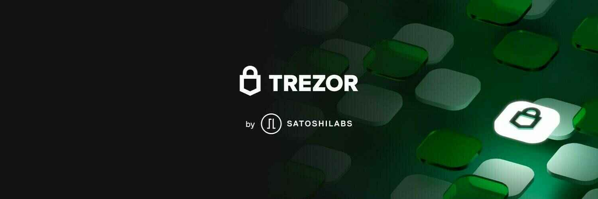
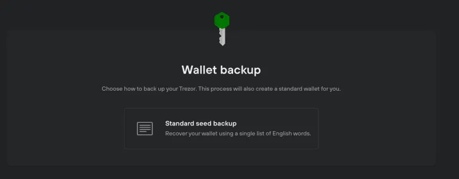
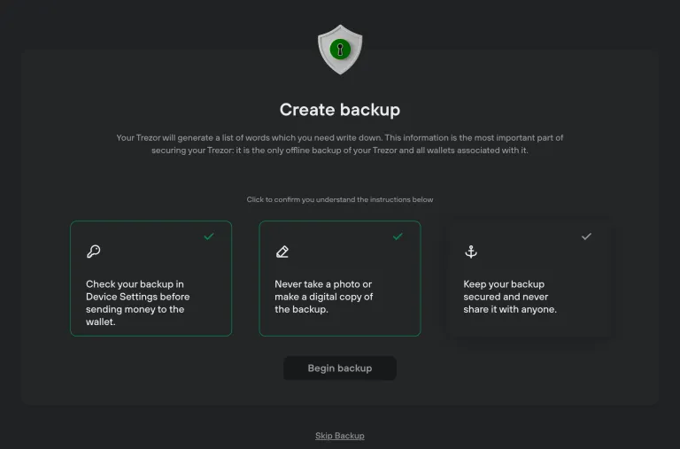
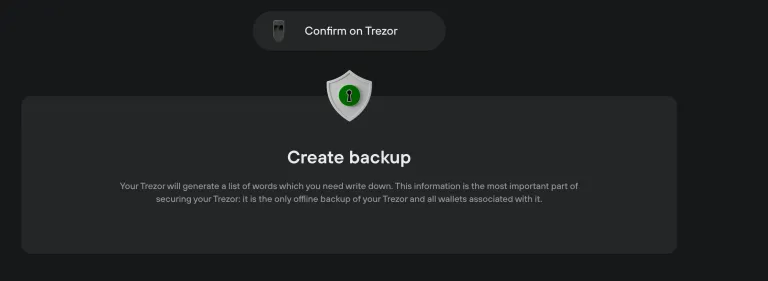
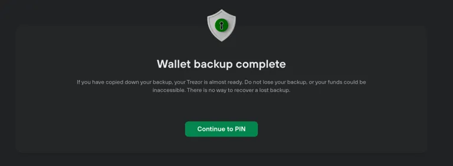
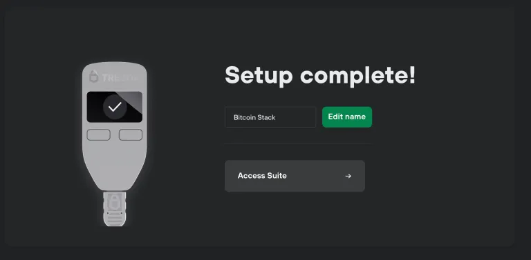
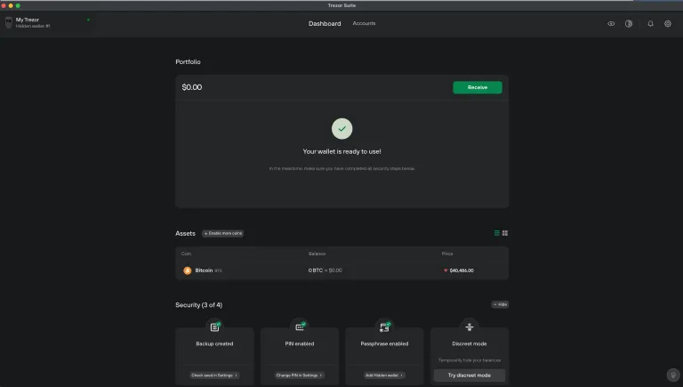
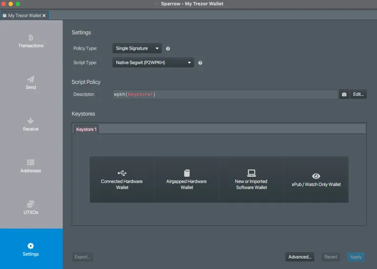
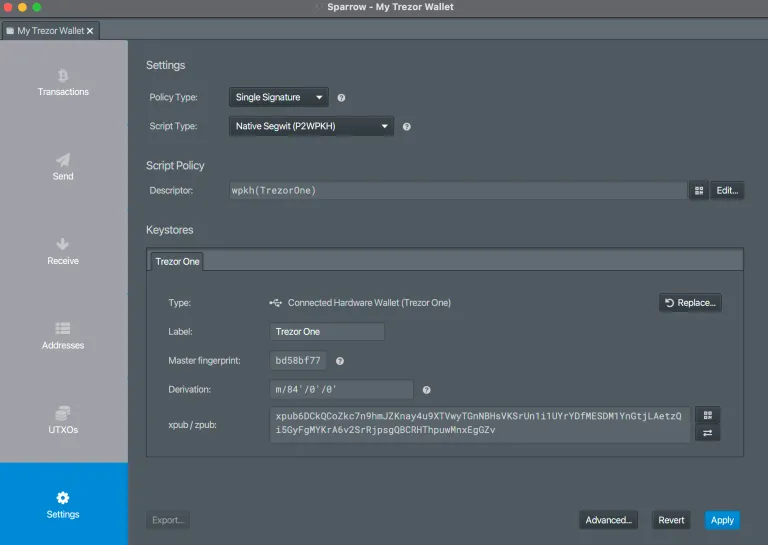
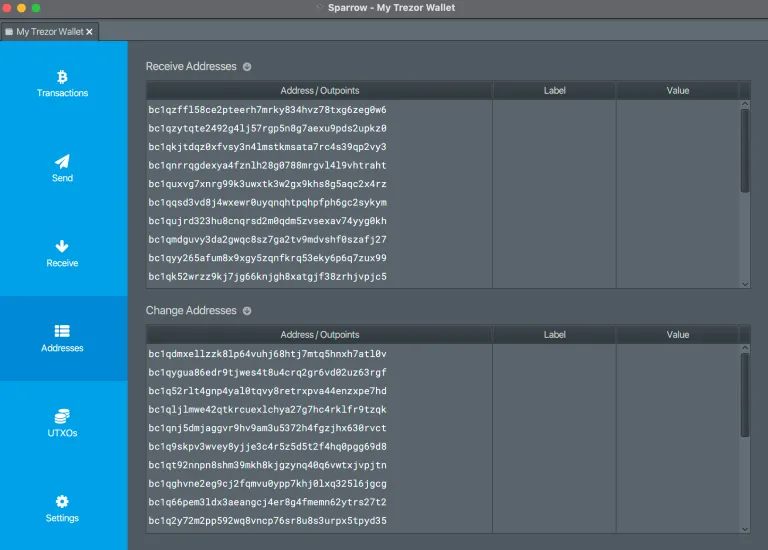

冷蔵ハードウェアポートフォリオ – 60€ – 初心者向け – 2,000€から50,000€の間で安全。

Trezorは、Bitcoinを始めるのに理想的な冷蔵物理ウォレットです。使いやすく、あまり高価ではなく、機能的です。

既に使い方に関するチュートリアルを作成しています：

1. セットアップ方法
2. ビットコインの回復
3. 使用、送信、およびビットコインの受け取り

あなたも自分のTrezorを持ちたいですか？
以下をクリックしてプロジェクトに貢献してください！

セットアップ - https://www.youtube.com/watch?v=q-BlT6R4_bE

回復: https://www.youtube.com/watch?v=3n4d4egjiFM

使用: https://www.youtube.com/watch?v=syouZjLC1zY

## 執筆ガイド

https://armantheparman.com/trezor/ によって提案されたガイド

## Trezorのセットアップ

Trezorには独自のマイクロUSBケーブルが付属しています。そのケーブルを使用し、手元にある古いケーブルを使わないでください。一部のUSBケーブルは電力のみを供給します。このケーブルはデータと電力の両方を伝送します。デバイスを電話充電用のUSBケーブルで使用すると、デバイスが接続に失敗する可能性があります。

コンピュータに接続すると、デバイスが起動します。「Trezor.io/startに行ってください」というメッセージが表示されます。それを行い、コンピュータにTrezor Suiteをダウンロードしてください。


ダウンロードボタン（「Get Desktop App」）をクリックします


署名と署名キーのリンクに注意してください。ダウンロードが改ざんされていないことを確認するためには、追加の手順があります。これは初心者にはオプションですが、大きな財産を保護する場合は必須です。その指示はガイドの最後のAppendix Aにあります。

マイクロUSBケーブルでTrezorをコンピュータに接続し、プログラムをインストールして実行します。Macでの見た目は次のようになります：


プログラムを実行した後に表示される警告は無視して続行してください：


「Setup Trezor」をクリックします


ファームウェアが古い場合は、Trezorにファームウェアの更新を許可してください。

次に、新しいシードを作成するか、既に持っているシードを使用して別のデバイスからウォレットを復元することができます。新しいシードを作成する方法を説明します。


「Create new wallet」をクリックし、デバイス自体で確認ボタンをクリックしてこれを行いたいことを確認します。

次に、「Standard seed backup」の唯一のオプションをクリックします



次に、「create backup」をクリックします


3つのチェックマークをクリックして緑色にし（もちろん各メッセージを読んでください）、次に「begin backup」をクリックします。



次に、これが表示されます：



デバイスで一つずつ提示される単語を見て、それらをきちんと順番に書き留めてください。



デバイスをロックするPINを設定します（これはシードの一部ではなく、デバイス内のシードに誰もアクセスできないようにするためのものです）。


あなたのウォレットにシットコインを追加する選択肢がありますが、私はそれをお勧めしません。ビットコインのみに投資することをお勧めします。その理由についてはこちら（なぜビットコインか）とこちら（なぜビットコインのみか）で説明しています。


ウォレットに名前をつけて、「Access Suite」をクリックしてください：



パスフレーズなしでウォレットを作成するのが最も簡単ですが、パスフレーズ付きのウォレット（本物のウォレット）とパスフレーズなしのウォレット（囮のウォレット）の両方を作成することが最善です。Trezor Suiteを通じてデバイスにアクセスするたびに、「パスフレーズを適用するかどうか」を尋ねられます。


私は「Hidden Wallet」を選択し、「craigwrightisaliarandafraud」という自分で考えたパスフレーズを入力しました。


「隠されたウォレット」と呼ばれることが気に入っています。これは、パスフレーズの機能の一部を説明しているからです。

デバイス上でパスフレーズを確認してください。

このウォレットは空ですので、パスフレーズが正しいことを確認するよう求められました：


その後、ラベリングを有効にするかどうかを尋ねられます。私はまだ探求していませんが、トランザクションにラベルを付け、データをコンピューターやクラウドに保存する方法のようです。


最終的に、あなたのウォレットが利用可能になります：



コンピューターにあるものは、「ウォッチングウォレット」と呼ばれます。これは、公開鍵（およびアドレス）を持っていますが、秘密鍵は持っていません。秘密鍵が必要なのは、秘密鍵でトランザクションに署名して支払うためです。それを行う方法は、ハードウェアウォレットを接続することです。ハードウェアウォレットのポイントは、トランザクションをコンピューターとTrezorの間で行き来させ、Trezor内で署名を適用し、秘密鍵が常にデバイス内に保持されることです（コンピューターマルウェアに対するセキュリティのため）。

Trezor Suiteは、さまざまな理由でウォッチングウォレットとしては不十分です。最低限の場合は問題ありませんが、進歩したい場合は、デバイスをSparrow Bitcoin Walletに接続する方法を学びましょう。

## ウォッチングウォレット

以前の記事で、Sparrow Bitcoin Walletのダウンロードと検証方法、およびそれを自分のノードまたは公開ノードに接続する方法を説明しました。これらのガイドに従ってください：

- Bitcoin Coreをインストールする
- Sparrow Bitcoin Walletをインストールする
- Sparrow Bitcoin WalletをBitcoin Coreに接続する

Sparrow Bitcoin Walletの代わりにElectrum Desktop Walletを使用することもできますが、ほとんどの人にとって最適だと判断したSparrow Bitcoin Walletについて説明します。上級ユーザーは、代わりにElectrumを使用することを好むかもしれません（私のガイドを参照してください）。

これから、Sparrowを起動し、Trezor（シードフレーズはあるがパスフレーズは新しく）に接続します。このウォレットはTrezor Suiteにさらされたことがないため、新しいウォレットをTrezor Suiteに接続した後に作成されます。新しいウォレットをTrezor Suiteに二度と接続しないようにしてください。（囮のウォレットとしてパスフレーズなしで接続することはできます）。

新しいウォレットを作成する：


何かきれいな名前をつけてください


「Connected Hardware Wallet」をクリックします。




「スキャン」をクリックし、次の画面で「パスフレーズを設定」して、まったく新しいウォレットを作成します（全く新しいパスフレーズを使用してください。例えば、古いパスフレーズの後に数字を追加する方法があります）。その後、「パスフレーズを送信」し、デバイス上でそれを確認します。


次に「キーストアをインポート」をクリックします。

次の画面で編集する必要はありません。Trezorがあなたのために入力してくれます。「適用」をクリックします。



次の画面ではパスワードを追加することができます。「パスフレーズ」と混同しないでください。多くの人が混同しますが、命名は不幸です。このパスワードは、コンピューター上のこのウォレットをロックするためのものです。このソフトウェアに特有のもので、このコンピューターに特有のものです。Bitcoinの秘密鍵の一部ではありません。

「適用」をクリックします。


コンピューターが考えている間に一時停止した後、左側のボタンが灰色から青色に変わるのを見るでしょう。おめでとうございます、あなたのウォレットは今使用する準備ができています。心ゆくまで取引を作成し、送信してください。



受信

ビットコインを受け取るには、左側の「アドレス」タブに移動し、受け取るアドレスの1つを選択します。受け取りたいアドレスを右クリックし、「アドレスをコピー」を選択します。その後、送金元の取引所に移動してそこに貼り付けます。または、支払いに使用できるように顧客にアドレスを提供することもできます。

ウォレットを初めて使用するときは、非常に少額を受け取り、ウォレット内の別のアドレスや取引所に戻すなどして、それを使って支出する練習をするべきです。これにより、ウォレットが期待通りに機能していることを証明できます。

それを行ったら、書き留めた言葉のバックアップを取る必要があります。1つのコピーでは十分ではありません。少なくとも2枚の紙のコピー（金属製の方が良い）を持ち、それらを異なる、よく保護された場所に保管してください。これにより、自然災害がHWWと紙のバックアップを一度に破壊するリスクが減少します。「ビットコインハードウェアウォレットの使用」でこのことについて完全な議論を参照してください。

## 送信


支払いを行うときは、「支払先」フィールドに支払い先のアドレスを貼り付ける必要があります。ラベルを空白のままにはできませんが、これはあなた自身のウォレットの記録のためだけですが、Sparrowはそれを許可しません - 何かを入力してください（それを見るのはあなただけです）。金額を入力し、希望する手数料を手動で調整することもできます。

HWWが接続されていないと、ウォレットはトランザクションに署名できません。それがHWWの仕事です - トランザクションを受け取り、署名し、署名されたものを返すこと。デバイスで署名するときは、支払い先のアドレスがデバイスとコンピューターの画面で同じであること、そして受け取った請求書（例えば、特定のアドレスに支払うようにメールを受け取ったかもしれません）を視覚的に確認してください。

また、支払い額よりも大きなコインを使用することを選択した場合、残りの金額はウォレットの変更アドレスの1つに送り返されることに注意してください。このことを知らなかった人がいて、公開ブロックチェーンで自分のトランザクションを調べ、ビットコインが攻撃者のアドレスに送られたと思ったことがありますが、実際には自分の変更アドレスでした。
ファームウェア

ファームウェアを更新するには、Trezor Suiteに接続する必要があります。これを行いたい場合は、デバイスがリセットされた場合に備えて、バックアップの言葉とパスフレーズを復元できるようにしておいてください。
結論
この記事では、宣伝されているよりも安全でプライベートな方法でTrezor HWWを使用する方法を紹介しましたが、この記事だけでは十分ではありません。冒頭で述べたように、「ビットコインハードウェアウォレットの使用」で提供されている情報と組み合わせるべきです。付録A - ソフトウェアダウンロードの検証

## 付録A - ソフトウェアダウンロードの検証


署名（テキストファイル）と署名キー（テキストファイル）をダウンロードし、ファイル名とダウンロードした場所をメモしてください。

次に、Macの場合はGPG Suiteをダウンロードする必要があります（こちらの指示を参照）。

Windowsの場合は、GPG4winが必要です（こちらの指示を参照）。

Linuxの場合、GPGはすでにすべてのパッケージの一部です。もし持っていない場合は、次のコマンドで入手してください：sudo apt-get install gpg

次に、Mac/WindowsまたはLinuxでターミナルを開き、次のコマンドを入力します：

```bash
gpg –import XXXXXXXXXX
```

ここでのXXXXXXXXXXは、署名キーファイルの完全なパス（ファイルがあるディレクトリとファイル名を含む）です。キーのインポートが成功したことを示す確認が表示されるはずです。

その後

```bash
gpg –verify ZZZZZZZZZZ WWWWWWWWWW
```

ここでのZZZZZZZZZZは署名ファイルの完全なパス、WWWWWWWWWWはダウンロードしたTrezor Suiteプログラムの完全なパスです。

出力のどこかに「SatoshiLabsからの良い署名」というメッセージが表示されるはずです。下部には無視しても安全な警告があります。