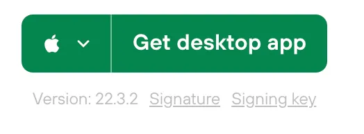

Ví cứng lạnh – 60€ – Người mới bắt đầu – Bảo mật từ 2 000€ đến 50 000€.

Là một ví vật lý lạnh, Trezor là lựa chọn lý tưởng để bắt đầu với Bitcoin. Nó dễ sử dụng, không quá đắt và chức năng đầy đủ.

Chúng tôi đã tạo các hướng dẫn về cách sử dụng nó:

1. Thiết lập
2. Khôi phục bitcoin
3. Sử dụng, gửi và nhận bitcoin

Bạn có muốn sở hữu Trezor của riêng mình không?
Bạn có thể đóng góp cho dự án bằng cách nhấp vào bên dưới!

thiết lập -https://www.youtube.com/watch?v=q-BlT6R4_bE

khôi phục: https://www.youtube.com/watch?v=3n4d4egjiFM

sử dụng: https://www.youtube.com/watch?v=syouZjLC1zY

## hướng dẫn viết

hướng dẫn được đề xuất bởi https://armantheparman.com/trezor/

## Thiết lập Trezor

Trezor đi kèm với cáp micro USB của riêng nó. Hãy chắc chắn bạn sử dụng cáp đó chứ không phải bất kỳ cáp cũ nào bạn có. Một số cáp USB chỉ dùng để cấp nguồn. Cáp này truyền dữ liệu VÀ nguồn. Nếu bạn sử dụng thiết bị với cáp USB sạc điện thoại, thiết bị có thể không kết nối được.

Kết nối nó với máy tính và thiết bị sẽ được bật nguồn. Bạn sẽ nhận được thông báo nói rằng “Go to Trezor.io/start”. Làm theo đó, và tải Trezor Suite về máy tính của bạn.


Nhấp vào nút tải xuống (“Get Desktop App”)


Chú ý đến các liên kết Signature và Signing key. Để xác minh việc tải xuống (kiểm tra xem tải xuống của bạn có bị can thiệp không), có các bước bổ sung là tùy chọn nếu bạn mới bắt đầu, nhưng BẮT BUỘC nếu bạn có tài sản lớn cần bảo mật. Hướng dẫn cho điều đó ở Phụ lục A (cuối hướng dẫn)

Kết nối Trezor với máy tính bằng cáp micro USB, và cài đặt và chạy chương trình. Dưới đây là cách nó trông trên Mac:


Bạn sẽ nhận được cảnh báo ngớ ngẩn sau khi chạy chương trình, chỉ cần tiếp tục:


Nhấp vào Thiết lập Trezor


Nếu firmware không cập nhật, cho phép Trezor cập nhật firmware.

Tiếp theo, bạn có thể tạo một hạt giống mới, hoặc khôi phục ví từ một thiết bị khác với hạt giống bạn đã có. Tôi sẽ đi qua việc tạo một hạt giống mới.


Nhấp vào “Tạo ví mới” – và xác nhận bạn muốn làm điều này trên chính thiết bị bằng cách nhấp vào nút xác nhận.

Sau đó nhấp vào lựa chọn duy nhất “Sao lưu hạt giống chuẩn”


Sau đó nhấp vào “tạo sao lưu”


Nhấp vào ba dấu kiểm để chúng chuyển sang màu xanh (tất nhiên là đọc từng thông điệp), và sau đó nhấp vào “bắt đầu sao lưu”.


Tiếp theo, bạn sẽ thấy điều này:


Trên thiết bị, xem các từ được trình bày cho bạn từng cái một và viết chúng xuống CẨN THẬN và THEO THỨ TỰ.


Đặt một PIN để khóa thiết bị (điều này không phải là một phần của hạt giống của bạn, nó chỉ để khóa thiết bị để không ai có thể truy cập vào hạt giống bên trong).


Bạn có lựa chọn để thêm các loại tiền ảo không mấy giá trị vào ví của mình - Tôi khuyên bạn không nên làm vậy, và chỉ nên lưu trữ Bitcoin, như tôi đã giải thích ở đây (tại sao chọn bitcoin) và ở đây (tại sao chỉ chọn bitcoin).


Đặt tên cho ví của bạn và nhấp vào “Access Suite”:


Cách đơn giản nhất để tạo một ví là không sử dụng cụm từ bí mật, nhưng tốt nhất là bạn nên tạo một ví với cụm từ bí mật (ví thực của bạn) VÀ một ví không sử dụng cụm từ bí mật (ví dự phòng của bạn). Mỗi lần bạn truy cập thiết bị thông qua Trezor Suite, bạn sẽ được hỏi liệu bạn có muốn “áp dụng” cụm từ bí mật hay không.


Tôi đã chọn “Hidden Wallet” và nhập một cụm từ bí mật mà tôi tự nghĩ ra “craigwrightisaliarandafraud”


Tôi thích cách nó được gọi là “ví ẩn”, vì nó giải thích một phần cách hoạt động của cụm từ bí mật.

Xác nhận cụm từ bí mật trên thiết bị.

Vì ví này là trống, tôi được yêu cầu xác nhận rằng cụm từ bí mật là chính xác:


Sau đó, bạn sẽ được hỏi liệu bạn có muốn kích hoạt tính năng gắn nhãn hay không. Đây không phải là điều tôi đã khám phá, nhưng có vẻ như là một cách bạn có thể gắn nhãn cho các giao dịch của mình và lưu dữ liệu vào máy tính hoặc đám mây của bạn.


Cuối cùng, ví của bạn sẽ sẵn sàng:


Những gì bạn có trên máy tính được gọi là “ví theo dõi”, bởi vì nó có các khóa công khai (và địa chỉ) của bạn, nhưng không có các khóa riêng tư. Bạn cần các khóa riêng tư để chi tiêu (bằng cách ký các giao dịch với các khóa riêng tư). Cách làm điều đó là kết nối ví cứng. Ý nghĩa của ví cứng là các giao dịch có thể được truyền đi và về giữa máy tính và Trezor, một chữ ký có thể được áp dụng bên trong Trezor, và khóa riêng tư luôn được giữ bên trong thiết bị (để bảo vệ chống lại malware máy tính).

Trezor Suite là một ví theo dõi không tốt vì nhiều lý do. Nó ổn cho những nhu cầu cơ bản nhất, nhưng nếu bạn muốn tiến xa hơn, hãy đọc tiếp và học cách kết nối thiết bị với Sparrow Bitcoin Wallet.

## Ví Theo Dõi

Trong các bài viết trước, tôi đã giải thích cách tải xuống và xác minh Sparrow Bitcoin Wallet, và cách kết nối nó với node của riêng bạn, hoặc một node công cộng. Bạn có thể theo dõi các hướng dẫn này:

- Cài đặt Bitcoin Core
- Cài đặt Sparrow Bitcoin Wallet
- Kết nối Sparrow Bitcoin Wallet với Bitcoin Core

Một lựa chọn khác để sử dụng Sparrow Bitcoin Wallet là Electrum Desktop Wallet, nhưng tôi sẽ tiếp tục giải thích về Sparrow Bitcoin Wallet vì tôi đánh giá đó là tốt nhất cho hầu hết mọi người. Người dùng nâng cao có thể thích sử dụng Electrum như một lựa chọn khác (xem hướng dẫn của tôi).

Bây giờ chúng ta sẽ khởi động Sparrow và kết nối Trezor (với cụm từ hạt giống nhưng bây giờ với một cụm từ bí mật). Ví này chưa bao giờ được tiếp xúc với Trezor Suite vì nó sẽ được tạo SAU khi chúng ta kết nối thiết bị với Trezor Suite. Đảm bảo bạn không bao giờ kết nối nó với Trezor Suite nữa để không lộ ví mới của bạn. (Bạn có thể kết nối nó mà không cần cụm từ bí mật vì đó có thể là ví dự phòng của bạn).

Tạo Ví Mới:


Đặt tên cho nó một cái tên đẹp


Nhấp vào “Connected Hardware Wallet”.


Nhấp vào “Scan” sau đó chọn “set passphrase” trên màn hình tiếp theo để tạo một ví mới hoàn toàn (sử dụng một passphrase hoàn toàn mới, ví dụ như passphrase cũ kèm theo một số ở sau cũng được). Sau đó “send passphrase”, rồi xác nhận trên thiết bị.


Sau đó nhấp vào “import keystore”.

Màn hình tiếp theo không cần chỉnh sửa gì, Trezor đã điền sẵn cho bạn. Nhấp vào “Apply”


Màn hình tiếp theo cho phép bạn thêm một mật khẩu. Đừng nhầm lẫn điều này với “passphrase”; nhiều người sẽ làm vậy. Cách đặt tên này không may mắn. Mật khẩu cho phép bạn khóa ví này trên máy tính của bạn. Nó chỉ đặc biệt cho phần mềm này trên máy tính này. Nó không phải là một phần của khóa riêng tư Bitcoin của bạn.

Nhấp vào “Apply”


Sau một khoảng nghỉ, trong khi máy tính đang suy nghĩ, bạn sẽ thấy các nút bên trái chuyển từ màu xám sang màu xanh. Xin chúc mừng, ví của bạn giờ đây đã sẵn sàng để sử dụng. Hãy thực hiện và gửi giao dịch theo ý muốn của bạn.


Nhận

Để nhận một số bitcoin, đi đến tab Addresses ở bên trái và chọn một trong những địa chỉ để nhận. Chỉ cần nhấp chuột phải vào địa chỉ bạn muốn, và chọn “copy address”. Sau đó đi đến sàn giao dịch nơi tiền được gửi từ và dán nó vào đó. Hoặc bạn cũng có thể cung cấp địa chỉ cho một khách hàng, người có thể sử dụng nó để thanh toán cho bạn.

Khi bạn sử dụng ví lần đầu tiên, bạn nên nhận một lượng nhỏ, thực hành gửi nó đến một địa chỉ khác, hoặc trong ví hoặc trở lại sàn giao dịch, để chứng minh rằng ví đang hoạt động như mong đợi.

Sau khi bạn làm điều đó, bạn phải sao lưu những từ bạn đã ghi lại. Một bản sao không đủ. Ít nhất phải có hai bản sao giấy (kim loại tốt hơn), và giữ chúng ở hai vị trí khác nhau, được bảo vệ tốt. Điều này giảm thiểu rủi ro một thảm họa tự nhiên phá hủy HWW và bản sao giấy của bạn trong một sự cố. Xem “Sử dụng Bitcoin Hardware Wallets” để thảo luận đầy đủ về điều này.

## Gửi


Khi thực hiện một khoản thanh toán, bạn cần dán địa chỉ bạn đang thanh toán vào trong trường “Pay to”. Bạn không thể để trống Label, nó chỉ cho bản ghi ví của riêng bạn, nhưng Sparrow không cho phép – chỉ cần nhập vào điều gì đó (chỉ bạn mới thấy nó). Nhập số lượng và bạn cũng có thể tự điều chỉnh phí bạn muốn.

Ví không thể ký giao dịch trừ khi HWW được kết nối. Đó là nhiệm vụ của HWW – nhận giao dịch, ký nó, và trả lại, đã ký. Đảm bảo khi bạn ký trên thiết bị, bạn kiểm tra visually địa chỉ bạn đang thanh toán có giống nhau trên thiết bị và trên màn hình máy tính, và hóa đơn bạn nhận (ví dụ bạn có thể đã nhận được email để thanh toán một địa chỉ nhất định).

Cũng chú ý rằng nếu bạn chọn sử dụng một đồng tiền lớn hơn số tiền thanh toán, thì phần còn lại sẽ được gửi trở lại một trong những địa chỉ thay đổi của ví bạn. Một số người không biết điều này, và đã kiểm tra giao dịch của họ trên blockchain công cộng, và nghĩ rằng một số bitcoin đã được gửi đến địa chỉ của kẻ tấn công, nhưng thực tế, đó là địa chỉ thay đổi của chính họ.
Firmware

Để cập nhật firmware, bạn cần kết nối với Trezor Suite. Nếu bạn muốn làm điều này, hãy đảm bảo bạn có các từ sao lưu và passphrase sẵn sàng để khôi phục thiết bị, chỉ trong trường hợp thiết bị được reset.
Kết luận
Bài viết này đã hướng dẫn bạn cách sử dụng Trezor HWW một cách an toàn và riêng tư hơn so với những gì được quảng cáo - nhưng chỉ có bài viết này thôi là chưa đủ. Như tôi đã nói ngay từ đầu, bạn nên kết hợp nó với thông tin được cung cấp trong "Sử dụng Ví Cứng Bitcoin".

## Phụ lục A - Xác minh việc tải xuống phần mềm



Tải xuống Chữ ký (một tệp văn bản) và Khóa ký (một tệp văn bản) và ghi chú lại tên tệp và nơi bạn đã tải tệp về.

Tiếp theo, đối với Mac, bạn cần tải xuống GPG Suite (Xem hướng dẫn tại đây).

Đối với Windows, bạn cần GPG4win (Xem hướng dẫn tại đây).

Đối với Linux, GPG đã là một phần của mọi gói cài đặt. Trong trường hợp bạn chưa có, hãy lấy nó với lệnh: sudo apt-get install gpg

Tiếp theo, cho Mac/Windows hoặc Linux, mở terminal và nhập lệnh:

```bash
gpg –import XXXXXXXXXX
```

nơi XXXXXXXXXX là đường dẫn đầy đủ tới tệp khóa ký (đường dẫn đầy đủ nghĩa là thư mục và tên tệp nơi tệp đó). Bạn sẽ thấy một thông báo xác nhận việc nhập khóa thành công.

Sau đó

```bash
gpg –verify ZZZZZZZZZZ WWWWWWWWWW
```

nơi ZZZZZZZZZZ là đường dẫn đầy đủ tới tệp chữ ký và WWWWWWWWWW là đường dẫn đầy đủ tới chương trình Trezor Suite mà bạn đã tải xuống.

Bạn sẽ thấy một thông điệp “Chữ ký tốt từ SatoshiLabs” ở đâu đó trong kết quả đầu ra. Có một cảnh báo ở phía dưới mà bạn có thể bỏ qua được.