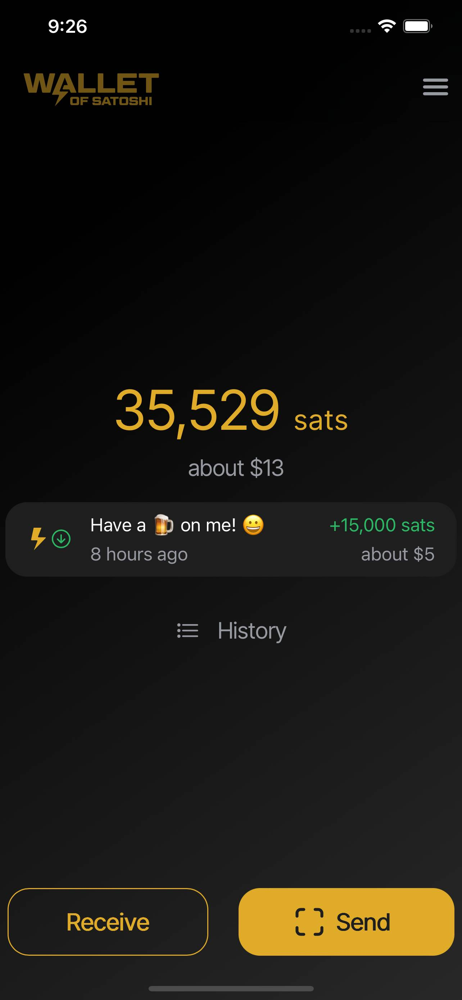

Wallet of Satoshi (https://www.walletofsatoshi.com/) ist eine mobile App für iOS und Android, mit der Sie Lightning-Zahlungen senden und empfangen können.

Es handelt sich um eine konfigurationsfreie Verwahrbrieftasche mit Schwerpunkt auf Einfachheit und bestmöglicher Benutzererfahrung. Sie kann über die Links auf walletofsatoshi.com heruntergeladen werden.

Laden Sie einfach die App herunter und installieren Sie sie, und Sie sind im Lightning-Netzwerk!

## Tutorial-Video

## Anleitung

Wallet of Satoshi ist wirklich sehr einfach zu bedienen.

Vom Startbildschirm aus drücken Sie einfach "Senden" oder "Empfangen", von dort aus können Sie einen QR-Code scannen, um zu senden, oder einen QR-Code scannen lassen, um zu empfangen.

Ausführliche Anleitung folgt.
