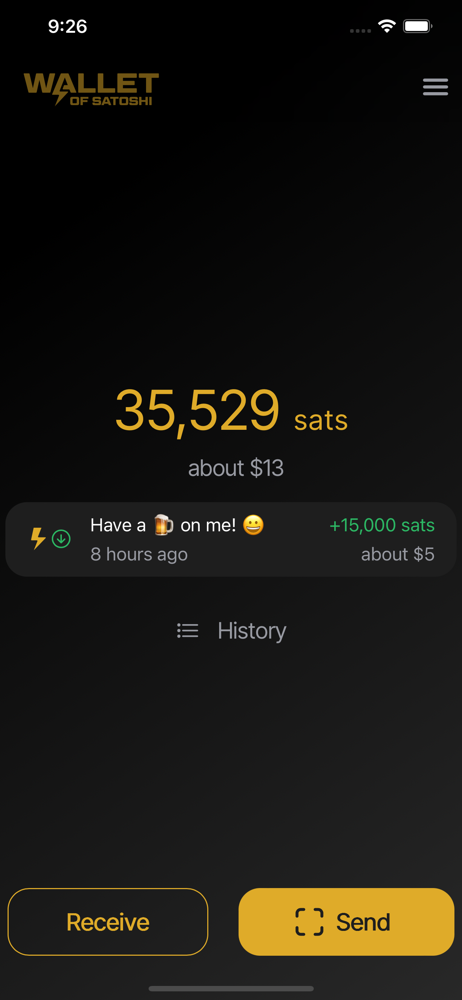

# Wallet of Satoshi

Wallet of Satoshi (https://www.walletofsatoshi.com/) es una aplicación móvil para iOS y Android que te permite enviar y recibir pagos Lightning.

Es una billetera custodial de configuración cero con un enfoque en la simplicidad y la mejor experiencia de usuario posible. Puede ser descargada utilizando los enlaces en walletofsatoshi.com

¡Simplemente descarga e instala la aplicación y estarás en la Red Lightning!

## Video tutorial

## Guía

Wallet of Satoshi es realmente muy fácil de usar.

Desde la pantalla de inicio, simplemente presiona enviar o recibir, desde allí puedes escanear un código QR para enviar o ser escaneado para recibir.

Próximamente se publicará una guía completa.
