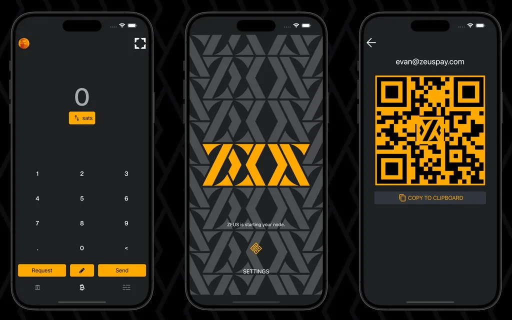

## ZEUS Wallet 简介

ZEUS 是一款移动比特币钱包和节点管理应用程序，具备比特币闪电钱包的全部功能，使比特币支付变得简单，让用户完全掌控自己的财务，并允许更高级的用户通过掌上电脑管理他们的闪电节点。

### ZEUS 的目标用户是谁？

目前，ZEUS 适用于运行自己 [Lightning Network Daemon (LND)](https://lightning.engineering/) 或 [Core Lightning (CLN)](https://blockstream.com/lightning/) 家用 / 商业节点并通过 Zeus 进行远程管理的人。

使用 [BTCPay](https://btcpayserver.org/)、[LNBits](https://lnbits.com/) 或 [Alby](https://getalby.com/)（或任何其他 LNDhub 帐户）的商家也可以通过 ZEUS 连接、使用和管理他们的节点 / 帐户。

[从 v0.8 开始](https://blog.zeusln.com/zeus-v0-8-0-open-beta/)，ZEUS 将开始为那些只想通过移动设备以简单方式进行快速、低成本比特币支付的普通用户提供服务，提供一个[内置移动闪电节点](https://docs.zeusln.app/category/embedded-node)，并集成了[闪电网络服务提供商 (LSP)](https://docs.zeusln.app/lsp/intro)。

### 重要的 Zeus 资源：

- Zeus 官方网页 - [https://zeusln.app/](https://zeusln.app/)
- Zeus 文档 - [https://docs.zeusln.app/](https://docs.zeusln.app/)
- [Zeus Github 仓库](https://github.com/ZeusLN/zeus)
- [Zeus Telegram 支持群](https://t.me/ZeusLN)
- [Zeus 在 NOSTR 上](https://iris.to/zeus@zeusln.app)
- [Zeus 博客公告](https://blog.zeusln.com)

### Zeus 功能

#### 一般功能

- 自托管钱包，仅支持比特币和闪电网络
- 无手续费，无需 KYC
- 完全开源 (APGLv3)
- 支持多节点/多账户（您可以管理自己的主节点，运行嵌入式 LND 节点，连接多个 LNDhub 账户）
- 易于使用的活动选单
- PIN 码或密语加密，隐私模式 - 隐藏您的敏感数据
- 通讯录，多主题，多语言

#### 技术功能

- 通过 Tor 连接
- 完全支持 LNURL（支付、提现、授权、通道），向闪电网络地址发送
- 详细的闪电网络通道管理，支持 MPP/AMP，密钥发送，路由费用管理
- 支持手续费替换 (RBF) 和子为亲偿 (CPFP)
- 支持 NFC 支付和请求，签名和验证消息
- 支持 Segwit 和 Taproot
- 简易 Taproot 通道
- 自托管闪电网络地址 (@zeuspay.com)
- 点 Square 收银系统（即将推出 POS 机）

### 指南和视频教程

为了能够使用 Zeus 并管理闪电网络通道、流动性、费用等，最好先阅读一些关于闪电网络的重要指南。

#### 指南：

- [LND - Lightning Network Daemon 文档](https://docs.lightning.engineering/)
- [CLN - Core Lightning 文档](https://lightning.readthedocs.io/index.html)
- [初学者闪电网络指南](https://bitcoiner.guide/lightning/) – 由 Bitcoin Q&A 提供
- [闪电节点管理](https://www.lightningnode.info/) – 由 openoms 提供
- [闪电网络与机场类比](https://darthcoin.substack.com/p/the-lightning-network-and-the-airport)
- [管理闪电节点流动性](https://darthcoin.substack.com/p/managing-lightning-node-liquidity)
- [闪电节点维护](https://darthcoin.substack.com/p/lightning-node-maintenance)

#### BTC Sessions 的视频教程

## 如何在移动设备上使用 Zeus LN 嵌入式节点入门指南

本指南献给所有希望在移动设备上使用自托管节点钱包开启全新自主网络 (LN) 之旅的新用户。

假设您已经尝试过各种托管型 LN 钱包，但尚未准备好运行公共路由 LN 节点，您只是想以更自主的方式在 LN 上积累更多 sats，并通过 LN 进行日常支付。

Zeus 应运而生，[从其博客发布的 v0.8.0 版本](https://blog.zeusln.com/new-release-zeus-v0-8-0/)开始，现在在应用中提供嵌入式 LND 节点。此前，Zeus 仅是一个远程节点管理应用程序，外加 LNDhub 账户。但现在……节点就在手机里！

### Zeus Node 主要功能快速回顾：

- **私有 LND 节点** - 这意味着此节点不会通过您的节点进行其他支付的公开路由。节点和通道是未公开的（私有的，不会显示在公共 LN 图上）。收付款将通过您连接的 LSP 对等节点进行。请记住：Zeus 嵌入式节点不会进行公开路由！

- **持久 LND 服务** - 用户可以激活此功能，并像任何常规 LN 节点一样持续保持 LND 服务处于活动状态。无需打开应用程序，持久服务将确保所有通信在线。

- **Neutrino 区块过滤器** - 区块同步使用[区块过滤器和 Neutrino 协议](https://bitcoinops.org/en/topics/compact-block-filters/)完成（无需泄露用户链上资金信息）。提醒：对于高延迟/慢速网络连接，基于 Neutrino 的区块同步有时可能会失败。尝试切换到附近的 Neutrino 服务器可能有助于恢复同步。如果没有此同步，您的 LND 节点将无法启动！

- **简易 Taproot 通道** - 关闭这些通道后，用户将承担更少的费用，并获得更高的隐私保护，因为在查看其链上活动时，这些通道看起来与其他 Taproot 支出并无二致。

- **集成 LSP** - Olympus 是 Zeus 的全新 LSP 节点。用户无需事先设置 LN 通道，即可立即通过闪电网络接收聪（比特币）。您只需创建一张闪电网络 (LN) 发票，然后通过 Zeus 的零配置通道服务从任何其他闪电网络钱包付款即可。点击此处了解更多关于 Zeus LSP 的信息。该 LSP 还通过提供封装发票来增强用户的隐私性，从而对付款人隐藏其节点的公钥。

- **联系人簿** - 您可以手动保存联系人或从 NOSTR 导入，以便轻松地向您常用的收款方付款。

- **全面支持 LNURL、闪电网络地址的发送和接收** - 现在您可以使用 @zeuspay.com 设置您自己的自托管闪电网络地址。提醒：您还可以在支持闪电网络身份验证的网站上使用 Zeus 进行闪电网络身份验证。非常方便。

- **销售点 (POS)** - 现在，商家用户可以设置自己的产品，并通过集成的 POS 系统直接在 Zeus 上进行销售。目前仅包含基本功能，但未来将添加更多扩展功能。

- **LND 日志** - 用户可以实时查看 LND 服务日志，并利用日志调试可能出现的问题（主要用于连接故障）。

- **自动备份** - LN 节点通道会自动备份到 Olympus 服务器。此自动备份使用您的节点钱包种子进行加密（没有种子则完全无效）。用户还可以手动导出 SCB（静态通道备份）以进行灾难恢复。

### 如何使用 Zeus 闪电节点（嵌入式 LND）

在本指南中，我将只讨论嵌入式 LND 节点，而不涉及使用这个出色应用程序的其他方式（远程节点管理和LNDhub 账户）。关于其他类型的连接的信息，请参阅 [Zeus 文档页面](https://docs.zeusln.app/category/getting-started)，其中有非常详细的说明，不需要单独编写专门的指南。

#### 第一步骤 - 初始设置

由于 Zeus 是一个完整的 LND 节点，我有一些初步建议：

- 请勿使用老旧设备，这可能会影响这款强大应用的使用。尤其是在同步期间，应用会大量占用 CPU 和内存。如果 CPU 和内存不足，甚至可能导致 Zeus 应用无法运行。
- 请使用 Android 11 或更高版本的移动操作系统，并尽可能更新。iOS 用户也一样，尽量使用更高版本的操作系统。
- 您至少需要 1GB 的磁盘空间用于数据存储。随着时间的推移，存储空间可能会增加，但 Zeus 提供了将数据库压缩到 MB 级别的功能。
- 无需将 Zeus 与 Tor 或 Orbot 服务一起使用。请不要让事情变得过于复杂。在这种情况下，Tor 并不会提升您的隐私，反而会使初始同步更加困难。此外，请谨慎选择您使用的 VPN，并检查连接到中微子服务器的延迟。请记住，Neutrino 区块过滤器不会泄露或追踪您的设备身份，它们只是提供区块服务。闪电网络流量也位于带有私有通道的 LSP 之后，因此泄露的信息非常少，无需担心隐私问题。

- 请耐心等待初始同步，这可能需要几分钟时间。尽量连接到延迟较低的宽带互联网。如果您运行自己的比特币节点，[您可以激活 Neutrino 服务](https://docs.lightning.engineering/lightning-network-tools/lnd/enable-neutrino-mode-in-bitcoin-core)并将您的 Zeus 连接到您自己的节点，即使使用内部局域网也可以，这样可以获得最大速度。

设置连接类型 “Embedded node” 后，应用程序将开始同步一段时间。请耐心等待同步完成，然后进入主设置页面。

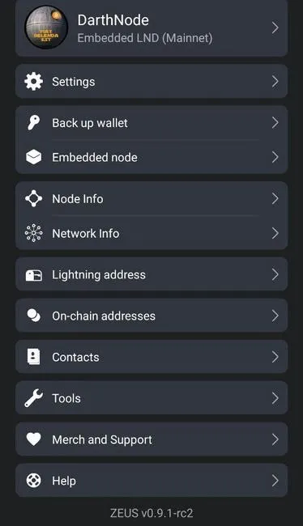

开始使用 Zeus 之前，让我们简要了解一下各个设置部分，并掌握一些主要功能：

**a - 设置**

该部分包含整个应用程序的常规设置

**1 - 闪电服务提供商 (LSP)**

此处介绍两种 LSP 服务：

- _Just in time channels_ - 当您没有任何已开启的通道或可用的收款额度时，如果启用此服务，系统将立即为您开启一个通道。如果您不想开启更多此类通道，可以禁用此选项。
- _Request channels in advance_ - 您可以直接在应用程序中通过多种选项和金额（支付额度和收款额度）Olympus LSP 购买有收款额度的闪电通道。

LSP 通过向用户的节点打开支付通道来帮助用户连接到闪电网络。[在此阅读更多关于 LSP 的信息](https://medium.com/breez-technology/envisioning-lsps-in-the-lightning-economy-832b45871992)。ZEUS 集成了一个名为[OLYMPUS by ZEUS](https://mempool.space/lightning/node/031b301307574bbe9b9ac7b79cbe1700e31e544513eae0b5d7497483083f99e581)的新 LSP，可供所有使用新嵌入式节点的用户使用。

在本节中，默认设置为 Olympus LSP (https://0conf.lnolymp.us)，但您也可以很快设置另一个支持该协议的 0conf LSP。

_记住：_

当您使用封装的 LN 发票通过 Olympus LSP 开通通道时，您还将获得 10 万聪的收款额度的流动性！如果您需要立即接收更多聪（sats），这确实是一个不错的选择。

例如：您存入 40 万聪以打开 LSP 通道，那么 LSP 将向您的 Zeus 节点打开一条容量为 50 万聪的通道，并将您存入的 40 万聪推向您的一方。

_"收款额度" = 通道的接收容量_。

未来，我们希望能够将更多 LSP 集成到 Zeus 中，并交替使用它们。新的 LSP 采用此类 0conf 通道的开放标准只是时间问题。

如果您不想“即时”打开新通道，可以禁用此选项。

在同一部分，您还可以选择在 LSP 向您的 Zeus 节点打开通道时启用 “request Simple Taproot Channels”。这些简单 Taproot 通道提供更好的链上隐私和更低的通道关闭费用。您只有两个原因不想使用它们：

- 它们是新产品，在使用它们时，LND 中可能仍存在错误。
- 您的对手不支持它们。目前，即使是 LND 节点也必须明确选择加入。

**2 - 支付设置**

此功能允许您设置闪电网络 (LN) 或链上支付的首选费用。您还可以选择增加或减少发票的超时时间。

如果部分闪电网络支付失败，您可以提高费用以寻找更佳的支付路径。此外，如果您进行链上交易，您可以设置特定费用，以避免在高额费用期间交易长时间滞留在内存池中。

**3 - 发票设置**

本部分包含生成发票的一些选项：

- 设置要在生成的发票中显示的标准备注
- 设置发票的到期时间（以秒为单位），您可以根据需要设置发票的到期时间（更长或更短）
- Include route hints（包含路由提示）--提供用于查找未公开或私有通道的信息。这允许将付款路由到网络上不公开的节点。路由提示提供收款方私有节点和公共节点之间的部分路由。此路由提示随后会包含在接收者生成的发票中，并提供给付款方。我建议默认启用此功能，否则收款可能会失败（找不到路由）。
- AMP Invoice - 原子多路径支付 (AMP) 是 LND 实现的一种新型闪电支付方式，允许使用 [keysend](https://docs.lightning.engineering/lightning-network-tools/lnd/send-messages-with-keysend) 接收聪而无需特定发票。它实际上是一个静态支付代码。[点击此处了解更多信息](https://docs.lightning.engineering/lightning-network-tools/lnd/amp)。
- Show custom preimage field（显示自定义预览字段）- 只有在非常特殊的情况下，即您确实希望在预览中使用自定义字段时，才使用此选项。[点击此处了解更多信息](https://Bitcoin.stackexchange.com/questions/90797/how-can-i-generate-preimage-for-lightning-network-Invoice-should-i)。

本节的另一个选项是如何设置要使用的链上地址类型：嵌套式 SegWit、SegWit、Taproot。

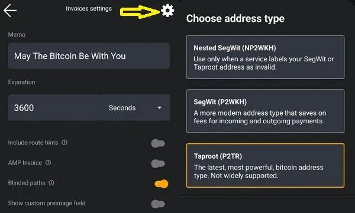

点击顶部的齿轮按钮，将弹出一个窗口，供您选择所需的地址类型。设置完成后，下次点击链上（on-chain）接收按钮时，系统将生成所选的地址类型。您可以随时更改此设置。

**4 - 通道设置**

在此部分，您可以预设一些频道开启功能，例如：

- 确认次数
- 公告通道（Announce Channel，默认为关闭），这意味着频道将不会发布公告
- Simple Taproot Channels
- 显示通道购买按钮

**5 - 隐私设置**

在这里，您可以找到一些基本设置，以便使用 Zeus 应用程序增加更多隐私：

- 区块浏览器以查看交易详情（Mempool.space、blockstream.info 或自定义的个人版本）
- 读取剪贴板（Read Clipboard）- 开启/关闭 Zeus 读取设备剪贴板的开关
- Lurker Mode - 开启/关闭 Zeus 隐藏某些敏感信息。在进行演示或截图时，此功能非常实用。
- Mempool 费用建议 - 如果您想使用 [mempool.space](https://mempool.space/) 推荐的费用级别，请启用此选项。

**6 - 安全**

此部分仅提供两种应用开机安全设置选项：设置密码或 PIN 码。

​​设置 PIN 码后，您还可以设置 “duress PIN”（胁迫 PIN 码）。此附加的秘密 PIN 码仅在您受到威胁等紧急情况下使用。如果您输入此 PIN 码，所有配置将被清除。因此，您最好定期备份数据。自动备份默认开启，但建议您在设备外也进行备份。

**7 - 货币**

启用或禁用在 Zeus 应用程序使用中显示法定货币换算的选项。目前支持全球 30 多种法定货币。

**8 - 语言**

您可以切换多种翻译语言，这些语言均由 Zeus 社区的母语者审核。

**9 - 显示**

在此部分，您可以个性化 Zeus 显示屏，选择各种颜色主题、默认屏幕（小键盘或余额）、显示节点别名、激活大键盘按钮、显示更多小数位。

**10 - 销售点**

这是一项特殊功能，用于启用/禁用 Zeus 中的集成 PoS 系统。您可以运行独立的 PoS 系统，也可以与 Square PoS 系统连接。目前，Zeus 只支持 PoS 的基本功能，但足以作为一个良好的开端，并能帮助那些小商户（酒吧/餐馆、杂货店）开始以本地方式接受 BTC。

在该设置中，您可以看到设置 PoS 的各种选项：

- 确认付款类型：仅 LN、0-conf、1-conf
- 启用/禁用操作 POS 机的员工小费
- 显示/隐藏键盘
- 应用于小票的税率
- 创建产品和产品类别
- 所有销售的简单列表

以下是 Zeus POS 系统的使用演示视频：

**B - 备份钱包**

ZEUS 内置节点基于 LND，并使用 [aezeed 种子格式](https://github.com/lightningnetwork/lnd/blob/master/aezeed/README.md)。这与大多数比特币钱包中常见的 [BIP39 格式](https://github.com/bitcoin/bips/blob/master/bip-0039.mediawiki) 不同，尽管它们看起来可能很相似。Aezeed 包含一些额外数据，例如钱包的创建日期，这有助于在恢复过程中更高效地进行重新扫描。

aezeed 密钥格式应与以下移动钱包兼容：Blixt、BlueWallet 和 Breez。请注意，如果您有未关闭或待关闭的通道，仅凭种子不足以恢复您的所有余额！

请访问[Zeus 文档页面](https://docs.zeusln.app/for-users/embedded-node/backup-and-recovery)了解更多关于备份和恢复流程的信息。

重要提示：保存助记词时，请务必同时保存节点公钥！有时，将公钥、助记词和静态通道备份 (SCB) 放在手边，以便在需要验证恢复状态时使用，会很有帮助。

仅当您开启了闪电网络通道时才需要 SCB。如果您只有链上资金，则无需 SCB。

如果您发现长时间后仍然无法显示旧交易历史，请前往 “Embedded node - Peers”，并禁用 “使用选定节点列表” 选项（默认为 btcd.lnolymp.us）。这将触发重启，并连接到响应速度更快的可用 Neutrino 节点。或者，您也可以使用下面提到的其他知名 Neutrino 节点。

如果您想了解更多 LND 节点的恢复选项，[请阅读我之前的指南](https://darth-coin.github.io/nodes/shtf-restore-lnd-node-en.html)，其中介绍了如何将 Aezeed 种子导入 Sparrow 钱包或其他方法。

**C - 嵌入式节点（Embedded Node）**

本节将介绍一些用于管理集成节点的基本工具：

- _Disaster Recovery_ - LN 通道的自动和手动备份。请访问 Zeus 文档页面，了解如何使用此功能。
- _Express Graph Sync_ - Zeus 应用将从专用服务器下载 LN gossip 数据图，以实现更快、更佳的同步，并提供最佳的传输路径。您还可以选择在启动时清除之前的图数据。
- _Peers_ - 用于管理 Neutrino 对等节点和 0-conf 对等节点的部分。如果您遇到初始同步问题，例如通道无法上线，则可能是因为您的设备与配置的 Neutrino 对等节点之间存在较高的延迟。请尝试切换首选对等节点列表，或添加您已知延迟更低的对等节点。常用的 Neutrino 服务器包括：

 - btcd1.lnolymp.us | btcd2.lnolymp.us - 适用于美国地区
 - sg.lnolymp.us - 亚洲地区
 - btcd-Mainnet.lightning.computer - 适用于美国地区
 - uswest.blixtwallet.com （西雅图） - 适用于美国地区
 - europe.blixtwallet.com（德国） - 适用于欧盟地区
 - asia.blixtwallet.com - 适用于亚洲地区
 - node.eldamar.icu - 适用于美国地区
 - noad.sathoarder.com - 适用于美国地区
 - bb1.breez.technology | bb2.breez.technology - 适用于美国地区
 - neutrino.shock.network - 美国地区

- _LND logs_ - 非常实用的工具，可用于调试 LN 节点问题，并从技术层面深入了解节点运行状况。
- _Advanced Settings_ - 更多工具可用于控制 LND 节点的使用：：

 - _Pathfinding mode_ - bimodal（双模）或 apriori（先验路径）查找模式，用于为您的 LN 支付寻找更优路径，并重置之前的路由信息​​。请阅读以下关于路径查找的优秀指南：[路径查找](https://docs.lightning.engineering/lightning-network-tools/lnd/pathfinding) - 由 Docs Lightning Engineering 提供，以及 [LN 支付路径查找](https://voltage.cloud/blog/lightning-network-faq/understanding-payment-pathfinding-between-nodes-on-lightning-network/) - 由 Voltage 提供。
 - _Persistent LND_ - 如果您希望 LND 服务在后台持续运行，并保持节点 24/7 全天候在线，请激活此模式。如果您在小型商店中使用 Zeus 作为 POS 机，或者您通过 LN 地址收到大量 LN 小费，这将非常有用。
 - _Rescan wallet_ - 此选项会在重启后触发对您钱包所有链上交易的完整扫描。仅当您的钱包中缺少某些交易时才启用此选项。重新扫描任务需要几分钟时间，请耐心等待，并始终查看日志以了解更多进度详情。
 - _Compact Database_ - 如果您的 Zeus 应用程序占用了大量设备空间（请参阅设备设置中的应用程序详情），该选项将非常有用。如果您使用 Zeus 的活动很多，我建议您经常进行压缩。一旦发现 Zeus 应用程序有超过 1 到 1.5GB 的数据，请执行压缩。它会重新启动并需要一些时间，请耐心等待。
 - _Delete Neutrino files_ - 该选项用于删除 Neutrino 文件（需要重启），这将大大减少数据存储的使用量。减少数据使用量也会对电池使用产生很大影响，尤其是在使用 Zeus 的持久模式下，更能有效减少电池消耗。

**D - 节点信息**

在本节中，您可以找到有关 Zeus 节点状态的更多详细信息，例如：

- Alias - 别名，简短的节点 ID
- Public Key（公钥）- 其他节点需要使用的完整公钥才能找到指向您节点的路径。请注意，此公钥在常规闪电网络浏览器（Mempool、Amboss、1ML 等）上不可见。此公钥只能通过您连接的闪电网络对等节点和通道访问。
- 闪电网络实现版本
- Zeus 应用程序版本
- Synced to chain（已同步到区块链）和 Synced to graph（已同步到图表）的状态 - 非常重要，它们显示了您节点的正确状态。如果这两个状态未显示为 “true”，则表示您的节点仍在同步或同步过程中遇到一些问题。因此，建议您查看闪电网络日志或稍等片刻。
- 区块高度和哈希值 - 显示节点看到并同步的最后一个区块和哈希值。

**E - 网络信息**

本部分显示从您的图同步数据中提取的闪电网络总体状态的更多详细信息：可用公共通道数、节点数、僵尸通道数（离线或失效）、图直径、图的平均度和最大度。

这些信息可用于调试或统计。

**F - 闪电地址**

在本部分，用户可以设置自己的自托管闪电地址 @zeuspay.com。

ZEUS PAY 利用用户生成的原像哈希、hodl 发票和 Zaplocker Nostr 认证方案，使用户即使无法 24/7 全天候在线也能接收发送到静态闪电地址的付款。用户只需在 24 小时内登录其 ZEUS 钱包即可领取付款，否则款项将被退回给接收者。

如果您激活 “persistent mode”，您的闪电地址将立即收到所有付款。

了解 [Zaplocker](https://github.com/supertestnet/zaplocker#how-it-works) 支付的工作原理以及更多关于 [ZeusPay 费用](https://docs.zeusln.app/lightning-Address/fees) 的信息。

**G - 链上地址**

在本部分，您可以查看生成的链上地址，以便更好地管理您的比特币。

**H - 联系人**

Zeus v 0.8.0 版本新增了联系人功能，您可以利用它快速向亲朋好友付款，还可以从 Nostr 导入联系人。

只需输入您的 Nostr npub 地址或易于理解的 NIP-05 地址，Zeus 就会向 Nostr 查询您的所有联系人。您可以在这里向联系人快速付款，或将所有或选定的联系人导入到本地通讯录。

以下视频简要介绍了如何配置和使用您的 Zeus 联系人：

**I - 工具**

这里有多个子版块，提供更多工具：

- _Accounts_ - 您可以在这里导入外部账户/钱包，包括冷钱包和热钱包，用于控制或作为 Zeus 节点通道的外部资金来源。此功能目前仍处于实验阶段。
- _Speed Up Transaction_ - 当您的交易卡在内存池中，需要提高手续费时，此功能非常有用。您需要提供交易详情中的交易输出，并选择您想要使用的新手续费。新手续费必须高于之前的手续费，并且要求您的链上钱包中有足够的可用资金。

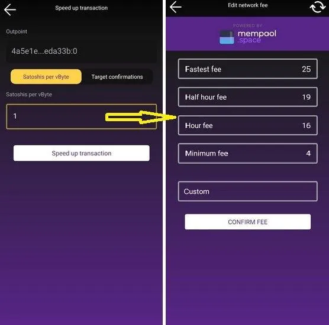

您需要找到待处理的交易，复制其交易 ID。然后进入此版块并粘贴该交易 ID，再选择您想要使用的新手续费。此时会弹出一个新窗口，显示推荐的手续费，您也可以设置自定义手续费。请记住，UTXO 必须高于前一个。

建议您在 Zeus 链上钱包中保留一个最大 10 万聪的 UTXO，以便在必要时用它来替换（提高）手续费。

- _Sign or verify_ - 此功能允许您使用钱包密钥对特定消息进行签名。它还可以用于验证消息，以证明消息来自特定的钱包密钥。
- _Currency converter_ - 一个计算 BTC 和其他法定货币之间汇率换算的简单工具。

**J - 商品和支持**

您可以在这里找到更多关于 Zeus、在线商店、赞助商和社交媒体的信息和链接。

**K - 求助**

在最后一个部分，您可以找到 Zeus 文档页面、GitHub Issues（如果您想提交错误报告或直接向应用开发者提出请求）和电子邮件支持的链接。

### 步骤 2 - 开始使用Zeus节点

请记住，Zeus 主要用作 LN 钱包，用于通过闪电网络方便快捷地付款。当然，它也包含一个链上钱包，但只能用于打开/关闭闪电通道，而不能用于购买咖啡的定期支付。

请阅读我的其他指南[如何利用三级储蓄账户打造自己的银行](https://darth-coin.github.io/beginner/be-your-own-bank-en.html)。

此时，用户有两种方式开始使用 Zeus：

目前用户有两种方式可以开始使用 Zeus：

- 直接通过闪电网络，使用 Olympus LSP 的 0-conf 通道
- 先在链上钱包充值，然后与目标节点建立普通的闪电网络通道。

#### 方法 A - 使用奥林巴斯 LSP

这是一种非常简单直接的方法，可以帮助 Zeus 为新的闪电网络 (LN) 用户提供有意思的教导。无论是完全没有聪的比特币新手，还是由朋友介绍的新用户，亦或是首次使用 LN 进行支付的新商家，都可以使用这种方法。

默认情况下，Zeus 将使用其自有的 LSP Olympus。但之后，您也可以切换到其他支持此零配置协议的 LSP 来建立通道。

只需在您的 Zeus 上创建一个发票（输入金额并点击 "request" 按钮），您就能立即收到这些聪了。

您生成的发票将被[包装](https://docs.zeusln.app/lsp/wrapped-invoices)，如果您支付了服务相关费用，您将看到相关费用。此包装发票包含指向您 Zeus 节点的路由提示，以便 LSP 可以找到您的新节点并使用您存入的新资金建立通道。

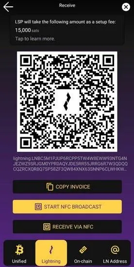

首次从 LSP 获取包含所需资金的闪电网络通道时，您必须使用另一个闪电网络钱包支付此账单，并等待片刻，直到 LSP 为您的 Zeus 节点打开通道，扣除手续费并将剩余款项推送到您这边的通道。

您只需使用另一个闪电网络钱包支付 ZEUS 为您生成的发票，您的通道就会立即打开。[请参阅 Zeus LSP 手续费](https://docs.zeusln.app/lsp/fees)。

支付通道费用的另一个好处是零路由费。这意味着在路由付款时，通过 ZEUS 的 OLYMPUS 的第一跳不会产生路由费。请注意，超过 ZEUS 的 OLYMPUS 之后的跳数仍会收取费用。

通道准备就绪后，点击屏幕底部右侧的按钮，即可显示 Zeus 通道。

您会看到这样一个通道，显示您这边的通道平衡：

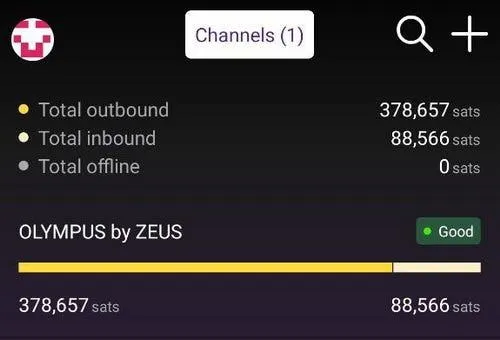

您从该通道支出的资金越多，收款额度资金就越多。从该通道接收的聪（比特币）越多，收款额度就越小。

下面是关于 LN 通道如何工作的简单直观演示（由 Rene Pickhardt 制作）：

在当前通道演示界面，点击通道名称即可查看更多详细信息。

您与 Olympus 之间有一个通道，总容量为 490,000 聪，您这边余额为 378,000 聪，Olympus 这边余额为 88,000 聪。这意味着您最多可以在同一通道中再接收 88,000 聪。

如果您需要接收超过 8.8 万聪（本例中为可用收款额度），例如 50 万聪，只需创建一个包含该金额的新闪电发票，即可触发向 Olympus LSP 发送新的通道请求。这样您就能获得第二个通道。

因此，为了避免因打开多个通道而支付更多费用，建议首次打开较大的通道，例如容量为 1-2 百万聪。一旦开通，您可以使用本指南中介绍的任何外部交换服务，将这些聪的一部分（例如 50%）交换到链上。

一旦您从该通道换出，比如说换出 50%，并将聪装回您自己的 Zeus 链上钱包，您就可以进入下一个打开新通道的方法--从链上平衡。

#### 方法 B - 使用链上余额

使用这种方法，您可以打开通往任何其他 LN 节点的通道，包括同一个奥林巴斯 LSP。但如果您已经与奥林巴斯建立了通道，建议您也与另一个节点建立通道，这样更可靠，而且还可以使用 MPP（多部分支付）。

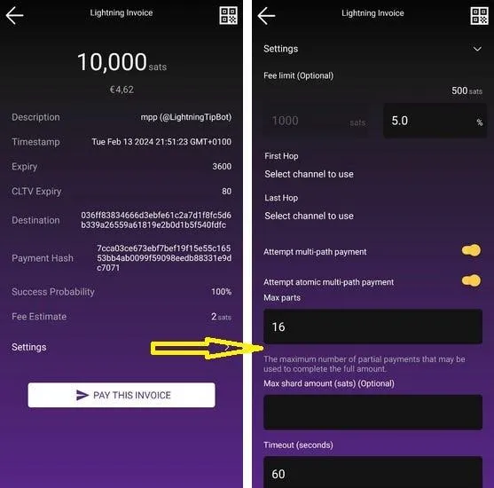

以上是使用 MPP 支付闪电发票的示例。如您所见，屏幕底部有 “Settings” 选项，点击后会打开一个下拉页面，其中包含您即将进行的付款的更多详细信息。在该界面中，如果您至少打开了两个通道，MPP 功能将默认开启。您还可以激活 AMP（原子多路径）并设置所需的特定部分。这是一个强大的功能！

对于像 Zeus 这样的私有节点，我建议拥有 2-3 个优质通道（最多 4-5 个），并配备良好的 LSP 和充足的流动性，以满足您在闪电网络 (LN) 上支付或接收聪的所有需求。[更多闪电网络节点流动性建议，请参阅此指南](/nodes/managing-lightning-node-liquidity-en.html)。此外，这里还有一份来自 Bitcoin Design 团队的[关于闪电网络流动性的通用指南](https://bitcoin.design/guide/how-it-works/liquidity/)。

我知道，即使对于经验丰富的用户来说，选择合适的节点也并非易事。 [所以我会提供一些入门选项](https://github.com/ZeusLN/zeus/discussions/2265)，这些是我用 Zeus 测试过的对等节点（为了避免兼容性问题，我只尝试连接到 LND 节点）。

这里还有一个 Zeus 认证节点列表。如果您知道其他可靠的节点，欢迎添加到列表中。

您可以通过以下步骤在 Zeus 中打开通道：点击主视图右下角的通道图标，进入 “Channels” 视图，然后点击右上角的 “+” 图标。

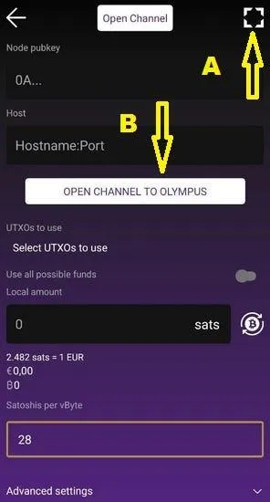

如果您想打开与特定节点的通道，请点击右上角的 (A) 扫描节点二维码 nodeID（在 Mempool、Amboss 和 1ML 上，您可以获取该二维码），所有对等节点的详细信息将会显示。

提醒：

- Zeus 嵌入式节点不使用 Tor 服务！因此，请勿尝试与使用 Tor 的节点建立通道！这样做弊大于利，反而会损害您的隐私。对于闪电网络而言，Tor 并不能提升隐私，反而会带来更多麻烦。
- 请谨慎选择您的对等节点，最好选择优质的流动性提供商 (LSP) 和路由节点，而不是那些可能关闭您的通道且无法提供良好流动性的普通节点。[我专门撰写了一篇关于流动性和节点示例的指南](https://darth-coin.github.io/nodes/managing-lightning-node-liquidity-en.html)。

如果直接点击 "Open Channel to Olympus" 按钮，系统将自动填写所需字段，以便打开通往 [OLYMPUS by ZEUS](https://mempool.space/lightning/node/031b301307574bbe9b9ac7b79cbe1700e31e544513eae0b5d7497483083f99e581) 的通道。

与付费 LSP 通道不同，您的通道需要链上确认，确认资金将来自您的链上资金（您可以在“打开通道”视图中选择您的 UTXO）；通道不会立即打开。请先查询实际的 mempool 手续费，并根据您希望通道打开的速度进行相应调整。

点击 “Open Channel” 按钮之前，请下拉高级选项：

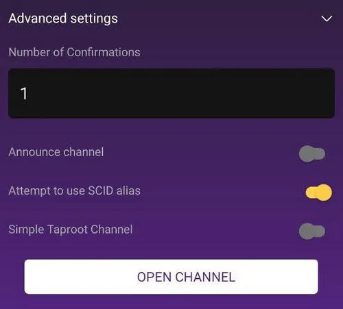

您还需要确保通道设置为非公开（私有）。默认情况下，已公布通道的此选项处于关闭状态。不建议在 Zeus 嵌入式节点中启用此选项，它仅在您将 Zeus 与远程节点配合使用，作为公共路由节点时才有用。

与付费 LSP 通道不同，使用此方法打开通道无法享受零手续费路由。

完成！只需点击“打开通道”按钮，等待矿工确认交易即可。通道打开后，您可以使用通道中的聪进行任意交易。

请记住，这些通道的所有余额都将保留在您的账户中，因此您无法获得收款额度。正如我之前所说，您需要兑换或花费一些聪在闪电网络 (LN) 上购买商品，以“腾出更多空间”来接收资金。

您可以将闪电网络通道想象成一杯水。您将一些水（聪）倒入空杯（您的通道）中，直到装满为止。您必须先喝掉一些水（花费/兑换），才能继续倒入水。当杯子快空的时候，可以通过充值（聪）的方式注入更多水。[点击此处了解更多关于外部交换服务的信息](https://darth-coin.github.io/nodes/lightning-submarine-swaps-en.html)。

还有其他闪电网络服务提供商（LSP）提供有收款额度的通道，例如 LNBig 或 Bitrefill。我认为应该还有其他类似的服务，但我现在想不起来了。

因此，如果您需要一个几乎空的闪电网络通道（初始时对等方余额为 100%），以便接收超出现有已满通道处理能力的付款，这可能是一个非常好的选择。您需要支付一定的开通费用，但可以获得充足的入站空间。

## 使用技巧

### 收款额度限制

目前，由于 LN 代码的限制，无法准确接收 “收款额度” 显示的金额。请务必记住，您的发票金额应略低于 “Channel Local Reserve” 金额。

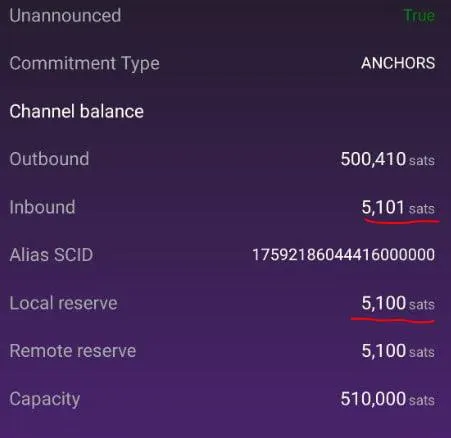

如上图所示，“inbound”（收款额度）显示我仍然可以接收 5101 聪，但实际上目前无法接收更多。您可以看到，这与 “Local reserve” 金额相同。

因此，请记住，在创建收款发票时，同时查看您的通道流动性，并从中扣除本地储备，以便尽可能接近收款限额。

### 给 Zeus 节点新手的快速建议：

- 正确设置您的新通道。

例如，如果您知道一周内将收到 100 万聪，则应开设一个 200 万聪通道，并将其交换到链上钱包或另一个（临时）托管闪电账户，占您支付额度的 50-60%。随时准备好更多的流动性。一旦您需要更多的流动性回到 Zeus 通道，您可以将其从托管账户移回。

如果您知道每周会发送 50 万聪，可以开设一个 100 万聪的通道。这样，您就能保持一定的储备，直到再次充值。

- 如果您是商家，并且经常收到多于支出，可以购买一个专用的收款额度通道。这是最经济的方式。您只需支付少量费用，即可获得一个“空”通道。

- 不要开设 5 万、10 万、30 万或 50 万聪这样毫无意义的小通道。即使您只用它们来发送 Zap，几天之内就能把它们填满。开通更大容量的通道，并且要开通不同的通道，不要只开通一个。

一旦您开通了更大的通道，您就可以随时使用外部潜艇交换将聪转移到您的链上钱包（包括转回 Zeus 链上钱包）。保持收款额度和支付额度平衡是好事，而且如果您愿意，您还可以 “重用” 这些聪来开通更多通道。

### Wrapped Invoice

如果您希望在收款时更加注重隐私，可以使用 “Wrapped Invoice” 功能。请注意：要使用此功能，您需要一个 Olympus LSP 通道。封装发票会 “隐藏” 最终目的地（您的 Zeus 节点），并向接收者显示您的 LSP 节点作为目的地。

为了获取包装好的发票，请进入主键盘屏幕，输入金额并点击申请。将显示一个普通的发票二维码。现在，点击右上方的 "X" 按钮，您将跳转到发票的更多选项。

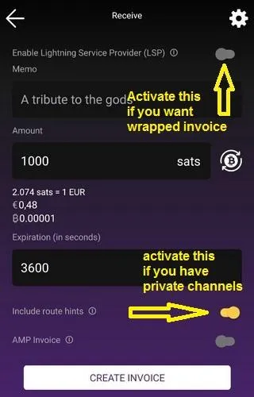

现在，您必须激活顶部的 "Enable LSP" 选项，然后点击 "Create Invoice" 按钮。此选项将创建封装发票，请注意，此操作会收取少量费用。

### 带有路由提示的发票

如果您需要管理多个收款额度的流动性，此功能非常实用。实际上，您可以指定要将发票中的 sats 接收到哪个入站通道。

此功能也可用于循环再平衡，即当您想要将流动性从一个已满的通道转移到另一个已耗尽的通道时。

如何创建带有路由提示的发票？

- 在主屏幕上，向右滑动 “LN” 按钮，然后点击 “Receive”。

- 在发票设置中，滚动到底部，激活 “Insert route hints” 按钮，然后选择 “Custom” 选项卡。这将打开一个包含所有可用通道的屏幕。选择您要用来接收资金的通道。

- 填写所有其他发票详细信息，例如金额、备注等，然后点击 “create invoice”。

- 支付该发票后，资金将转入指定的渠道。

如果您想将发票款项支付给自己（循环再平衡），当您从同一个 Zeus 节点付款时，请在付款界面选择您希望用于发送付款的接收通道（流动性更高的通道）。

### 使用 Keysend 支付

Keysend 是闪电网络一项被严重低估的功能，用户应该更频繁地使用它。

[Keysend](https://docs.lightning.engineering/lightning-network-tools/LND/send-messages-with-keysend)允许闪电网络中的用户直接向他人的公钥发送付款，只要他们的节点有公共信道并启用了 Keysend。Keysend 不要求接收者签发发票。

那么，如何才能用 Zeus 做到这一点呢？

只需扫描或复制目标节点 ID（或者使用 Zeus 联系人将常用目标节点保存为联系人），然后在 Zeus 主界面点击 “Send” 按钮。在该界面中，粘贴节点 ID 或从联系人中选择。

输入聪的金额和必要的信息（是的，您也可以将其用作闪电的秘密聊天工具），然后点击 "Send" 按钮。完成！

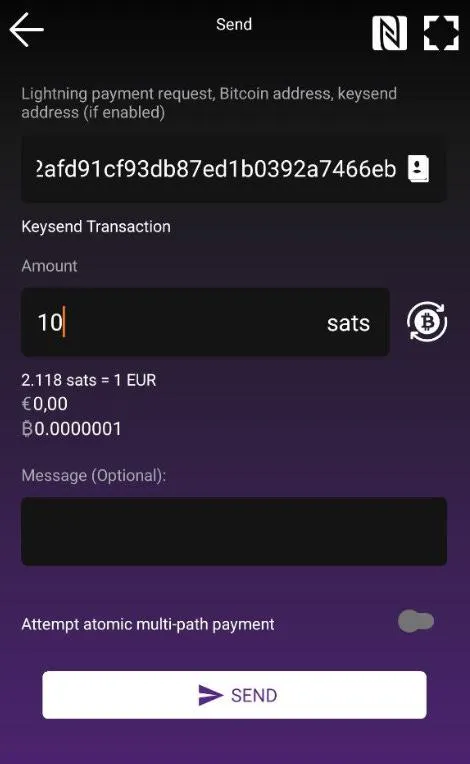

如果您与目标节点之间有直接通道，则不会产生任何费用。

如果您与目标节点之间没有直接通道，则密钥发送付款将作为正常的闪电网络发票付款来支付费用，并路由至目标节点。

## 结论

我建议您阅读后续指南 [Zeus 的高级用法指南](https://darth-coin.github.io/wallets/zeus-node-advanced-usage-en.html)，其中包含更多说明和用例。

好了！就是这样！从现在开始，您只需像使用普通 BTC/LN 钱包一样在手机上使用 Zeus Node 即可。它的用户界面非常简洁易用，任何类型的用户都能轻松上手，我想我无需赘述如何进行收付款。

最后，这里附上一张隐私对比图表：

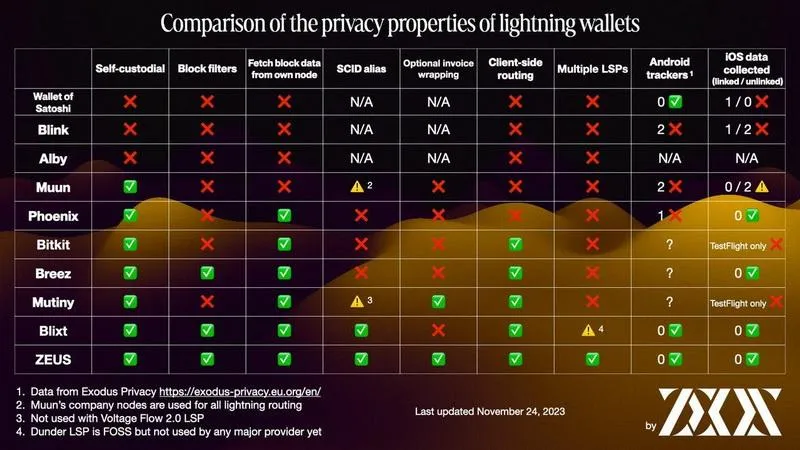
