ZEUS 最初是一款用于远程管理闪电网络节点的移动应用程序，允许您控制安装在远程服务器上的节点。

但该应用程序还包含一个“嵌入式节点”功能。

**本教程将重点介绍该应用程序的这一功能。** 这使得任何人都可以在移动设备上拥有自己的闪电网络节点，而无需专用服务器，就像 ACINQ 提供其功能强大的闪电钱包 Phoenix 一样。

https://planb.academy/tutorials/wallet/mobile/phoenix-0f681345-abff-4bdc-819c-4ae800129cdf

*提醒一下，闪电网络是一个与比特币并行运行的网络，它允许比特币无需进行链上交易即可进行交换。其结果是交易几乎是瞬时的，无需等待 10 分钟的区块验证。这在实体店付款时尤其有用。此外，闪电网络提供了比特币网络本身所不具备的卓越**保密性***。。

**Zeus“集成版”** 旨在满足希望最大限度保护隐私和自主权的比特币用户的需求。

简而言之，它**有可能**成为密码朋克们梦寐以求的移动钱包。即便它仍处于早期阶段（alpha 版本），存在一些漏洞，但其功能丰富，毫无疑问，它将令那些追求最大控制权和选择权的勇于探索者们欣喜不已。

另一方面，我认为它目前并不适合那些不熟悉比特币、只想简单收发聪（比特币最小单位）的初学者。尽管未来可能会有所改变，但我们正在为初学者实施基于 Cashu（Chaumian Ecash）协议的托管功能

## 安装应用程序

前往[项目网站](https://zeusln.com/)下载适用于您智能手机操作系统的应用程序：

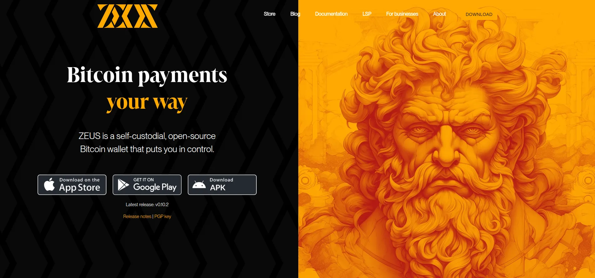

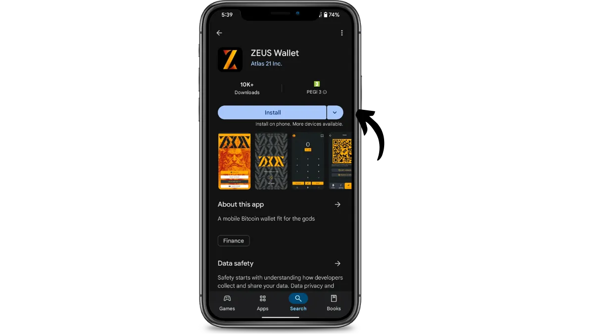

## 创建钱包

应用程序启动后，点击 "Quick Start" 按钮开始创建钱包。

随后会出现一系列初始化界面。请稍等片刻，然后等待几分钟，直到节点通过 Neutrino 完成 100% 同步。

这可能需要几分钟时间。Neutrino 是一种让移动钱包无需运行完整节点即可访问比特币区块链信息的方法。

稍等片刻，即可开始使用。

## 应用程序设置

准备就绪？嗯，还没完全准备好。毕竟，一个名副其实的 Zeus 用户，使用钱包时自然要尽显风范。所以我们需要更换一下头像。

点击屏幕右上角的头像：

点击齿轮图标，然后点击加号“+”：

选择一张最能代表 Zeus 钱包的照片，然后点击屏幕底部的 "CHOOSE PICTURE"，再点击右上角的箭头返回上一页。

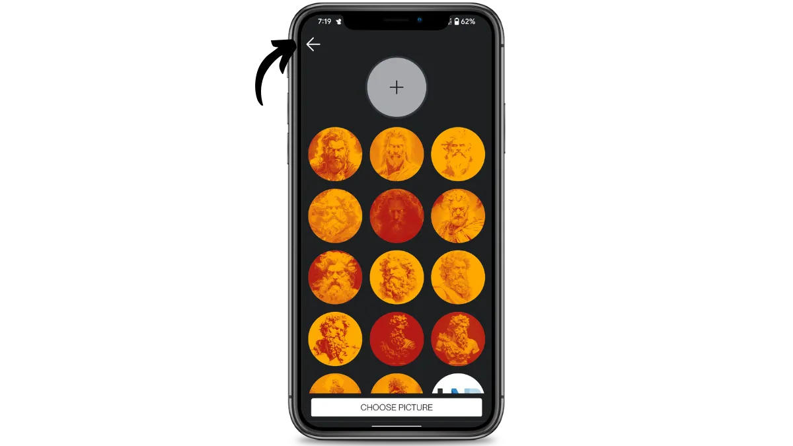

最后，给您的钱包起个名称，然后点击 "SAVE Wallet CONFIG" 使更改生效。最后，点击左上角的返回箭头返回主屏幕。

这一次，我们可以真正开始了。

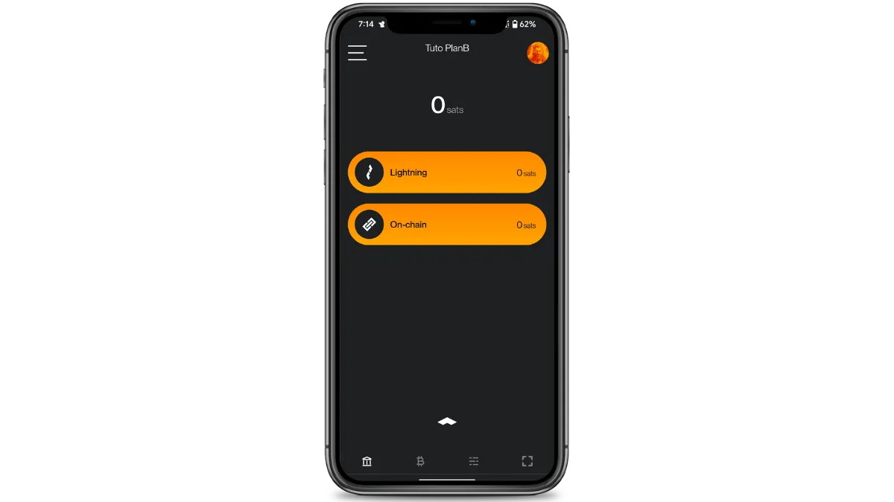

### 生物识别

为了保护您的钱包安全，您可以添加 PIN 码/密码并启用生物识别功能。

为此，请点击左上角的横线进入 Wallet 主选单。

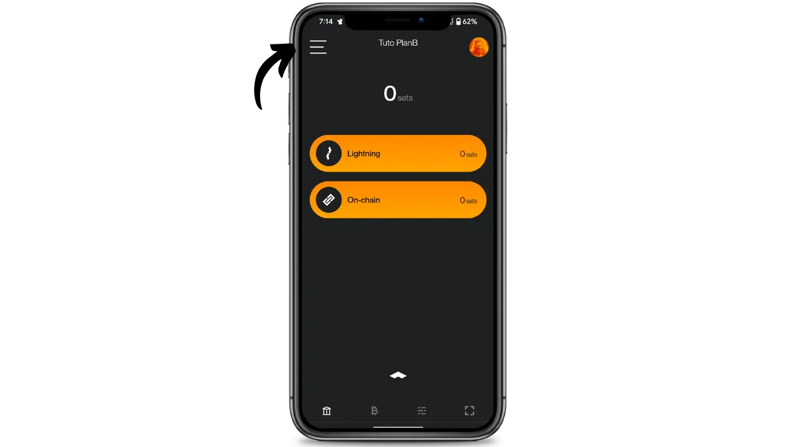

选择 "Settings"，然后选择 "Security"，最后选择 "Set/Change PIN"。

创建 PIN 码、确认 PIN 码并按下相应的 "Biometrics（生物识别）"按钮激活生物识别。使用左上角的箭头返回主选单。

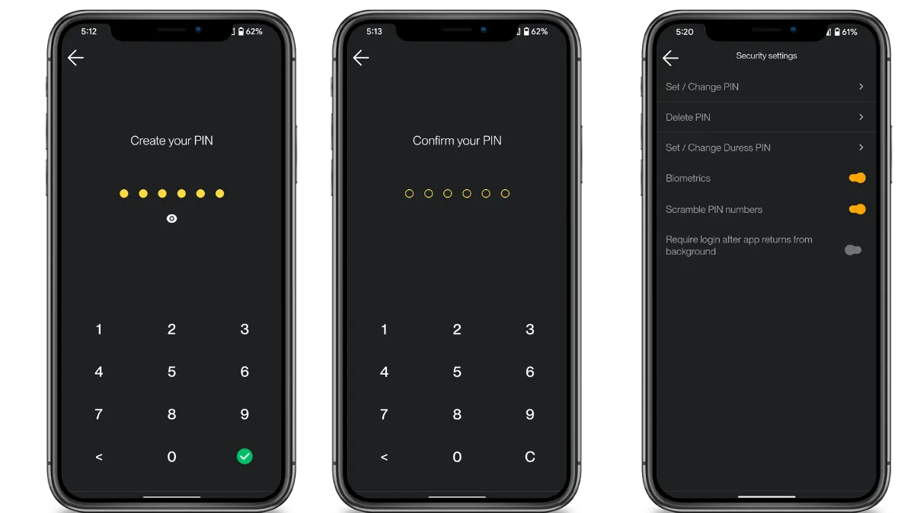

### 保存助记词

返回主选单后，点击 "Back up Wallet"，然后阅读警告文本。警告文本会告知您，丢失即将收到的 24 个单词将等同于失去对资金的访问权限，并且任何拥有这些单词的人（除了您之外）都可以访问您的资金。切勿将它们透露给任何人。

点击屏幕底部的 "I UNDERSTAND"。然后点击 24 个单词中的每一个以查看它们，并仔细记下它们。

您可以把它写在纸上，或者为了增加安全性，把它刻在不锈钢上，以防火灾、水灾或倒塌。助记词的介质选择取决于您的安全策略，但如果您将 Zeus 用作包含中等金额的支出组合，纸张就足够了。

如需了解如何正确保存和管理助记词，我强烈建议您参考以下教程，尤其如果您是新手：

https://planb.academy/tutorials/wallet/backup/backup-mnemonic-22c0ddfa-fb9f-4e3a-96f9-46e2a7954270

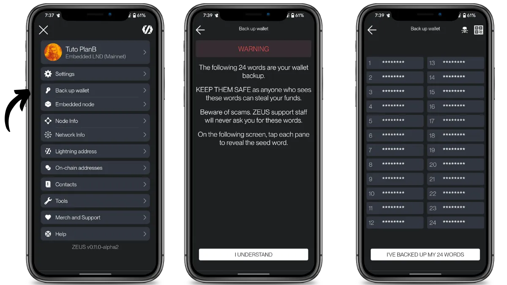

完成后，点击屏幕底部的 "I'VE BACKUP MY 24 WORDS"，即可返回主屏幕，准备接收您的第一笔比特币。

## 选项 1 - 接收链上比特币并开通闪电通道

**Zeus Embedded** 主要设计为嵌入式闪电节点，但也可作为链上钱包使用。

为了要接收链上比特币，请点击 “On-Chain” 按钮，然后点击 “Receive”。

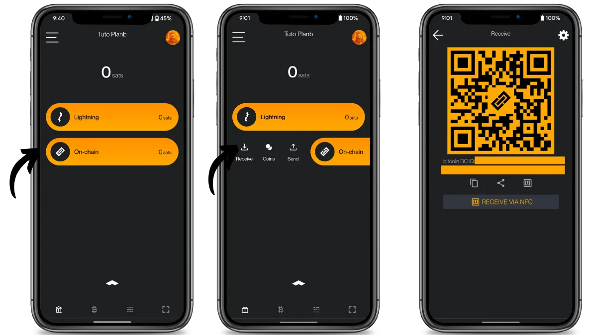

资金确认并记入您的钱包后，您可以使用它们来开通**闪电通道**。您的闪电通道是您通往闪电网络的入口，使您能够以更安全、更快捷的方式交换比特币。
- 为此，请单击 "MOVE On-Chain FUNDS TO LIGHTNING"。

在下一个屏幕上，系统会提示您与 **Olympus by Zeus** 合作开通通道，Olympus by Zeus 是钱包推荐的闪电服务提供商 (LSP)。

在本教程中，为了简单起见，我们将选择这个选项，但也完全可以与网络上的任何节点打开通道。

通过选择 "OPEN ADDITIONAL CHANNEL（打开附加通道）"，甚至可以在单个事务中打开多个通道。 *不过，我们将在 **Zeus Embedded** 教程的 "高级" 版本中讨论这个问题。*

- 然后选择您希望用于该频道的金额。在我们的例子中，我们将使用链上的所有资金，因此我们要激活 "Use all possible funds" 按钮。

- 最后，选择屏幕下方的 "OPEN CHANNEL" 按钮。

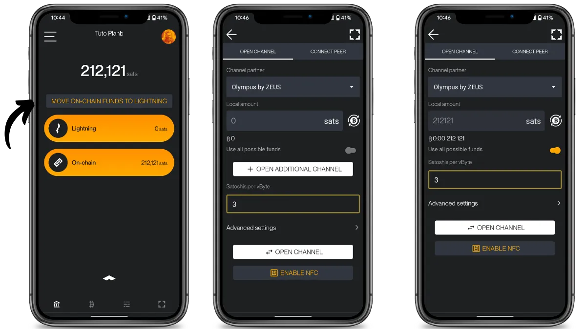

几秒钟内，通道就建立好了，我们可以开始进行第一笔闪电网络交易了。在主屏幕上，我们可以看到钱包余额旁边有一个小时钟。这是因为我们还需要等待 3 次链上确认，通道才能真正生效。

3 次确认后，我们会发现余额已计入闪电网络账户。

还有一个小细节：当我们点击屏幕底部的选单查看闪电通道状态时，会发现余额中有一小部分无法使用：我们只能花费 208253 聪，而不是实际拥有的 210370 聪。这是闪电协议特有的正常现象。

最后，需要注意的是，我们的合作伙伴 Olympus 保留自行决定关闭通道的权利，例如，如果通道未使用。为了确保通道的正常运行，我们需要向闪电服务提供商 (LSP) 付费，我们将在下一段中介绍第二种开通通道的方式。

## 通过闪电网络发送比特币

现在我们的通道已经建立并运行，让我们看看如何使用它通过闪电网络支付发票（invoice）。

为此，请点击 “Lightning” 按钮，然后点击 “Send”。

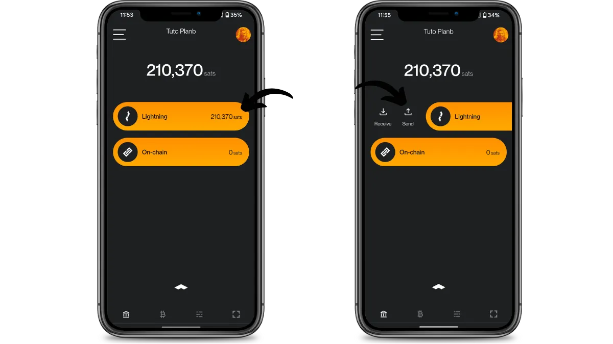

在下一个屏幕上，将您的发票复制到指定字段，或者点击右上角的图标扫描发票。最后，向右滑动 "Slide to Pay" 按钮即可完成支付。

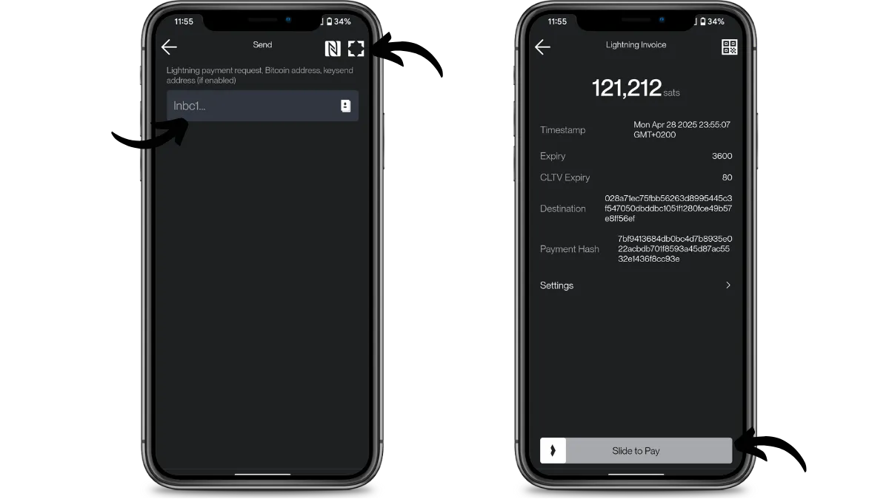

稍等片刻，发票即可支付，您的比特币将以光速传输到目的地。

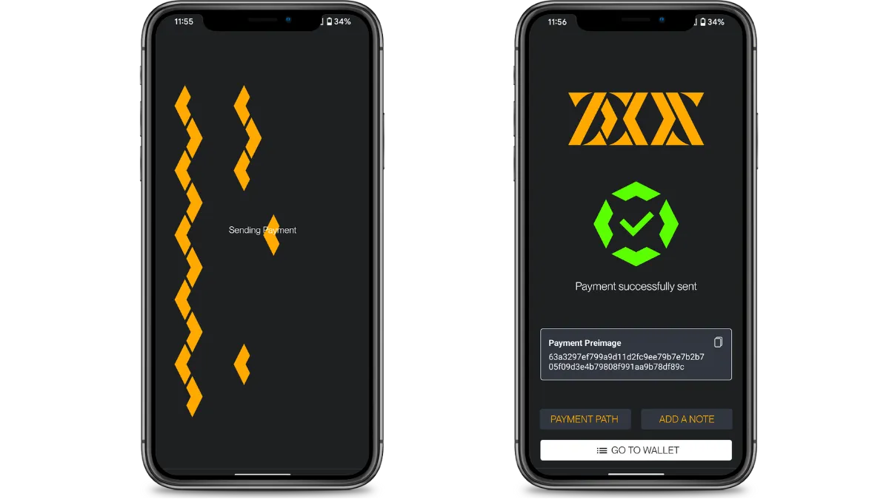

Zeus 还允许您添加备注来指定付款金额，或者查看您的比特币在到达目的地之前所经过的路径（以及所有中间节点收取的费用）。这就是我们喜欢钱包的这种功能。

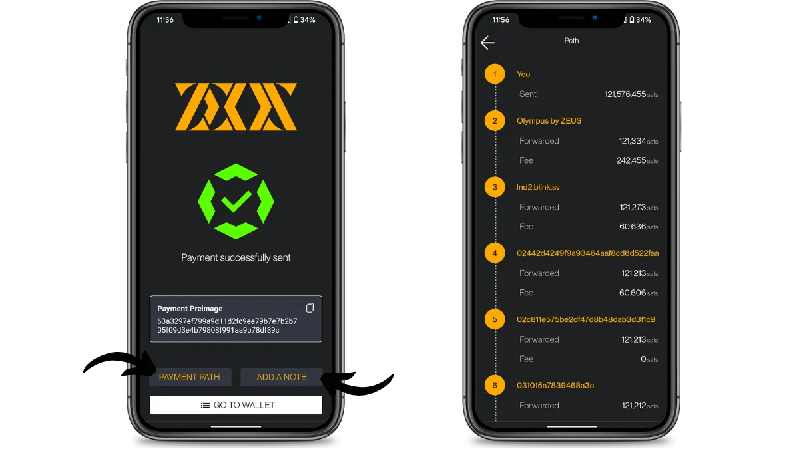

请注意，与 [Phoenix]([Plan ₿ Academy - Phoenix](https://planb.academy/fr/tutorials/wallet/mobile/phoenix-0f681345-abff-4bdc-819c-4ae800129cdf))等钱包不同，Zeus 的路由是在本地计算的，不会委托给第三方（例如 Phoenix 中的 ACINQ）。因此，只有您自己知道收款人是谁。虽然效率略有降低（支付完成时间稍长），但隐私性得到了极大的提升。

点击主屏幕底部的小箭头，您还可以查看支付历史记录。这里以绿色显示收到的 212,121 聪用于链上支付，以红色显示用于开通通道的 211,756 聪，以及用于支付闪电发票的 121,212 聪。

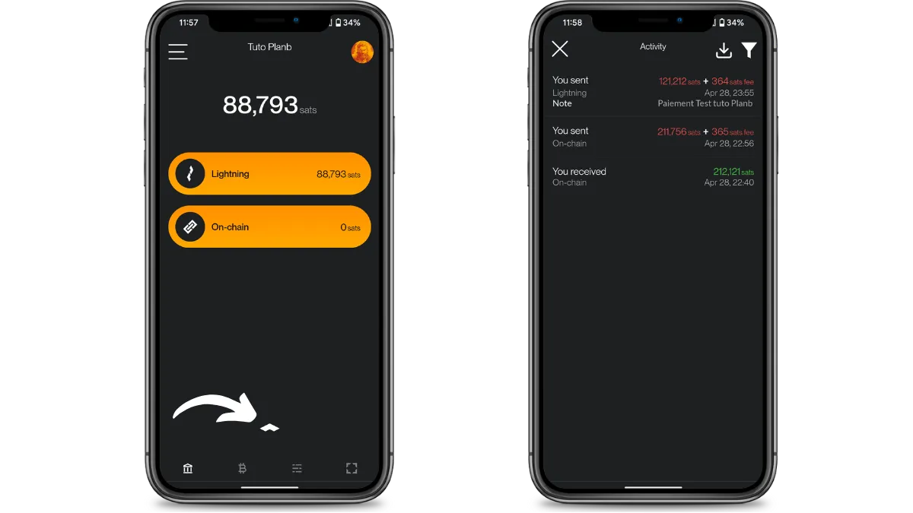

## 选项 2 - 直接通过闪电网络接收比特币

正如我们刚才看到的，无需手动开通通道，您也可以使用 Zeus LSP（Olympus）直接通过闪电网络接收资金，即使没有预先创建的通道。

- 要执行此操作，请点击主屏幕上的 “Lightning” 按钮，然后点击 “Receive”。
- 然后在 “Amount” 框中选择您希望接收的金额，并选择屏幕底部的 “Create Invoice” 按钮。

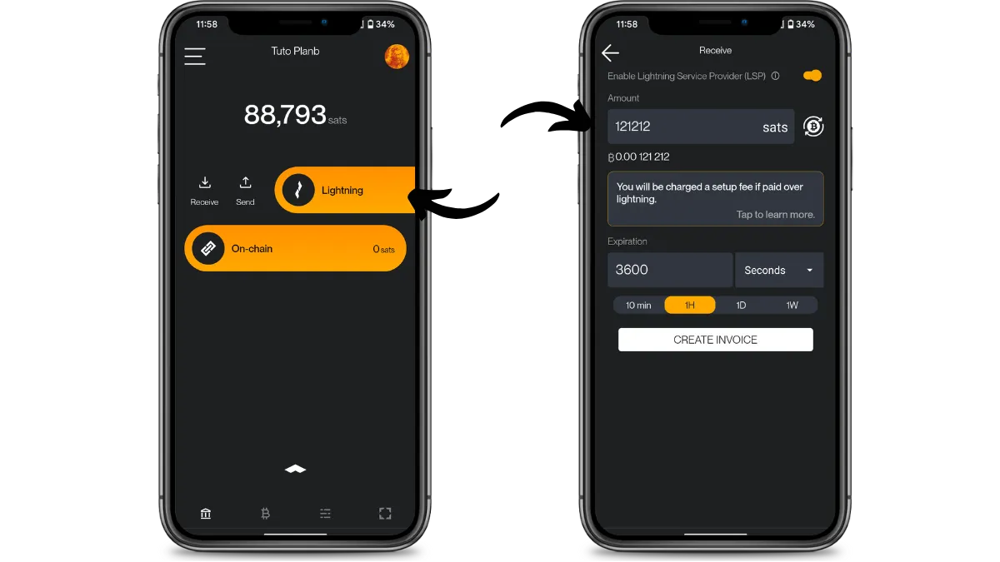

下一个屏幕显示接收聪所需支付的发票。我们被告知，如果通过闪电网络付款，LSP 将扣除 10,000 聪。稍后我们将了解这些通道开通费用的合理性。

支付发票或委托他人支付后，通道将自动开通，但会按约定扣除 10,000 聪。

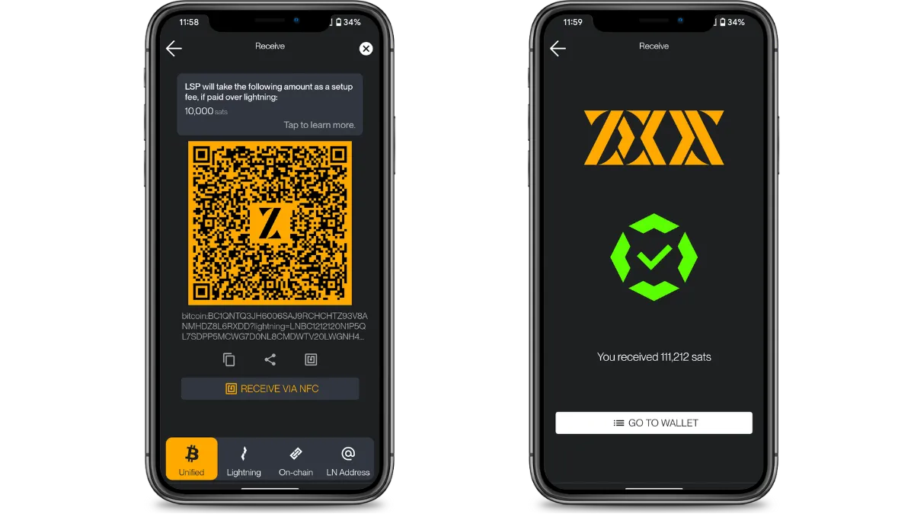

我们现在位于两个闪电网络通道的前端，点击主屏幕底部白色箭头指示的按钮即可查看其状态。

我们可以看到，与通过链上规模开通的通道不同，直接通过闪电网络开通的通道没有显示任何警告。

由于您已支付设置此通道的费用，闪电网络服务提供商 (LSP) 承诺维护该通道 3 个月，并为您提供 “收款额度”。在底部通道中，您可以看到接收容量为 96383 聪。因此，LSP 已锁定资金，以便您在开通通道后即可直接接收付款。

因此，支付的 10,000 聪费用包括：打开通道的成本（比特币链上交易、3 个月的通道维护保证金以及资金锁定）。

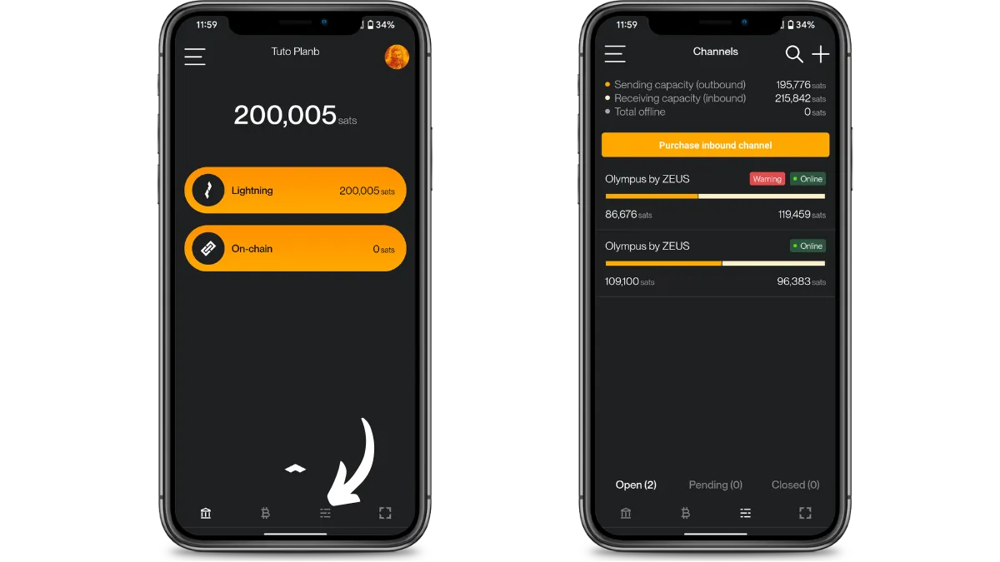

恭喜！您现在可以开始使用 Zeus Embedded，这款钱包移动照明系统拥有市场上最先进的功能。

为了了解更多关于闪电网络的技术操作，您可以找到 Fanis Michalakis 出色的免费 Plan ₿ Academy 培训：

https://planb.academy/courses/34bd43ef-6683-4a5c-b239-7cb1e40a4aeb
