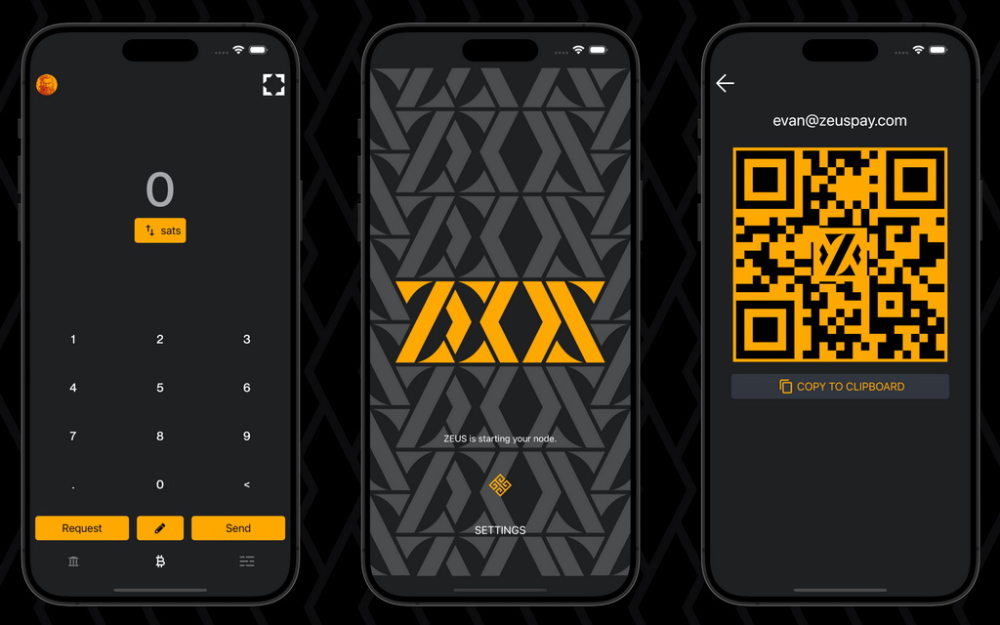
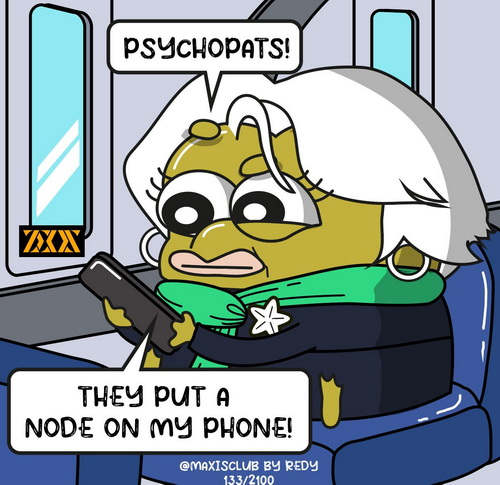
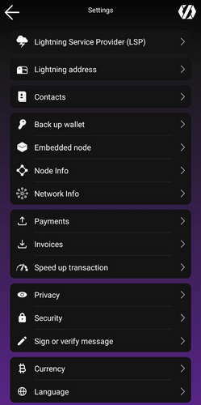
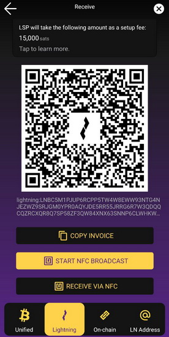
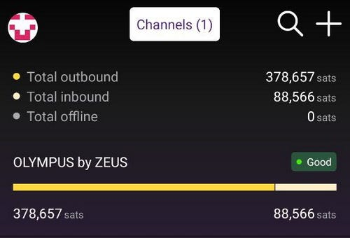
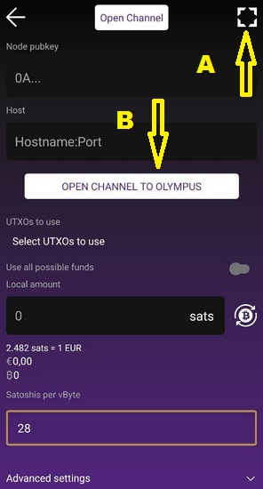
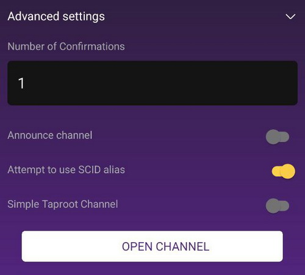
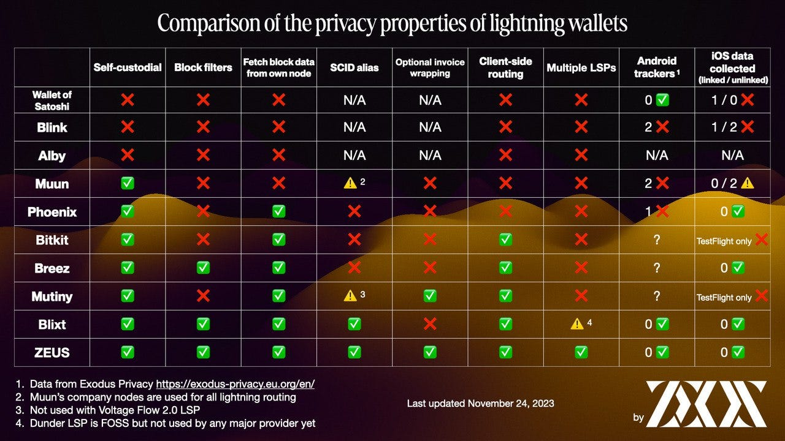

Zeus es una aplicación móvil de administración de billetones y nodos de bitcoin con funcionalidades completas de una billetera Lightning de bitcoin que simplifica los pagos de bitcoin, les brinda a los usuarios un control completo de sus finanzas y permite a los usuarios más avanzados administrar sus nodos de rayos desde la palma de su mano.

## Características de Zeus
### Características generales:
- billetera de autocustodia, bitcoin y lightning
- Sin tarifas de procesamiento, sin KYC
- codigo completamente abierto (APGLV3)
- Multi-nodo / cuentas compatibles (nodo LND integrado, puede administrar sus propios nodos de inicio, ejecutar el nodo LND integrado, conectarse a múltiples cuentas de lndhub)
- Menú de actividad fácil de usar
- Cifrado PIN o de frase de pases, Modo de privacidad: oculte sus datos confidenciales
- Libro de contacto, múltiple tema, lenguaje múltiple

### Características técnicas
- Conéctate sobre Tor
- Soporte completo de LNURL (pago, retiro, autenticación, canal), envío a direcciones Lightning
- Dirección Lightning rayo de autocustodia @zeuspay.com
- Gestión detallada del canal lightning, soporte MPP/AMP, teclas, gestión de tarifas de enrutamiento
- Reemplazo por tarifa (RBF) e infantil-pagos por padres (CPFP)
- Pagos y solicitudes de NFC, firmar y verificar mensajes
- Soporte de Segwit y Taproot
- canales de taproot simples
- Punto de venta por Square (pronto Open Pos) o standalone integrado

## ¿Para quién es Zeus?
Actualmente, hay tres formas de connexiones para Zeus:
- conectar a un nodo LN remoto
- ejecutar un nodo LN integrado en la app Zeus
- conectar a varias cuentas LNDhub

### Conexion a nodo remoto
Zeus es para personas que ejecutan sus propios [Lightning Network Daemon (LND)](https://lightning.ingineering/) o [Core Lightning Lightning (CLN)](https://blockstream.com/lightning/) Nodos Home/Business y administrarlos a través de Zeus, de forma remota.

Aqui hay un video tutorial de BTC Sessions que explica en detalles como utilizar Zeus con un nodo remoto.

### Conexion con cuentas LNDhub
Comerciantes que usan [btcpay](https://btcpayserver.org/) o [LNbits](https://lnbits.com/) o [Alby](https://getalby.com/) (o cualquier otra cuenta de lndhub) también puede conectarse, usar y administrar sus nodos / cuentas desde ZEUS.

Puedes leer mas detalles sobre como conectar cuentas LNDhub en la pagina [Zeus Docs - LNDhub](https://docs.zeusln.app/for-users/remote-connections/lndhub)

## Ejecutar Zeus Nodo LN integrado
[Comenzando con V0.8.0](https://blog.zeusln.com/new-release-zeus-v0-8-0/), Zeus introdujo a los usuarios promedio que solo desean una manera simple de realizar pagos de bitcoin rápidos y baratos, desde su dispositivo móvil al tener un [nodo de rayo móvil incorporado](https://docs.zeusln.app/category/embedded-node) con un integrado [proveedor de servicios de Lightning (LSP)](https://docs.zeusln.app/lsp/intro).

### Resumen rápido de las características principales de Zeus Nodo Integrado:
- Nodo LND privado: eso significa que este nodo NO realizará enrutamiento público de los pagos de otros a través de su nodo. El nodo y los canales no se anuncian (privados, no visibles en el gráfico público de LN). Recibir y realizar pagos se realizará a través de sus pares LSP conectados.

RECUERDE: ¡Zeus Nodo Integrado NO realizará enrutamiento público!

- Servicio LND persistente: el usuario puede activar esta función y mantener el servicio LND activo continuamente como cualquier nodo LN normal. No es necesario que la aplicación esté abierta, el servicio persistente mantendrá toda la comunicación en línea.

- Filtros de bloque de Neutrino: la sincronización de bloques se realiza mediante [filtros de bloque y el protocolo Neutrino](https://bitcoinops.org/en/topics/compact-block-filters/) (sin información sobre los fondos en cadena de nuestros usuarios). Recordatorio: para conexiones a Internet lentas o de alta latencia, este bloque de sincronización basado en neutrinos a veces puede fallar. Intentar cambiar a un servidor cercano a neutrinos podría ayudar a restaurar la sincronización. ¡Sin esta sincronización su nodo LND no podría iniciarse!

- Canales Taproot simples: al cerrar estos canales, los usuarios incurren en menos tarifas y reciben más privacidad, ya que parece que les gusta cualquier otro gasto de Taproot al examinar su huella en la cadena.

- LSP integrado: Olympus es el nuevo nodo LSP para Zeus. Los usuarios pueden recibir satélites a través de LN inmediatamente, sin haber configurado canales LN previamente. Simplemente tendrás que crear una factura LN y pagar desde cualquier otra billetera LN, con el servicio del canal Zeus 0-conf. [Lea más sobre Zeus LSP aquí](https://docs.zeusln.app/lsp/intro).

- El LSP también brinda mayor privacidad a nuestros usuarios al proporcionarles facturas envueltas que ocultan las claves públicas de sus nodos a los pagadores.

- Libro de contactos: puede guardar contactos manualmente o importarlos desde NOSTR para enviar pagos fácilmente a sus destinos habituales.

- Soporte completo para LNURL, envío y recepción de direcciones LN: ahora puede configurar su propia dirección LN con autocustodia con @zeuspay.com

Recordatorio: También puede utilizar Zeus para LN-auth en sitios donde puede iniciar sesión con autenticación LN. Es muy útil.

- Punto de venta: ahora los usuarios comerciantes pueden configurar sus propios productos y venderlos directamente desde Zeus, con PoS integrado. Por el momento contiene necesidades básicas pero en el futuro contendrá funciones ampliadas.

- Registros de LND: el usuario puede leer en tiempo real los registros del servicio LND y usarlos para depurar posibles problemas (principalmente por malas conexiones)

- Copias de seguridad automatizadas: los canales del nodo LN se respaldan automáticamente en el servidor Olympus. Esta copia de seguridad automatizada está encriptada con la semilla de su billetera de nodo (sin la semilla es totalmente inútil). El usuario también puede exportar manualmente un SCB (copia de seguridad de canales estáticos) para una recuperación ante desastres.

### Cómo empezar con Zeus Nodo Integrado

### PASO 1 - CONFIGURACIÓN INICIAL

Debido a que Zeus es un nodo LND completo, tendré algunas recomendaciones iniciales:

- No utilices un dispositivo antiguo, eso podría afectar el uso de esta poderosa aplicación. Especialmente durante el período de sincronización, la aplicación podría utilizar intensamente la CPU y la RAM. La falta de estos podría incluso imposibilitar el uso de la aplicación Zeus.

- Utilice al menos Android 11 como sistema operativo móvil y actualice tanto como sea posible. Lo mismo ocurre con iOS, intente utilizar una versión mucho superior del sistema operativo.

- Necesitará al menos 1 GB de espacio en disco para el almacenamiento de datos. Con el tiempo podría crecer más, pero existe una funcionalidad para compactar la base de datos a un nivel de MB.

- NO es necesario utilizar Zeus con el servicio Tor u Orbot. Por favor, no complique las cosas más de lo necesario. Tor en este caso no le ofrecerá más privacidad, solo empeorará las cosas para la sincronización inicial. También tenga cuidado con qué VPN está utilizando y verifique la latencia de la conexión hacia los servidores de neutrinos. Tenga en cuenta que los filtros de bloque Neutrino no filtran ni rastrean la identidad de su dispositivo, solo sirven bloques. El tráfico de LN también está detrás de un LSP con canales privados, por lo que se publica muy poca información, no hay razón para preocuparse por la privacidad.

- Tenga paciencia para la sincronización inicial, puede tardar varios minutos. Intenta estar conectado a una conexión a Internet de banda ancha y con buena latencia. Si ejecutas tu propio nodo Bitcoin, [puedes activar el servicio de neutrino](https://docs.lightning.engineering/lightning-network-tools/lnd/enable-neutrino-mode-in-bitcoin-core) y conectar tu Zeus a tu propio nodo, incluso usando la LAN interna, así tendrás una velocidad máxima.

- Una vez que configure el tipo de conexión "Nodo integrado", la aplicación comenzará a sincronizarse por un tiempo. Espere pacientemente para terminar esa parte, luego ingrese a la página principal de Configuración.

Brevemente, profundicemos en cada una de las secciones de Configuración y comprendamos algunas de las características principales, antes de comenzar a usar Zeus:

**A - Proveedor de servicios Lightning (LSP)**

Un LSP ayuda a conectar a los usuarios a la red Lightning abriendo canales de pago a sus nodos. [Lea más sobre LSP aquí](https://medium.com/breez-technology/envisioning-lsps-in-the-lightning-economy-832b45871992). ZEUS tiene un nuevo LSP integrado llamado [OLYMPUS by ZEUS](https://amboss.space/node/031b301307574bbe9b9ac7b79cbe1700e31e544513eae0b5d7497483083f99e581), que está disponible para todos los usuarios que utilizan el nuevo nodo integrado.

En esta sección, por defecto está el LSP de Olympus (https://0conf.lnolymp.us), pero también puede configurar otro LSP de 0conf que admita este protocolo, como https://lsp.voltageapi.com. En el futuro esperamos poder tener muchos otros LSP que puedan integrarse en Zeus y utilizar alternativamente cada uno de ellos. Es sólo cuestión de tiempo hasta que los nuevos LSP adopten un estándar abierto para este tipo de canales 0conf.

Si no desea abrir nuevos canales “sobre la marcha”, puede desactivar esta opción.

En esta misma sección, también tiene la opción de elegir "solicitar canales Taproot simples" cuando el LSP abrirá un canal hacia su nodo Zeus. Estos canales Simple Taproot ofrecen una mejor privacidad en la cadena y tarifas más bajas al cerrar el canal. Sólo hay dos razones por las que no querrías usarlos:

Son nuevos y todavía puede haber errores en LND al usarlos.

Su contraparte no los apoya. Incluso los nodos LND tienen que optar explícitamente por ellos, por ahora.

**B - Dirección Lightning**

En esta sección, el usuario puede configurar su propia dirección LN de autocustodia @zeuspay.com.

ZEUS PAY aprovecha los hash de preimagen generados por el usuario, las facturas hodl y el esquema de certificación Zaplocker Nostr para permitir que los usuarios que no estén en línea las 24 horas del día, los 7 días de la semana, reciban pagos a una dirección estática. Los usuarios sólo necesitan iniciar sesión en sus billeteras ZEUS dentro de las 24 horas para reclamar los pagos; de lo contrario, serán devueltos al remitente.

Si activa el "modo persistente", todos los pagos a su dirección LN se recibirán instantáneamente.

Aprenda sobre cómo funcionan los [pagos de Zaplocker](https://github.com/supertestnet/zaplocker#how-it-works) y más sobre las [tarifas de Zeuspay aquí](https://docs.zeusln.app/lightning-address/fees).

**C - Contactos**

Se introdujo un nuevo libro de contacto en Zeus V 0.8.0 que puede usar para enviar rápidamente pagos a sus amigos y familiares, también con la capacidad de importar sus contactos de Nostr.

Simplemente ingrese su dirección NIP-05 legible por Nostr o NPUB, y Zeus consultará Nostr para todos sus contactos. Desde allí, puede enviar un pago rápido a un contacto, o importar todos o seleccionar contactos a su libro de contacto local.

Aquí hay un video corto cómo configurar y usar sus contactos Zeus:

**D - Respaldo de la billetera**

El nodo integrado en ZEUS se basa en LND y usa el formato de semilla [Aezeed](https://github.com/lightningnetwork/lnd/blob/master/aezeed/README.md). Esto es diferente al formato [BIP39](https://github.com/bitcoin/bips/blob/master/bip-0039.mediawiki) típico que ves en la mayoría de las billeteras de bitcoin, aunque puede parecer similar. Aezeed incluye algunos datos adicionales, incluida la fecha de nacimiento de la billetera que ayudará a los recansivos durante la recuperación a ocurrir de manera más eficiente.

El formato de tecla Aezeed debe ser compatible con las siguientes billeteras móviles: Blixt, Bluewallet y Breez. ¡Tenga en cuenta que la semilla sola será insuficiente para recuperar todos sus saldos si tiene canales de cierre abiertos o pendientes!

Obtenga más información sobre el proceso de copia de seguridad y restauración en la página de [Zeus Docs](https://docs.zeusln.app/for-users/embedded-node/backup-and-recovery).

Si desea ver más opciones de recuperación para un nodo LND, [lea esta guía dedicada](https://darthcoin.substack.com/p/recuperar-fondos-de-un-nodo-umbrel), donde puede encontrar los pasos para importar una semilla Aezeed en la billetera de Sparrow.

**E - Nodo Integrado**

En esta sección encontraremos algunas herramientas básicas para administrar el nodo integrado:

1. Recuperación ante desastres: copias de seguridad automatizadas y manuales para los canales LN. Lea más sobre cómo usar esta función en la página [Zeus Docs](https://docs.zeusln.app/for-users/embedded-node/backup-and-recovery).

2. Express Graph Sync: la aplicación Zeus descargará el gráfico de datos de gossip LN de un servidor dedicado, para una sincronización más rápida y mejor, ofreciendo las mejores rutas de pago. También puede elegir para borrar los datos de gráficos anteriores al inicio.

3. Pares: sección para manejar los pares de neutrinos y los pares 0 -Conf. Si tiene problemas con la sincronización inicial, los canales que no entran en línea se deben a que su dispositivo tiene una alta latencia con el par de neutrinos configurado. Intente cambiar de la lista de pares preferidos o agregue su compañero específico que sabe que tiene una mejor latencia para Sync.

Los servidores de neutrinos bien conocidos son:
- btcd1.lnolymp.us | btcd2.lnolymp.us
- btcd-mainnet.lightning.computer
- node.blixtwallet.com
- node.eldamar.icu
- noad.sathoarder.com
- bb1.breez.technology | bb2.breez.technology

4. LND Registros: una herramienta muy útil para depurar sus problemas de nodo LN y controlar en profundidad lo que está sucediendo con un nivel más técnico.

5. Configuración avanzada: más herramientas para controlar el uso de su nodo LND:

- Modo PathFinding - Bimodal o Apriori, formas de encontrar una mejor ruta para sus pagos LN y también restablecer la información de enrutamiento anterior.

- LND persistente: active este modo si desea que el servicio LND se ejecute continuamente en segundo plano y mantenga su nodo en línea 24/7. Esto es muy útil si usa Zeus como POS en una pequeña tienda o está recibiendo muchos consejos LN sobre la dirección LN.

- Re-escanear Billetera: esta opción activará al reiniciar un escaneo completo de todos los TX de su billetera. Actívelo solo en caso de que le falte algunos TX en su billetera. La tarea de rescan llevará tiempo, varios minutos, así que tenga paciencia y siempre verifique los registros para ver más detalles sobre el progreso.

- Compactar Base de datos: esta opción es muy útil si su aplicación Zeus está ocupando mucho espacio para dispositivos (consulte los detalles de la aplicación en la configuración de su dispositivo). Si tiene mucha actividad usando ZEUS, recomendaría hacer esta compactación con más frecuencia. Una vez que vea que tiene más de 1-1.5 GB de datos para la aplicación ZEUS, haga la compactación. Se reiniciará y tomará algún tiempo, así que tenga paciencia.

Además, la otra opción para eliminar los archivos de neutrinos (con un reinicio) reducirá mucho el uso del almacenamiento de datos. La reducción del uso de datos también tiene un gran impacto en el uso de la batería, reduciendo el uso de la batería, especialmente si usa ZEUS en modo persistente.

**F - Información de nodo**

En esta sección, encontrará más detalles sobre el estado de su nodo Zeus como:
- Alias - ID de nodo corto
- Clave pública: la clave pública completa para su nodo requerido para otros nodos para encontrar esa ruta hacia su nodo. Recuerde que este pubkey no es visible en los exploradores LN regulares ([Mempool](https://mempool.space/lightning), [Amboss](https://amboss.space/), [1ML](https://1ml.com/), etc.). Este pubKey solo se puede accesir a través de sus pares y canales de LN conectados.
- Versión de implementación de LN
- Versión de la aplicación Zeus
- Sincronizado para encadenar y sincronizar al estado de gráfico, muy importantes, que muestran el estado correcto de su nodo. Si estos dos no muestran "verdadero", significa que su nodo todavía se está sincronizando o tiene algunos problemas de sincronización. Por lo tanto, se sugiere que busque sus registros LND o espere un poco más.
- Altura del bloque y hash: muestra el último bloque y el hash que su nodo vio y sincronizó.

**G - Información de red** 
Esta sección muestra más detalles sobre el estado general para la red Lightning, extraída de los datos de sincronización de su gráfico: número de canales públicos disponibles, número de nodos, número de canales zombies (fuera de línea o muertos), diámetro gráfico, promedio y máximo de grado para la gráfica.

Estos datos de información podrían ser útiles para depurar o simplemente utilizar para estadísticas.

**H - Configuración de pago**

Esta característica le ofrecerá la forma de establecer sus propias tarifas preferidas para pagos, a través de LN o Onchain. También proporcione la opción de aumentar o disminuir el tiempo de espera para sus facturas.

Si algunos de sus pagos de LN fallan, puede aumentar la tarifa para encontrar una mejor ruta. Además, si está haciendo OnChain TXS, puede configurar una tarifa específica para que su TX no pueda terminar atrapado en la Mempool durante mucho tiempo, en caso de altas tarifas.

**I - Configuración de facturas**

En esta sección hay algunas opciones para generar facturas:
- Establezca un memo estándar que se muestre en la factura que genere
- Tiempo de vencimiento en segundos, en caso de que desee tiempo específico, más largo o más corto para que se pague su factura
- Incluya sugerencias de ruta: proporcione información para encontrar canales no publicitados o privados. Esto permite el enrutamiento de pagos a nodos que no son visibles públicamente en la red. Una pista de enrutamiento proporciona una ruta parcial entre el nodo privado del receptor y un nodo público. Esta pista de enrutamiento se incluye en la factura generada por el receptor y se proporciona al pagador.
- Factura de AMP: los pagos atómicos múltiples son un nuevo tipo de pagos de Lightning implementados por LND que permiten recibir SAT sin una factura específica, utilizando [Keysend](https://docs.lightning.engineering/lightning-network-tools/lnd/send-messages-with-keysend). Es prácticamente un código de pago estático. [Leer más aquí](https://docs.lightning.engineering/lightning-network-tools/lnd/amp).
- Mostrar campo preimagen personalizado: use esta opción solo en casos muy específicos cuando realmente desea usar campos personalizados en la preimagen. [Leer más aquí](https://bitcoin.stackexchange.com/questions/90797/how-can-i-generate-preimage-for-lightning-network-invoice-should-i).

**J - Acelerar la transacción**

Esta característica podría ser útil cuando tiene un TX atascado en Mempool y desea aumentar la tarifa. Deberá proporcionar la salida TX de los detalles de TX y seleccionar la nueva tarifa deseada que desea utilizar. Debe ser más alto que el anterior y exigir que tenga más fondos disponibles en su billetera en la cadena.

**K - La configuración de privacidad**

Aquí encontrará algunas configuraciones básicas para agregar más privacidad usando la aplicación Zeus:

- Block Explorer para abrir los detalles de TX (Mempool.space, blockstream.info o personal personalizado)
- Leer portapapeles: encender/apagar si desea que Zeus lea el portapapeles de su dispositivo
- Modo Lurker: encendido/apagado si desea ocultar información confidencial específica de su aplicación Zeus. Es una buena opción cuando haces demostraciones o capturas de pantalla.
- Sugerencia de tarifas MEMPOOL: active esta opción si desea utilizar los niveles de tarifas recomendados de [Mempool.space](https://mempool.space/)

**L - Seguridad**

Esta sección tiene solo dos opciones para asegurar la aplicación en la apertura: configure una contraseña o un PIN.

Una vez que configura un PIN para abrir la aplicación, también podrá establecer un "Pin de coacción". Este PIN adicional secreto se usará solo en caso de situación de coacción, si está amenazado. Si coloca este PIN, la configuración estará eliminada. Por lo tanto, es mejor que sigas actualizando tus copias de seguridad. Las copias de seguridad automatizadas están activadas de forma predeterminada, pero es bueno tener sus propias copias de seguridad también fuera del dispositivo.

**M - Firmar o verificar**

Con esta función, puede firmar un mensaje específico con las teclas de su billetera. También se puede usar para verificar un mensaje para demostrar que proviene de una llaves de billetera específicas.

**N - Divisa**

Habilitar o deshabilitar la opción de mostrar una conversión de moneda fiduciaria en el uso de la aplicación ZEUS. Actualmente está apoyando más de 30 monedas fiduciarias en todo el mundo.

**O - Idioma**

Puede cambiar entre múltiples idiomas de traducción, revisados por la comunidad Zeus con hablantes nativos.

**P - Pantalla**

En esta sección, puede personalizar su pantalla Zeus, seleccionar varios temas de color, pantalla predeterminada (teclado o equilibrio), mostrar su alias de nodo, activar los botones de teclado grandes, mostrar más lugares decimales.

**Q - Punto de venta**

Esta es una característica especial para habilitar / deshabilitar un sistema POS integrado en ZEUS. Puede ejecutar un POS independiente o vinculado a un sistema POS cuadrado. Actualmente respalda las funcionalidades básicas como un POS, pero lo suficiente para un buen comienzo y podría ayudar a esos pequeños comerciantes (bares/restaurantes, comestibles) a comenzar a aceptar BTC de manera nativa.

Dentro de esta configuración, encontrará varias opciones para configurar su POS:
- Tipo de pago de confirmación: solo LN, 0-Conf, 1-Conf
- Habilitar / deshabilitar consejos para empleados que operan el POS
- Mostrar / ocultar teclado
- Porcentaje fiscal para aplicar en el boleto
- Crear productos y categorías de productos
- Una lista simple de todas las ventas

Aquí hay un video de demostración en vivo Cómo usar Zeus POS:

**R - Merch y Suporte**

Aquí encontrará más información y enlaces sobre Zeus, tienda en línea, patrocinadores, redes sociales.

**S - Ayuda**

En esta última sección, encontrará enlaces a la página de documentación de ZEUS, problemas de GitHub (si desea publicar un error o solicitar directamente a los desarrolladores de aplicaciones), soporte por correo electrónico.

### PASO 2 - COMIENCE A USAR EL NODO ZEUS

Recuerde, Zeus se utilizará principalmente como billetera LN, para pagos fáciles y rápidos sobre LN. Claro, también contiene una billetera en la cadena, pero esa debe usarse exclusivamente para abrir / cerrar canales LN y no para pagos regulares de un café.

Lea esta guía sobre [cómo ser su propio banco utilizando los 3 niveles de alijo](https://darthcoin.substack.com/p/bitcoin-proprio-banco).

En este momento, el usuario tiene 2 formas de comenzar a usar Zeus:
- De inmediato sobre LN, usando el canal 0-Conf de Olympus LSP
- Deposite primero en la billetera de OnChain y luego abra un canal LN normal con el compañero que desee.

### Método A - Uso de Olympus LSP

Esta es una forma muy fácil y directa de incorporar a un nuevo usuario de LN con Zeus. Podría ser un usuario de Bitcoin totalmente nuevo que no tiene ningún SAT, incorporado por un amigo o un nuevo comerciante que comienza con su primer pago LN.

Por defecto, Zeus usará su propio LSP, Olympus. Pero más tarde puede cambiar también a otros LSP que admiten este protocolo 0-Conf para abrir canales.

Simplemente creando una factura en su ZEUS (coloque la cantidad y haga clic en el botón "Solicitar"), podrá recibir esos SAT de inmediato.

La factura que genere estará [envuelta](https://docs.zeusln.app/lsp/wrapped-invoices) y se le presentará las tarifas asociadas con el servicio si se les paga. Esta factura envuelta contiene sugerencias de ruta hacia su nodo Zeus, por lo que el LSP podría encontrar su nuevo nodo y abrir un canal con los nuevos fondos que está depositando.

Para obtener un canal LN del LSP con los fondos que desea recibir por primera vez, esta factura debe pagarse desde otra billetera LN y esperar unos momentos hasta que el LSP esté abriendo el canal hacia su nodo Zeus, deducir la tarifa y empujar El monto restante del pago en su lado del canal.

Todo lo que tiene que hacer es pagar la factura generada por usted en Zeus con otra billetera Lightning, y el canal se abrirá al instante. Consulte las [tarifas de Zeus LSP](https://docs.zeusln.app/lsp/fees).

Otro beneficio de pagar un canal es el enrutamiento de tarifas cero. Eso significa que al enrutar los pagos, el primer salto a través de Olympus por Zeus no incurre en tarifas de enrutamiento. Tenga en cuenta que el salto más allá de Olympus de Zeus aún le cobrará.

Una vez que el canal esté listo, haga clic en el botón derecho en la parte inferior de la pantalla, que muestra los canales Zeus.

Y verá un canal como este, mostrando su lado del equilibrio del canal:

Para obtener más información, gastará de este canal, más liquidez entrante tendrá. Para más SAT, recibirá en este canal, menos espacio de liquidez entrante que tendrá.

Aquí hay una agradable demostración visual simple (de Rene Pickhardt) sobre cómo funcionan los canales LN:

En este momento, considerando la pantalla de demostración para canales, haga clic en el nombre del canal y verá más detalles al respecto.

Tiene un solo canal con Olympus, de una capacidad total de 490 000 sats, con un equilibrio de 378k sats de su lado y 88k sats en el lado de Olympus. Eso significa que podría recibir un máximo de 88k sats más en el mismo canal.

Si necesita recibir más de 88k sats (la liquidez entrante disponible en este caso), supongamos que otros 500k sats, simplemente creando una nueva factura de LN con esa cantidad, activará una nueva solicitud de canal al Olympus LSP. Entonces obtendrás un segundo canal.

Es por eso que, para evitar pagar más tarifas para abrir múltiples canales, se recomienda abrir la primera vez un canal más grande, digamos 1-2M sats. Una vez abierto, puede cambiar a la parte de la cadena de esos sats, digamos 50%, utilizando cualquier [servicio de intercambio externo descrito en esta guía](https://darthcoin.substack.com/p/intercambios-submarinos-lightning).

Una vez que cambie de ese canal, digamos 50% y recupere los SAT en su propia billetera Zeus Onchain, está listo para pasar al siguiente método para abrir un nuevo canal, desde el equilibrio de Onchain.

### Método B - Uso de su balance de OnChain

Con este método, puede abrir canales hacia cualquier otro nodo LN, incluido el mismo Olympus LSP. Pero si ya tiene un canal con Olympus, se recomienda tener también con otro nodo, para obtener más confiabilidad y también podría usar [MPP (pago de múltiples partes)](https://docs.lightning.engineering/the-lightning-network/pathfinding/multipath-payments-mpp).

Para un nodo privado como Zeus, recomendaría tener 2-3 buenos canales (Max. 4-5), con buenas LSP y buena liquidez para cubrir todas sus necesidades para pagar o recibir SATS sobre LN. [Consulte más consejos de liquidez del nodo LN en esta guía](https://darthcoin.substack.com/p/managing-lightning-node-liquidity). También aquí otra [guía general sobre liquidez LN](https://bitcoin.design/guide/how-it-works/liquidity/) del equipo de diseño de Bitcoin.

Puede abrir un canal en Zeus yendo a la vista de canales haciendo clic en el icono del canal en la esquina inferior derecha de la vista principal, y luego presionando el icono + en la esquina superior derecha.

Si desea abrir un canal con un nodo específico, haga clic en (a) esquina superior para escanear el nodo NODEID (en Mempool, Amboss, 1 ml Puede obtener ese QR) y se completarán todos los detalles entre pares.

RECORDATORIO

- ¡El nodo incrustado de Zeus no usa el servicio TOR! ¡Así que por favor no intente abrir canales con nodos que estén debajo de Tor! Te estás haciendo más daño a ti mismo que agregar más privacidad. Tor para LN No ofrece más privacidad, sino que agrega más problemas.
- Elija sabiamente a sus compañeros, sea mejor que sea bueno LSPS, buenos nodos de enrutamiento, no nodos de plebe aleatorios que puedan cerrar sus canales y no pudieran ofrecer una buena liquidez. [Aquí hay una guía dedicada sobre liquidez y ejemplo de nodos](https://darthcoin.substack.com/p/managing-lightning-node-liquidity).

Si hace clic directamente en el botón "Abrir canal a Olympus", llenará los campos requeridos para abrir un canal a [Olympus por Zeus](https://amboss.space/node/031b301307574bbe9b9ac7b79cbe1700e31e544513eae0b5d7497483083f99e581).

A diferencia de los canales LSP pagados, su canal requerirá confirmación en la cadena, utilizando sus fondos OnChain (puede seleccionar entre sus utxos en la vista de canal abierto); No se abrirá instantáneamente. [Consulte primero las tarifas reales de Mempool](https://mempool.space/) y ajústelos en consecuencia, dependiendo de qué tan rápido desee abrir ese canal.

Antes de presionar el botón para abrir el canal, deslice hacia abajo las opciones avanzadas:

También deberá asegurarse de que el canal no esté anunciado (privado). Por defecto, la opción está desactivada para los canales anunciados. No se recomienda activar esta opción para el nodo integrado ZEUS, es útil solo cuando usa Zeus con su nodo remoto, como nodo de enrutamiento público.

A diferencia de los canales LSP pagados, no se beneficiará de el enrutamiento de tarifas cero abriendo canales con este método.

Y listo, simplemente haga clic en el botón "Abrir canal", espere a que los mineros confirmen el TX. Una vez que el canal está abierto, puede realizar transacciones como desee con los SAT desde sus canales.

Tenga en cuenta que estos canales tendrán todo el equilibrio de su lado, por lo que no tendrá liquidez entrante. Como dije antes, intercambie o gaste algunos SAT comprando cosas en LN para "hacer más espacio" para recibir.

Piense en sus canales LN como un vaso de agua. Vierte un poco de agua (SAT) en un vaso vacío (su canal) hasta que la llene. No puede verter más agua hasta que beba un poco (gastar / intercambiar). Cuando el vidrio esté casi vacío, vierta más agua (SAT) usando un intercambio. [Lea más sobre servicios de intercambio externos aquí](https://darthcoin.substack.com/p/lightning-network-submarine-swaps).

También hay otros servicios de LSP que le venden canales entrantes: [LNBIG](https://lnbig.com/#/open-channel) o [BitRefill](https://www.bitrefill.com/thor-lightning-network-channels). Creo que son más servicios como estos, pero no puedo recordarlos en este momento.

Entonces, si necesita prácticamente un canal LN vacío (el saldo es del 100% en el lado del par desde el principio), para recibir más pagos de los que puede manejar en sus canales llenos existentes, esta podría ser una muy buena opción. Pagará una tarifa específica por abrir estos canales y obtendrá mucho espacio entrante.

¡Y eso es! De ahora en adelante, solo usa el nodo Zeus como una billetera BTC/LN normal en su móvil. La interfaz de usuario es bastante sencilla y fácil de usar, intuitiva para cualquier tipo de usuario, no creo que tenga que ingresar más detalles sobre cómo hacer y recibir pagos.

En conclusión, aquí hay una tabla de privacidad de comparación:

## Recursos importantes de Zeus:
- Zeus official webpage - [https://zeusln.app/](https://zeusln.app/)
- Zeus Documentation - [https://docs.zeusln.app/](https://docs.zeusln.app/)
- [Zeus Github repository](https://github.com/ZeusLN/zeus)
- [Zeus Telegram support group](https://t.me/ZeusLN)
- [Zeus en NOSTR](https://iris.to/zeus@zeusln.app)
- [Anuncios del blog de Zeus](https://blog.zeusln.com)

## Otras guías y tutoriales
Para poder usar ZEUS y administrar los canales lightning, la liquidez, las tarifas, etc., es mejor leer primero algunas guías importantes sobre Lightning Network.

- [LND - Lightning Network Daemon Documentation](https://docs.lightning.engineering/)
- [CLN - Core Lightning Documentation](https://lightning.readthedocs.io/index.html)
- [Beginners Lightning Guide](https://bitcoiner.guide/lightning/) – by Bitcoin Q&A
- [Lightning Node Management](https://www.lightningnode.info/) – by openoms
- [The Lightning Network and the airport analogy](https://darthcoin.substack.com/p/the-lightning-network-and-the-airport)
- [Managing Lightning Node Liquidity](https://darthcoin.substack.com/p/managing-lightning-node-liquidity)
- [Lightning Node Maintenance](https://darthcoin.substack.com/p/lightning-node-maintenance)
