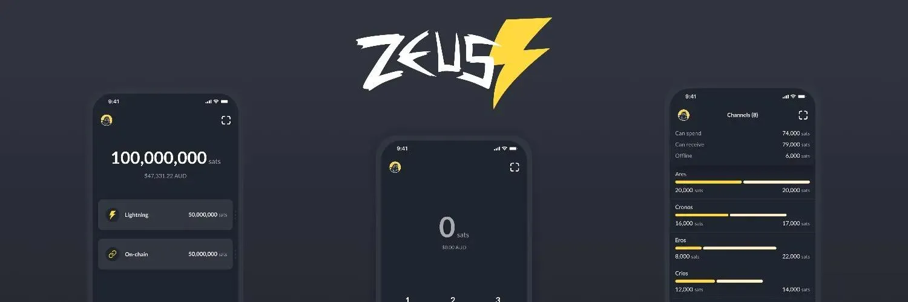

**Zeus es una billetera de Bitcoin de código abierto y no custodial** que te brinda control total sobre cómo realizas pagos.

Para ver la documentación completa sobre ZEUS, puedes consultar sus excelentes páginas de documentación: https://docs.zeusln.app/

## Tutorial en vídeo

