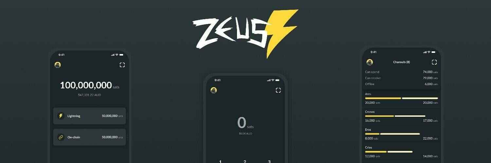

# Zeus - Il fulmine nel palmo della tua mano

**Zeus è un portafoglio Bitcoin open-source e non custodiale** che ti dà il pieno controllo su come effettuare pagamenti.

Per consultare l'intera documentazione su ZEUS puoi fare riferimento alle loro fantastiche pagine di documentazione: https://docs.zeusln.app/

## Video tutorial

