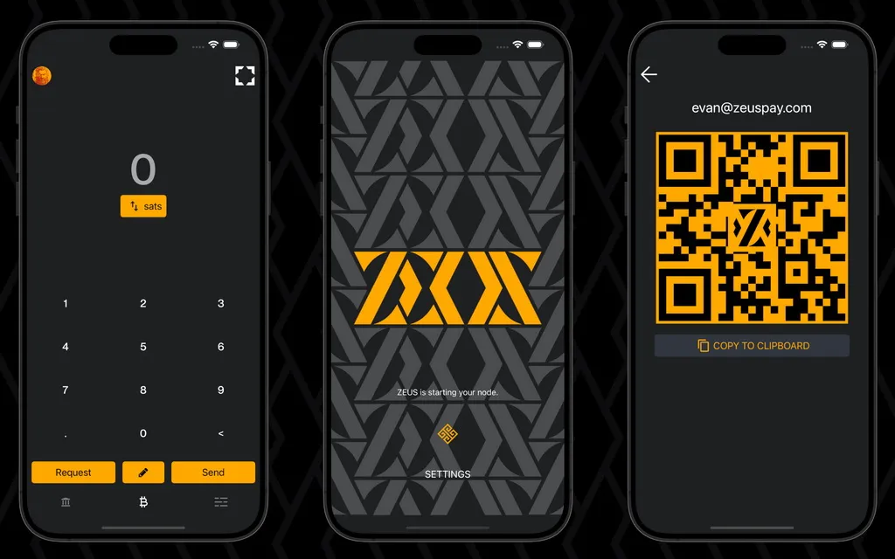

ZEUSは、ビットコインの支払いを簡単にし、ユーザーに財務の完全なコントロールを提供し、より上級のユーザーが手のひらから自分のLightningノードを管理できるようにする、ビットコインライトニングウォレットの全機能を備えたモバイルビットコインウォレットおよびノード管理アプリです。

## ZEUSは誰のためのものか？
現在、ZEUSは自分自身の[Lightning Network Daemon (LND)](https://lightning.engineering/)または[Core Lightning (CLN)](https://blockstream.com/lightning/)のホーム/ビジネスノードを運用し、Zeusを通じて遠隔でそれらを管理する人々のためのものです。

[BTCPay](https://btcpayserver.org/)、[LNBits](https://lnbits.com/)、[Alby](https://getalby.com/)（またはその他のLNDhubアカウント）を使用する商人も、ZEUSを通じて自分のノード/アカウントに接続し、使用し、管理することができます。

[v0.8から始まる](https://blog.zeusln.app/zeus-v0-8-0-open-beta/)ZEUSは、モバイルデバイスから迅速かつ安価なビットコイン支払いを簡単に行いたいと思っている一般ユーザーにサービスを提供し始めます。これは、[組み込みのモバイルLightningノード](https://docs.zeusln.app/category/embedded-node)と統合された[Lightning Service Provider (LSP)](https://docs.zeusln.app/lsp/intro)を持つことにより実現されます。

## 重要なZeusリソース:
- Zeus公式ウェブページ - [https://zeusln.app/](https://zeusln.app/)
- Zeusドキュメンテーション - [https://docs.zeusln.app/](https://docs.zeusln.app/)
- [Zeus Githubリポジトリ](https://github.com/ZeusLN/zeus)
- [Zeus Telegramサポートグループ](https://t.me/ZeusLN)
- [Zeus on NOSTR](https://iris.to/zeus@zeusln.app)
- [Zeusブログアナウンスメント](https://blog.zeusln.com)

## Zeusの特徴
### 一般的な特徴:
- 自己管理型、ビットコインおよびライトニング専用ウォレット
- 処理手数料なし、KYCなし
- 完全オープンソース (APGLv3)
- マルチノード/アカウント対応（自宅のノードを管理、組み込みLNDノードを実行、複数のLNDhubアカウントに接続可能）
- 簡単に使用できるアクティビティメニュー
- PINまたはパスフレーズ暗号化、プライバシーモード - 機密データを隠す
- 連絡先帳、マルチテーマ、マルチ言語

### 技術的な特徴
- Tor経由で接続
- 完全なLNURLサポート（支払い、引き出し、認証、チャネル）、Lightningアドレスへの送金
- 詳細なライトニングチャネル管理、MPP/AMPサポート、Keysend、ルーティング手数料管理
- Replace-by-fee (RBF)およびChild-pays-for-parent (CPFP)サポート
- NFC支払いおよびリクエスト、メッセージの署名＆検証
- SegwitおよびTaprootサポート
- シンプルなTaprootチャネル
- 自己管理型ライトニングアドレス (@zeuspay.com)
- Squareによるポイントオブセール（近日公開のPoS）

## ガイドとビデオチュートリアル
Zeusを使用し、Lightningチャネル、流動性、手数料などを管理するためには、Lightning Networkに関するいくつかの重要なガイドを最初に読むことが良いでしょう。

### ガイド:
- [LND - Lightning Network Daemonドキュメンテーション](https://docs.lightning.engineering/)
- [CLN - Core Lightningドキュメンテーション](https://lightning.readthedocs.io/index.html)
- [初心者向けライトニングガイド](https://bitcoiner.guide/lightning/) – Bitcoin Q&Aによる
- [ライトニングノード管理](https://www.lightningnode.info/) – openomsによる
- [ライトニングネットワークと空港のアナロジー](https://darthcoin.substack.com/p/the-lightning-network-and-the-airport) 
- [ライトニングノードの流動性管理](https://darthcoin.substack.com/p/managing-lightning-node-liquidity)
- [ライトニングノードのメンテナンス](https://darthcoin.substack.com/p/lightning-node-maintenance)

### BTC Sessionsによるビデオチュートリアル

